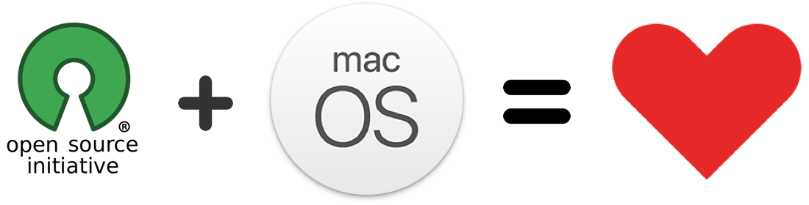

# Awesome macOS open source applications

## Support
Hey friend! Help me out for a couple of :beers:!  

List of awesome open source applications for macOS. This list contains a lot of native, and cross-platform apps. The main goal of this repository is to find free open source apps and start contributing. Feel free to [contribute](CONTRIBUTING.md) to the list, any suggestions are welcome!

You can see in which language an app is written. Currently there are following languages:

- ![c_icon] - C language.
- ![cpp_icon] - C++ language.
- ![c_sharp_icon] - C# language.
- ![clojure_icon] - Clojure language.
- ![coffee_script_icon] - CoffeeScript language.
- ![css_icon] - CSS language.
- ![go_icon] - Go language.
- ![elm_icon] - Elm language.
- ![haskell_icon] - Haskell language.
- ![javascript_icon] - JavaScript language.
- ![lua_icon] - Lua language.
- ![objective_c_icon] - Objective-C language.
- ![python_icon] - Python language.
- ![ruby_icon] - Ruby language.
- ![rust_icon] - Rust language.
- ![swift_icon] - Swift language.
- ![type_script_icon] - TypeScript language.

## Contents
- [Audio](#audio)
- [Backup](#backup)
- [Browser](#browser)
- [Chat](#chat)
- [Cryptocurrency](#cryptocurrency)
- [Database](#database)
- [Development](#development)
    - [Git](#git)
    - [iOS / macOS](#ios--macos)
    - [JSON Parsing](#json-parsing)
    - [Web development](#web-development)
    - [Other](#other)
- [Downloader](#downloader)
- [Editors](#editors)
    - [CSV](#csv)
    - [JSON](#json)
    - [Markdown](#markdown)
    - [TeX](#tex)
    - [Text](#text)
- [Extensions](#extensions)
- [Finder](#finder)
- [Games](#games)
- [Graphics](#graphics)
- [IDE](#ide)
- [Images](#images)
- [Keyboard](#keyboard)
- [Mail](#mail)
- [Menubar](#menubar)
- [Music](#music)
- [News](#news)
- [Notes](#notes)
- [Other](#other-1)
- [Podcast](#podcast)
- [Productivity](#productivity)
- [Screensaver](#screensaver)
- [Security](#security)
- [Sharing Files](#sharing-files)
- [Social Networking](#social-networking)
- [Streaming](#streaming)
- [System](#system)
- [Terminal](#terminal)
- [Utilities](#utilities)
- [VPN & Proxy](#vpn--proxy)
- [Video](#video)
- [Wallpaper](#wallpaper)
- [Window Management](#window-management)

## Applications

### Audio
- [AUHost](https://github.com/vgorloff/AUHost) - Application which hosts AudioUnits v3 using AVFoundation API.  ![swift_icon]  
 
 Screenshots 
 
  <bt>  <bt>  <bt>  

 
- [Aural Player](https://github.com/maculateConception/aural-player) - Aural Player is a audio player application for the macOS platform. Inspired by the classic Winamp player for Windows, it is designed to be to-the-point and easy to use.  ![swift_icon]  
 
 Screenshots 
 
  <bt>  <bt>  <bt>  <bt>  <bt>  <bt>  <bt>  <bt>  <bt>  <bt>  <bt>  <bt>  <bt>  

 
- [Background Music](https://github.com/kyleneideck/BackgroundMusic) - Background Music, a macOS audio utility: automatically pause your music, set individual apps' volumes and record system audio.  ![cpp_icon]  
 
 Screenshots 
 
  <bt>  

 
- [CAM](https://github.com/hanayik/CAM) - macOS camera recording using ffmpeg  ![javascript_icon]  
 
 Screenshots 
 
  <bt>  <bt>  <bt>  <bt>  

 
- [LocalRadio](https://github.com/dsward2/LocalRadio) - LocalRadio is software for listening to "Software-Defined Radio" on your Mac and mobile devices.  ![objective_c_icon]  
 
 Screenshots 
 
  <bt>  

 
- [Lyricism](https://github.com/lyc2345/Lyricism) - macOS app to show you lyric what currently iTunes or Spotify is playing.  ![objective_c_icon] ![swift_icon]  
 
 Screenshots 
 
  <bt>  <bt>  <bt>  

 
- [LyricsX](https://github.com/ddddxxx/LyricsX) - Lyrics for iTunes, Spotify and Vox.  ![swift_icon]  
 
 Screenshots 
 
  <bt>  <bt>  <bt>  <bt>  

 
- [Mous Player](https://github.com/bsdelf/mous) - Simple yet powerful audio player for BSD/Linux/macOS.  ![cpp_icon]  
 
 Screenshots 
 
  <bt>  <bt>  <bt>  <bt>  <bt>  

 
- [Muse](https://github.com/xzzz9097/Muse) - Spotify controller with TouchBar support.  ![swift_icon]  
 
 Screenshots 
 
  <bt>  

 
- [SBPlayer](https://github.com/shibiao/SBPlayerClient) - SBPlayer is a beautiful and powerful media player base on VLCKit.  ![objective_c_icon]  
 
 Screenshots 
 
  <bt>  <bt>  

 
- [ShazamScrobbler](https://github.com/ShazamScrobbler/shazamscrobbler-macos) - Scrobble vinyl, radios, movies to Last.fm.  ![objective_c_icon]  
 
 Screenshots 
 
  <bt>  

 
- [Sonora](https://github.com/sonoramac/Sonora) - Minimal, beautifully designed music player for macOS.  ![objective_c_icon]  
 
 Screenshots 
 
  <bt>  

 
- [SpotMenu](https://github.com/kmikiy/SpotMenu) - Spotify and iTunes in your menu bar. ![objective_c_icon] ![swift_icon]  
 
 Screenshots 
 
  <bt>  

 
- [SpotSpot](https://github.com/will-stone/SpotSpot) - Spotify mini-player for macOS.  ![javascript_icon] 
- [Suohai](https://github.com/Sunnyyoung/Suohai) - Audio input/output source lock for macOS.  ![swift_icon]  
 
 Screenshots 
 
  <bt>  

 
- [Tickeys](https://github.com/yingDev/Tickeys) - Instant audio feedback for typing. macOS version.  ![rust_icon]  
 
 Screenshots 
 
  <bt>  <bt>  <bt>  

 
- [[Un]MuteMic](https://github.com/CocoaHeadsBrasil/MuteUnmuteMic) - macOS app to mute & unmute the input volume of your microphone. Perfect for podcasters. ![objective_c_icon] ![c_icon]  
 
 Screenshots 
 
  <bt>  

 
- [eqMac2](https://github.com/nodeful/eqMac2) - System-Wide Equalizer for the Mac.  ![cpp_icon]  
 
 Screenshots 
 
  <bt>  <bt>  

 
- [fre:ac](https://github.com/enzo1982/freac) - The fre:ac audio converter project.  ![cpp_icon]  
 
 Screenshots 
 
  <bt>  

 
- [iTunes-Volume-Control](https://github.com/alberti42/iTunes-Volume-Control) - This app allows you to control the iTunes volume using volume up and volume down hotkeys.  ![objective_c_icon]  
 
 Screenshots 
 
  <bt>  

 
- [jmc](https://github.com/jcm93/jmc) - jmc is new macOS media organizer.  ![swift_icon]  
 
 Screenshots 
 
  <bt>  <bt>  <bt>  <bt>  

 
- [waveSDR](https://github.com/getoffmyhack/waveSDR) - macOS native desktop Software Defined Radio application using the RTL-SDR USB device.  ![swift_icon]  
 
 Screenshots 
 
  <bt>  

 

### Backup
- [Mackup](https://github.com/lra/mackup) - Keep your application settings in sync (macOS/Linux).  ![python_icon] 
- [UrBackup](https://github.com/uroni/urbackup_backend) - UrBackup is Client/Server network backup for Windows, macOS and Linux. ![cpp_icon] ![c_icon] 
- [shallow-backup](https://github.com/alichtman/shallow-backup) - Easily create lightweight documentation of installed applications, dotfiles, and more.  ![python_icon]  
 
 Screenshots 
 
  <bt>  

 

### Browser
- [Beaker Browser](https://github.com/beakerbrowser/beaker) - Beaker is an experimental peer-to-peer Web browser.   ![javascript_icon]  
 
 Screenshots 
 
  <bt>  <bt>  

 
- [Brave Browser](https://github.com/brave/browser-laptop) - Brave browser for Desktop and Laptop computers running Windows, macOS, and Linux.  ![javascript_icon] 
- [Finicky](https://github.com/johnste/finicky) - Always opens the right browser.  ![swift_icon] 
- [Helium](https://github.com/JadenGeller/Helium) - Floating browser window for macOS. ![objective_c_icon] ![swift_icon]  
 
 Screenshots 
 
  <bt>  

 
- [Kaktus Browser](https://github.com/kaktus/kaktus) - Experimental web browser with minimalistic design. Running Windows, macOS and Linux.  ![javascript_icon]  
 
 Screenshots 
 
  <bt>  <bt>  <bt>  

 
- [browserosaurus](https://github.com/will-stone/browserosaurus) - macOS tool that prompts you to choose a browser when opening a link.  ![javascript_icon] 
- [otter-browser](https://github.com/OtterBrowser/otter-browser) - Otter Browser aims to recreate the best aspects of the classic Opera (12.x) UI using Qt5.   ![cpp_icon]  
 
 Screenshots 
 
  <bt>  

 
- [seb-mac](https://github.com/SafeExamBrowser/seb-mac) - Safe Exam Browser for macOS and iOS.  ![c_icon] 

### Chat
- [Android Messenger Mac](https://github.com/jake-101/android-messenger-mac) -  Mac app wrapper around Google's stand-alone Android Messenger.  ![javascript_icon]  
 
 Screenshots 
 
  <bt>  

 
- [ChitChat](https://github.com/stonesam92/ChitChat) - Native Mac app wrapper for WhatsApp Web.  ![objective_c_icon]  
 
 Screenshots 
 
  <bt>  

 
- [Electronic WeChat](https://github.com/geeeeeeeeek/electronic-wechat) - Better WeChat on macOS and Linux.  ![javascript_icon]  
 
 Screenshots 
 
  <bt>  

 
- [Franz](https://github.com/meetfranz/franz) - Franz is messaging application for services like WhatsApp, Slack, Messenger and many more.  ![javascript_icon]  
 
 Screenshots 
 
  <bt>  

 
- [Google Allo for Desktop](https://github.com/kelyvin/Google-Allo-For-Desktop) - Native macOS & Windows desktop app for Google Allo.  ![javascript_icon]  
 
 Screenshots 
 
  <bt>  

 
- [GroupMe](https://github.com/dcrousso/GroupMe) - Unofficial GroupMe App. ![javascript_icon] ![css_icon]  
 
 Screenshots 
 
  <bt>  

 
- [Riot.im](https://github.com/vector-im/riot-web) - Riot.im is a collaboration app (currently Electron) for the [Matrix](https://matrix.org/blog/home/) protocol.  ![javascript_icon] 
- [Seaglass](https://github.com/neilalexander/seaglass) - A truly native [Matrix](https://matrix.org/blog/home/) client for macOS.  ![swift_icon]  
 
 Screenshots 
 
  <bt>  

 
- [Signal Desktop](https://github.com/signalapp/Signal-Desktop) - Electron app that links with your Signal Android or Signal iOS app.  ![javascript_icon] 
- [Telegram](https://github.com/overtake/TelegramSwift) - Source code of Telegram for macOS on Swift.  ![swift_icon] 
- [Telegram Desktop](https://github.com/telegramdesktop/tdesktop) - Telegram Desktop messaging app.  ![cpp_icon]  
 
 Screenshots 
 
  <bt>  

 
- [Telegram [Deprecated]](https://github.com/overtake/telegram) - Source code of deprecated Telegram for macOS version.  ![objective_c_icon] 
- [Textual](https://github.com/Codeux-Software/Textual) - Textual is an IRC client for macOS.  ![objective_c_icon]  
 
 Screenshots 
 
  <bt>  <bt>  <bt>  <bt>  

 
- [Torchat-Mac](https://github.com/javerous/TorChat-Mac) - TorChat for Mac is a macOS native and unofficial port of torchat.  ![objective_c_icon] 
- [WhatsAppBar](https://github.com/aldychris/WhatsAppBar) - Send WhatsApp message from menu bar.  ![swift_icon]  
 
 Screenshots 
 
  <bt>  <bt>  <bt>  

 
- [Wire Desktop](https://github.com/wireapp/wire-desktop) - Standalone Electron app for the chatapp Wire.  ![javascript_icon] 

### Cryptocurrency
- [AddressGenerator](https://github.com/onmyway133/AddressGenerator) - macOS app to safely generate cryptocurrency address.  ![swift_icon]  
 
 Screenshots 
 
  <bt>  <bt>  

 
- [Balance Open](https://github.com/balance-io/balance-open) - App for all the world’s currencies.  ![swift_icon]  
 
 Screenshots 
 
  <bt>  

 
- [CoinBar](https://github.com/adamwaite/CoinBar) - macOS menu bar application for tracking crypto coin prices.  ![swift_icon]  
 
 Screenshots 
 
  <bt>  <bt>  <bt>  <bt>  

 
- [Crypto Bar](https://github.com/geraldoramos/crypto-bar) - macOS menu bar application built with Electron.  ![javascript_icon]  
 
 Screenshots 
 
  <bt>  

 
- [Float coin](https://github.com/kaunteya/FloatCoin) - Native menu bar app with floating window and support for many Exchanges.  ![swift_icon]  
 
 Screenshots 
 
  <bt>  

 

### Database
- [DB Browser for SQLite](https://github.com/sqlitebrowser/sqlitebrowser) - SQLite database management GUI.  ![cpp_icon]  
 
 Screenshots 
 
  <bt>  

 
- [DBeaver](https://github.com/dbeaver/dbeaver) - Universal database tool and SQL client.  ![java_icon]  
 
 Screenshots 
 
  <bt>  <bt>  <bt>  <bt>  

 
- [Postbird](https://github.com/Paxa/postbird) - PostgreSQL GUI client for macOS.  ![javascript_icon]  
 
 Screenshots 
 
  <bt>  <bt>  <bt>  

 
- [Postgres.app](https://github.com/PostgresApp/PostgresApp) - The easiest way to get started with PostgreSQL on the Mac.  ![swift_icon] 
- [Redis.app](https://github.com/jpadilla/redisapp) - The easiest way to get started with Redis on the Mac.  ![swift_icon]  
 
 Screenshots 
 
  <bt>  

 
- [Robo 3T](https://github.com/Studio3T/robomongo) - Robo 3T (formerly Robomongo) is the free lightweight GUI for MongoDB enthusiasts.  ![cpp_icon]  
 
 Screenshots 
 
  <bt>  

 
- [Sequel Pro](https://github.com/sequelpro/sequelpro) - MySQL/MariaDB database management for macOS.   ![objective_c_icon]  
 
 Screenshots 
 
  <bt>  <bt>  

 
- [mongoDB.app](https://github.com/gcollazo/mongodbapp) - The easiest way to get started with mongoDB on the Mac.  ![swift_icon]  
 
 Screenshots 
 
  <bt>  

 

### Development

#### Git
- [Cashew](https://github.com/simplerocket-llc/OpenCashew) - Cashew macOS Github Issue Tracker. ![objective_c_icon] ![c_icon] 
- [GPM](https://github.com/mtgto/GPM) - macOS application for easily operating GitHub Projects.  ![swift_icon] 
- [GitHub Desktop](https://github.com/desktop/desktop) - Simple collaboration from your desktop.  ![type_script_icon]  
 
 Screenshots 
 
  <bt>  

 
- [GitSync](https://github.com/eonist/GitSync) - Minimalistic Git client for Mac.  ![swift_icon]  
 
 Screenshots 
 
  <bt>  

 
- [GitUp](https://github.com/git-up/GitUp) - The Git interface you've been missing all your life has finally arrived.  ![objective_c_icon]  
 
 Screenshots 
 
  <bt>  <bt>  <bt>  <bt>  <bt>  

 
- [GitX](https://github.com/gitx/gitx) - Graphical client for the git version control system.  ![objective_c_icon] 
- [Gitee](https://github.com/Nightonke/Gitee) - Gitee, macOS status bar application for Github. ![objective_c_icon] ![swift_icon]  
 
 Screenshots 
 
  <bt>  <bt>  <bt>  <bt>  <bt>  <bt>  <bt>  <bt>  <bt>  <bt>  <bt>  <bt>  <bt>  <bt>  

 
- [Github contributions](https://github.com/remirobert/Github-contributions) - GitHub contributions app, for iOS, WatchOS, and macOS.  ![swift_icon]  
 
 Screenshots 
 
  <bt>  

 
- [GithubListener](https://github.com/ad/GithubListener) - Simple app that will notify about new commits to watched repositories.  ![swift_icon]  
 
 Screenshots 
 
  <bt>  

 
- [GithubNotify](https://github.com/erik/github-notify) - Simple macOS app to alert you when you have unread GitHub notifications.  ![swift_icon] 
- [MessagesHistoryBrowser](https://github.com/glaurent/MessagesHistoryBrowser) - macOS application to comfortably browse and search through your Messages.app history.  ![swift_icon] 
- [Streaker](https://github.com/jamieweavis/streaker) - GitHub contribution streak tracking menubar app.  ![javascript_icon]  
 
 Screenshots 
 
  <bt>  <bt>  

 
- [TeamStatus-for-GitHub](https://github.com/marcinreliga/TeamStatus-for-GitHub) - macOS status bar application for tracking code review process within the team.  ![swift_icon]  
 
 Screenshots 
 
  <bt>  

 
- [Trailer](https://github.com/ptsochantaris/trailer) - Managing Pull Requests and Issues For GitHub & GitHub Enterprise.  ![swift_icon]  
 
 Screenshots 
 
  <bt>  <bt>  

 
- [Xit](https://github.com/Uncommon/Xit) - Xit is a graphical tool for working with git repositories.  ![swift_icon]  
 
 Screenshots 
 
  <bt>  

 

#### JSON Parsing
- [JSON Mapper](https://github.com/AppCraft-LLC/json-mapper) - Simple macOS app to generate Swift Object Mapper classes from JSON.  ![swift_icon] 
- [JSONExport](https://github.com/Ahmed-Ali/JSONExport) - Desktop application for macOS which enables you to export JSON objects as model classes with their associated constructors, utility methods, setters and getters in your favorite language.  ![swift_icon]  
 
 Screenshots 
 
  <bt>  

 
- [j2s](https://github.com/zadr/j2s) - macOS app to convert JSON objects into Swift structs (currently targets Swift 4 and Codable).  ![swift_icon] 

#### Other Development
- [ChefInspector](https://github.com/Yasumoto/ChefInspector) - Node and Attribute viewer for Chef  ![swift_icon]  
 
 Screenshots 
 
  <bt>  

 
- [macho-browser](https://github.com/dcsch/macho-browser) - Browser for macOS Mach-O binaries.   ![objective_c_icon] 
- [vegvisir](https://github.com/ant4g0nist/vegvisir) - Browser based GUI for **LLDB** Debugger.  ![javascript_icon]  
 
 Screenshots 
 
  <bt>  <bt>  <bt>  <bt>  <bt>  <bt>  <bt>  <bt>  

 

#### Web Development
- [CoreOS VM](https://github.com/TheNewNormal/coreos-osx) - CoreOS VM is macOS status bar app which allows in an easy way to control CoreOS VM on your Mac.  ![objective_c_icon]  
 
 Screenshots 
 
  <bt>  

 
- [Corectl App for macOS](https://github.com/TheNewNormal/corectl.app) - Corectl App is a macOS Status bar App which works like a wrapper around the corectl command line tool corectld to control the server runtime process.  ![swift_icon]  
 
 Screenshots 
 
  <bt>  

 
- [Insomnia](https://github.com/getinsomnia/insomnia) - Insomnia is a cross-platform REST client, built on top of Electron.  ![javascript_icon]  
 
 Screenshots 
 
  <bt>  

 
- [KubeMonitor](https://github.com/DanSanche/KubeMonitor) - KubeMonitor is a macOS app that displays information about your active Kubernetes cluster in your menu bar.  ![swift_icon]  
 
 Screenshots 
 
  <bt>  

 
- [Lantern](https://github.com/BurntCaramel/Lantern) - Dedicated Mac app for website auditing and crawling.  ![swift_icon] 
- [LocalSites](https://github.com/plan44/localSites) - Simple Menu Bar (Status Bar) App for macOS listing local Bonjour websites (as Safari 11 no longer has Bonjour Bookmarks).  ![swift_icon] 
- [Mockup Generator](https://github.com/andypotts/mockup-generator) - Mockup Generator is a macOS app built with AngularJS/Electron that sits in your menu bar allowing you to capture screenshots of your favourite websites and wrap them in device mock-ups.  ![javascript_icon]  
 
 Screenshots 
 
  <bt>  <bt>  

 
- [Now Desktop](https://github.com/zeit/now-desktop) - Create deployments right from the tray menu.  ![javascript_icon]  
 
 Screenshots 
 
  <bt>  

 
- [aws-s3-uploader](https://github.com/RafalWilinski/s3-uploader) - Simple macOS app for uploading files to Amazon Web Services.  ![javascript_icon]  
 
 Screenshots 
 
  <bt>  

 
- [iTunesConnect](https://github.com/ronakdev/itunesconnect) - macOS app to let you access iTunesConnect.  ![swift_icon] 
- [ndm](https://github.com/720kb/ndm) - Npm desktop GUI.  ![javascript_icon]  
 
 Screenshots 
 
  <bt>  

 
- [nodeScratchpad](https://github.com/vsaravind007/nodeScratchpad) - Evaluate Nodejs/JS code snippets from Menubar.  ![swift_icon] 
- [stts](https://github.com/inket/stts) - macOS app for monitoring the status of cloud services.  ![swift_icon]  
 
 Screenshots 
 
  <bt>  

 

#### iOS / macOS
- [AVXCAssets Generator](https://github.com/angelvasa/AVXCAssets-Generator) - Takes path for your assets images and creates appiconset and imageset for you in just one click.  ![swift_icon] 
- [Alloy](https://github.com/alexlee002/alloy) - Simple toolkit that makes your iOS / macOS apps development more easier.  ![objective_c_icon] 
- [AppBox](https://github.com/vineetchoudhary/AppBox-iOSAppsWirelessInstallation) - Tool for iOS developers to build and deploy Development, Ad-Hoc and In-house (Enterprise) applications directly to the devices from your Dropbox account.  ![objective_c_icon]  
 
 Screenshots 
 
  <bt>  <bt>  <bt>  

 
- [AppIcons](https://github.com/kuyawa/AppIcons) - Tool for generating icons in all sizes as required by macOS and iOS apps.  ![swift_icon]  
 
 Screenshots 
 
  <bt>  

 
- [AppStoreReviewTimes](https://github.com/arbel03/AppStoreReviewTimes) - Gives you indication about the average iOS / macOS app stores review times.  ![swift_icon]  
 
 Screenshots 
 
  <bt>  <bt>  

 
- [AppleTrace](https://github.com/everettjf/AppleTrace) - Trace tool for iOS/macOS.  ![objective_c_icon] 
- [Asset Catalog Tinkerer](https://github.com/insidegui/AssetCatalogTinkerer) - App that lets you open .car files and browse/extract their images. ![objective_c_icon] ![swift_icon]  
 
 Screenshots 
 
  <bt>  <bt>  <bt>  

 
- [Assets](https://github.com/athiercelin/Assets) - Assets is a macOS app that manages assets for your development projects (Xcode, web, etc).  ![swift_icon] 
- [Attabench](https://github.com/attaswift/Attabench) - Attabench is a microbenchmarking app for macOS, designed to measure and visualize the performance of Swift code.  ![swift_icon]  
 
 Screenshots 
 
  <bt>  <bt>  <bt>  

 
- [Board For GitHub](https://github.com/JustinFincher/BoardForGitHub) - Small application to monitor your GitHub project web page in a native macOS app :octocat:!  ![objective_c_icon]  
 
 Screenshots 
 
  <bt>  <bt>  <bt>  

 
- [Brisk](https://github.com/br1sk/brisk) - macOS app for submitting radars.  ![swift_icon]  
 
 Screenshots 
 
  <bt>  <bt>  

 
- [Cleaner for Xcode](https://github.com/waylybaye/XcodeCleaner) - Cleaner for Xcode.app built with react-native-macOS.  ![objective_c_icon] 
- [CocoaRestClient](https://github.com/mmattozzi/cocoa-rest-client) - Native Apple macOS app for testing HTTP/REST endpoints.  ![objective_c_icon]  
 
 Screenshots 
 
  <bt>  <bt>  <bt>  <bt>  <bt>  

 
- [FilterShop](https://github.com/KrisYu/FilterShop) - macOS App to explore CoreImage Filters.  ![swift_icon]  
 
 Screenshots 
 
  <bt>  

 
- [IconGenerator](https://github.com/onmyway133/IconGenerator) - macOS app to generate app icons.  ![javascript_icon]  
 
 Screenshots 
 
  <bt>  <bt>  

 
- [Iconizer](https://github.com/raphaelhanneken/iconizer) - Create Xcode image catalogs (xcassets) on the fly.  ![swift_icon]  
 
 Screenshots 
 
  <bt>  

 
- [Icons.app](https://github.com/SAP/macos-icon-generator) - App for macOS which is designed to generate consistent sized icons of an existing application in various states, jiggling (shaking) etc.  ![objective_c_icon] 
- [InjectionIII](https://github.com/johnno1962/InjectionIII) - overdue Swift rewrite of Injection. ![objective_c_icon] ![swift_icon] 
- [Knuff](https://github.com/KnuffApp/Knuff) - The debug application for Apple Push Notification Service (APNs).  ![objective_c_icon]  
 
 Screenshots 
 
  <bt>  

 
- [LayerX](https://github.com/yuhua-chen/LayerX) - Intuitive app to display transparent images on screen.  ![swift_icon]  
 
 Screenshots 
 
  <bt>  

 
- [Localizable.strings](https://github.com/ralcr/Localizable.strings) - Mac app to localize your iOS and macOS projects.  ![swift_icon] 
- [Localization Editor](https://github.com/igorkulman/iOSLocalizationEditor) - Simple macOS editor app to help you manage iOS app localizations by allowing you to edit all the translations side by side.  ![swift_icon] 
- [Localizations](https://github.com/athiercelin/Localizations) - Localizations is an macOS app that manages your Xcode project localization files (.strings).  ![swift_icon] 
- [Menubar Colors](https://github.com/nvzqz/Menubar-Colors) - macOS app for convenient access to the system color panel.  ![swift_icon]  
 
 Screenshots 
 
  <bt>  

 
- [MyTouchbarMyRules](https://github.com/toxblh/MTMR) - App to customize your Touch Bar as you want.  ![swift_icon] 
- [PodsUpdater](https://github.com/kizitonwose/PodsUpdater) - macOS app which helps you manage dependency releases in your Podfile.  ![swift_icon]  
 
 Screenshots 
 
  <bt>  <bt>  

 
- [ProfilesManager](https://github.com/shaojiankui/ProfilesManager) - Apple iOS/macOS Provisioning Profiles management,.provisionprofile, .mobileprovision files manager tool for mac.  ![objective_c_icon]  
 
 Screenshots 
 
  <bt>  

 
- [PushNotifications](https://github.com/onmyway133/PushNotifications) - macOS app to test push notifications on iOS and Android.  ![javascript_icon]  
 
 Screenshots 
 
  <bt>  <bt>  <bt>  <bt>  <bt>  <bt>  <bt>  <bt>  <bt>  

 
- [ResignTool](https://github.com/InjoyDeng/ResignTool) - This is an app for macOS that can (re)sign apps and bundle them into ipa files that are ready to be installed on an iOS device.  ![objective_c_icon]  
 
 Screenshots 
 
  <bt>  

 
- [SmartPush](https://github.com/shaojiankui/SmartPush) - iOS Push Notification Debug App.  ![objective_c_icon]  
 
 Screenshots 
 
  <bt>  

 
- [Touch Bar Preview](https://github.com/touchbar/Touch-Bar-Preview) - Small application to display your designs on the Touch Bar of the new MacBook Pro.  ![swift_icon] 
- [Touch Bar Simulator](https://github.com/sindresorhus/touch-bar-simulator) - Use the Touch Bar on any Mac.  ![swift_icon] 
- [TransporterPad](https://github.com/iseebi/TransporterPad) - iOS/Android app deployment tool for macOS.  ![swift_icon] 
- [WWDC](https://github.com/insidegui/WWDC) - Unofficial WWDC app for macOS.  ![swift_icon] 
- [WWDC.srt](https://github.com/ssamadgh/WWDCsrt) - Powerful app for downloading subtitle for each WWDC session video since 2013 in (srt) format.  ![swift_icon]  
 
 Screenshots 
 
  <bt>  <bt>  <bt>  <bt>  <bt>  

 
- [calabash-launcher](https://github.com/xing/calabash-launcher) - iOS Calabash Launcher is a macOS app that helps you run and manage Calabash tests on your Mac.  ![swift_icon]  
 
 Screenshots 
 
  <bt>  <bt>  <bt>  <bt>  <bt>  

 
- [iOS Images Extractor](https://github.com/devcxm/iOS-Images-Extractor) - iOS Images Extractor is a Mac app to normalize, decode, and extract images from iOS apps.  ![objective_c_icon]  
 
 Screenshots 
 
  <bt>  <bt>  

 
- [iSimulator](https://github.com/shaojiankui/iSimulator) - iSimulator, iOS Simulator Sandbox, like simpholders, a macOS app to find simulator's sandbox and go.  ![objective_c_icon]  
 
 Screenshots 
 
  <bt>  

 
- [iSimulator](https://github.com/wigl/iSimulator) - iSimulator is a GUI utility to control the Simulator and manage the app installed on the simulator.  ![objective_c_icon] 
- [xib2Storyboard](https://github.com/novemberfiveco/xib2Storyboard) - Tool to convert Xcode .xib to .storyboard files.  ![objective_c_icon] 

### Downloader
- [App Downloader](https://github.com/yep/app-downloader) - Easily search and download macOS apps from the huge `homebrew cask` app catalog.  ![swift_icon] 
- [Get It](https://github.com/Kevin-De-Koninck/Get-It) - Native macOS video/audio downloader. Think of it as a youtube downloader that works on many sites.  ![swift_icon] 
- [Pillager](https://github.com/Pjirlip/Pillager) - macOS Video Downloader written in Swift and Objective-C. ![objective_c_icon] ![swift_icon]  
 
 Screenshots 
 
  <bt>  <bt>  

 
- [YouTube Downloader for macOS](https://github.com/DenBeke/YouTube-Downloader-for-macOS) - Simple menu bar app to download YouTube movies on your Mac. I wrote this as a test project to learn more about app development on macOS.  ![swift_icon]  
 
 Screenshots 
 
  <bt>  

 
- [Youtube Downloader](https://github.com/onmyway133/YoutubeDownloader) - macOS app to download Youtube videos.  ![swift_icon]  
 
 Screenshots 
 
  <bt>  <bt>  

 
- [udemy-downloader-gui](https://github.com/FaisalUmair/udemy-downloader-gui) - desktop application for downloading Udemy Courses.  ![javascript_icon] 

### Editors

#### CSV
- [TableTool](https://github.com/jakob/TableTool) - simple CSV editor for the macOS.  ![objective_c_icon] 

#### JSON
- [JSON-Splora](https://github.com/wellsjo/JSON-Splora) - GUI for editing, visualizing, and manipulating JSON data.  ![javascript_icon]  
 
 Screenshots 
 
  <bt>  <bt>  

 

#### Markdown
- [Gingko](https://github.com/gingko/client) - Tree-structured markdown editor for macOS, Windows, and Linux.  ![elm_icon]  
 
 Screenshots 
 
  <bt>  

 
- [MacDown](https://github.com/MacDownApp/macdown) - Markdown editor for macOS.  ![objective_c_icon] 
- [Mark Text](https://github.com/marktext/marktext/) - Realtime preview markdown editor for macOS Windows and Linux.  ![javascript_icon] 
- [Twig](https://github.com/lukakerr/twig) - A modern MacOS markdown editor.  ![swift_icon]  
 
 Screenshots 
 
  <bt>  <bt>  

 

#### TeX
- [Qilin Editor](https://github.com/qilin-editor/qilin-app) - Text editor for exact sciences with built-in KaTeX/AsciiMath support.  ![javascript_icon]  
 
 Screenshots 
 
  <bt>  <bt>  <bt>  

 

#### Text
- [CotEditor](https://github.com/coteditor/CotEditor) - Lightweight Plain-Text Editor for macOS.  ![swift_icon]  
 
 Screenshots 
 
  <bt>  

 
- [MacVim](https://github.com/macvim-dev/macvim) - Text editor for macOS.  ![c_icon] 
- [Noto](https://github.com/brunophilipe/noto) - Plain text editor for macOS with customizable themes.  ![swift_icon]  
 
 Screenshots 
 
  <bt>  <bt>  

 
- [SubEthaEdit](https://github.com/subethaedit/SubEthaEdit) - General purpose plain text editor for macOS. Widely known for its live collaboration feature. ![objective_c_icon]  
 
 Screenshots 
 
  <bt>  <bt>  

 
- [TextMate](https://github.com/textmate/textmate) - TextMate is a graphical text editor for macOS.  ![objective_c_icon]  
 
 Screenshots 
 
  <bt>  

 
- [VimR](https://github.com/qvacua/vimr) - Refined Neovim experience for macOS.  ![swift_icon] 

### Extensions
- [BetterPiP](https://github.com/Capevace/BetterPiP) - Use native picture-in-picture with browsers such as Google Chrome for HTML5 videos.  ![swift_icon]  
 
 Screenshots 
 
  <bt>  

 
- [PiPTool](https://github.com/bfmatei/PiPTool) - Add the Picture-in-Picture Functionality to YouTube, Netflix, Plex and other video broadcasting services in macOS.  ![javascript_icon] 
- [PiPifier](https://github.com/arnoappenzeller/PiPifier) - PiPifier is a native macOS 10.12 Safari extension that lets you use every HTML5 video in Picture in Picture mode.  ![swift_icon]  
 
 Screenshots 
 
  <bt>  <bt>  <bt>  

 

### Finder
- [Clipy](https://github.com/Clipy/Clipy) - Clipy is a Clipboard extension app for macOS.  ![swift_icon]  
 
 Screenshots 
 
  <bt>  <bt>  

 
- [FiScript](https://github.com/Mortennn/FiScript) - Execute custom scripts from the MacOS context menu (CTRL+click) in Finder.  ![swift_icon]  
 
 Screenshots 
 
  <bt>  <bt>  

 
- [Finder Go](https://github.com/onmyway133/FinderGo) - macOS app and Finder Sync Extension to open Terminal, iTerm, Hyper from Finder.  ![swift_icon] 
- [OpenInCode](https://github.com/sozercan/OpenInCode) - Finder toolbar app to open current folder in Visual Studio Code.  ![objective_c_icon]  
 
 Screenshots 
 
  <bt>  

 

### Games
- [Battle for Wesnoth](https://github.com/wesnoth/wesnoth) - Turn-based tactical strategy game, featuring both single-player and online multiplayer combat.  ![cpp_icon] 
- [Boxer](https://github.com/alunbestor/Boxer) - The DOS game emulator that’s fit for your Mac. ![cpp_icon] ![objective_c_icon] 
- [Dolphin](https://github.com/dolphin-emu/dolphin) - Powerful emulator for Nintendo GameCube and Wii games.  ![cpp_icon] 
- [OpenEmu](https://github.com/OpenEmu/OpenEmu) - Retro video game emulation for macOS.  ![objective_c_icon]  
 
 Screenshots 
 
  <bt>  

 
- [OpenRCT2](https://github.com/OpenRCT2/OpenRCT2) - Re-implementation of RollerCoaster Tycoon 2.  ![cpp_icon]  
 
 Screenshots 
 
  <bt>  

 
- [Screentendo](https://github.com/AaronRandall/Screentendo) - Turn your screen into a playable level of Mario.  ![objective_c_icon]  
 
 Screenshots 
 
  <bt>  

 
- [Stockfish](https://github.com/daylen/stockfish-mac) - Beautiful, powerful chess application. ![cpp_icon] ![objective_c_icon] 

### Graphics
- [Aseprite](https://github.com/aseprite/aseprite) - Animated sprite editor & pixel art tool (Windows, macOS, Linux). ![cpp_icon] ![c_icon] 
- [CaptuocrToy](https://github.com/gragrance/CaptuocrToy) - Tool to capture screenshot and recognize text by online ocr apis.  ![swift_icon]  
 
 Screenshots 
 
  <bt>  

 
- [GifCapture](https://github.com/onmyway133/GifCapture) - Gif capture app for macOS.  ![swift_icon]  
 
 Screenshots 
 
  <bt>  <bt>  <bt>  <bt>  <bt>  

 
- [Gifcurry](https://github.com/lettier/gifcurry) - Video to GIF maker with a graphical interface capable of cropping, adding text, seeking, and trimming.  ![haskell_icon]  
 
 Screenshots 
 
  <bt>  <bt>  

 
- [Gifski](https://github.com/sindresorhus/gifski-app) - Convert videos to high-quality GIFs.  ![swift_icon]  
 
 Screenshots 
 
  <bt>  <bt>  <bt>  

 
- [InfiniteCanvas](https://github.com/CleanCocoa/InfiniteCanvas) - Proof of concept Mac drawing application.  ![swift_icon]  
 
 Screenshots 
 
  <bt>  

 
- [Inkscape](https://gitlab.com/inkscape/inkscape) - Inkscape is professional quality vector graphics software.  ![cpp_icon] 
- [Material Colors Native](https://github.com/BafS/Material-Colors-native) - Choose your Material colours and copy the hex code.  ![objective_c_icon]  
 
 Screenshots 
 
  <bt>  

 
- [Pencil2D Animation](https://github.com/pencil2d/pencil) - Pencil2D is an animation/drawing software for macOS, Windows, and Linux. It lets you create traditional hand-drawn animation (cartoon) using both bitmap and vector graphics.  ![cpp_icon] 
- [ScreenToLayers for macOS](https://github.com/duyquoc/ScreenToLayers) - ScreenToLayers is a macOS application to easily capture your screen as a layered PSD file. ![objective_c_icon] ![css_icon]  
 
 Screenshots 
 
  <bt>  

 
- [Sketch Toolbox](https://github.com/buzzfeed/Sketch-Toolbox) - Plugin manager for Sketch.app. ![objective_c_icon] ![c_icon]  
 
 Screenshots 
 
  <bt>  

 
- [macSVG](https://github.com/dsward2/macSVG) - macOS application for designing HTML5 SVG (Scalable Vector Graphics) art and animation with a WebKit web view.  ![objective_c_icon]  
 
 Screenshots 
 
  <bt>  

 

### IDE
- [Atom](https://github.com/atom/atom) - The hackable text editor.  ![javascript_icon] 
- [Oni](https://github.com/onivim/oni) - Oni is a modern take on modal editing code editor focused on developer productivity. ![javascript_icon] ![javascript_icon] ![type_script_icon] 
- [Visual Studio Code](https://github.com/Microsoft/vscode) - Code editor developed by Microsoft.  ![type_script_icon]  
 
 Screenshots 
 
  <bt>  

 
- [ZeroBraneStudio](https://github.com/pkulchenko/ZeroBraneStudio) - ZeroBrane Studio is a lightweight cross-platform Lua IDE with code completion, syntax highlighting, remote debugger, code analyzer, live coding, and debugging support for various Lua engines.  ![lua_icon]  
 
 Screenshots 
 
  <bt>  

 

### Images
- [APNGb](https://github.com/shgodoroja/APNGb) - macOS app which assembles and disassembles animated png files.  ![swift_icon] 
- [Crunch](https://github.com/chrissimpkins/Crunch) - Insane(ly slow but wicked good) PNG image optimization.  ![python_icon] 
- [Freehand](https://github.com/wddwycc/Freehand) - macOS Status Bar App for quick sketch.  ![swift_icon]  
 
 Screenshots 
 
  <bt>  

 
- [Gimp](https://github.com/GNOME/gimp) - Gimp is GNU Image Manipulation Program.  ![c_icon] 
- [ImageAlpha](https://github.com/kornelski/ImageAlpha) - Mac GUI for pngquant, pngnq and posterizer. ![objective_c_icon] ![python_icon]  
 
 Screenshots 
 
  <bt>  

 
- [Imagine](https://github.com/meowtec/Imagine) - Imagine is a desktop app for compression of PNG and JPEG, with a modern and friendly UI.  ![type_script_icon] 
- [Katana](https://github.com/bluegill/katana) - Katana is a simple screenshot utility for macOS that lives in your menubar. ![javascript_icon] ![css_icon] 
- [PhotoMiner](https://github.com/gergelysanta/photominer) - macOS app for finding and lost forgotten photos on your disks.  ![swift_icon]  
 
 Screenshots 
 
  <bt>  <bt>  <bt>  <bt>  <bt>  <bt>  

 
- [Screenbar](https://github.com/crilleengvall/Screenbar) - macOS menubar app for automating screenshots.  ![swift_icon]  
 
 Screenshots 
 
  <bt>  

 
- [WebPonize](https://github.com/1000ch/WebPonize) - WebPonize is a macOS App for converting PNG, JPEG, animated (or not) GIF images into WebP. ![swift_icon] ![c_icon] 

### Keyboard
- [AnnePro-mac](https://github.com/msvisser/AnnePro-mac) - macOS application for controlling AnnePro keyboard over bluetooth.  ![swift_icon] 
- [Fluor](https://github.com/Pyroh/Fluor) - Handy tool for macOS allowing you to switch Fn keys' mode based on active application.  ![swift_icon] 
- [GokuRakuJoudo](https://github.com/yqrashawn/GokuRakuJoudo) - Karabiner-Elements configuration manager, rescue to bloated karabiner.json  ![clojure_icon] 
- [Karabiner](https://github.com/tekezo/Karabiner) - Karabiner (KeyRemap4MacBook) is a powerful utility for keyboard customization. ![cpp_icon] ![objective_c_icon] 
- [Karabiner-Elements](https://github.com/tekezo/Karabiner-Elements) - Karabiner-Elements is a powerful utility for keyboard customization on macOS Sierra (10.12) or later. ![cpp_icon] ![objective_c_icon] 
- [Kawa](https://github.com/utatti/kawa) - Better input source switcher for macOS.  ![swift_icon]  
 
 Screenshots 
 
  <bt>  <bt>  

 
- [Thor](https://github.com/gbammc/Thor) - Switch the right application ASAP.  ![swift_icon]  
 
 Screenshots 
 
  <bt>  <bt>  

 

### Mail
- [Correo](https://github.com/amitmerchant1990/correo) - Menubar/taskbar Gmail App for Windows and macOS.  ![javascript_icon] 
- [Inboxer](https://github.com/denysdovhan/inboxer) - Unofficial Google Inbox Desktop App. ![javascript_icon] ![css_icon] 
- [Nylas Mail](https://github.com/nylas/nylas-mail) - Extensible mail client.  ![javascript_icon] 
- [Rambox](https://github.com/ramboxapp/community-edition) - Cross Platform messaging and emailing app that combines common web applications into one. ![javascript_icon] ![css_icon] 
- [dejalu](https://github.com/dinhviethoa/dejalu) - Fast and Simple Email Client. ![cpp_icon] ![objective_c_icon]  
 
 Screenshots 
 
  <bt>  

 
- [gInbox](https://github.com/chenasraf/gInbox) - Wrapper for Inbox by Gmail.  ![swift_icon]  
 
 Screenshots 
 
  <bt>  

 

### Menubar
- [Airpass](https://github.com/alvesjtiago/airpass) - Status bar Mac application to overcome time constrained WiFi networks.  ![javascript_icon] 
- [AnyBar](https://github.com/tonsky/AnyBar) - macOS menubar status indicator.  ![objective_c_icon] 
- [BitBar](https://github.com/matryer/bitbar) - Put the output from any script or program in your macOS Menu Bar.  ![objective_c_icon] 
- [CloudyTabs](https://github.com/josh-/CloudyTabs) - Simple menu bar macOS application for displaing lists of your iCloud Tabs and Reading List.  ![swift_icon]  
 
 Screenshots 
 
  <bt>  

 
- [DatWeatherDoe](https://github.com/inderdhir/DatWeatherDoe) - Simple menu bar weather app for macOS written in Swift.  ![swift_icon] 
- [DisplayMenu](https://github.com/Kwpolska/DisplayMenu) - Simple (bare-bones) macOS menubar extra to apply display presets.  ![swift_icon] 
- [Dozer](https://github.com/Mortennn/Dozer) - Hide MacOS menubar items.  ![swift_icon] 
- [MenuMeters](https://github.com/yujitach/MenuMeters) - CPU, memory, disk, and network monitoring tools for macOS.   ![objective_c_icon] 
- [Menubar Brightness](https://github.com/lucasbento/menubar-brightness) - macOS app to change the screen brightness on the menubar.  ![javascript_icon] 
- [Night Shift Control](https://github.com/isaiasmatewos/night-shift-control) - Night Shift Control is a simple macOS menubar app for controlling Night Shift. It's aim is to bring features from f.lux which are missing from Night Shift such as disabling Night Shift for certain apps.  ![swift_icon]  
 
 Screenshots 
 
  <bt>  

 
- [PSIBar](https://github.com/nikhilsh/PSIBar) - Quickly hacked up PSI macOS status bar app.  ![swift_icon] 
- [Quickeys](https://github.com/alexrosenfeld10/Quickeys) - A mac menu bar app that provides note taking functionality though a quick dropdown menu.  ![swift_icon]  
 
 Screenshots 
 
  <bt>  

 
- [SensibleSideButtons](https://github.com/archagon/sensible-side-buttons) - Small menu bar utility that lets you use your third-party mouse's side buttons for navigation across a variety of apps. ![objective_c_icon] ![c_icon] 
- [Shifty](https://github.com/thompsonate/Shifty) - macOS menu bar app that gives you more control over Night Shift.  ![swift_icon]  
 
 Screenshots 
 
  <bt>  

 
- [gSwitch](https://github.com/CodySchrank/gSwitch) - macOS status bar app that allows control over the gpu on dual gpu macbooks.  ![swift_icon] 
- [iGlance](https://github.com/Moneypulation/iGlance) - macOS System Monitor (cpu, memory, network, fan and battery) for the Status Bar.  ![swift_icon] 

### Music
- [Carol](https://github.com/AnaghSharma/Carol) - A minimal and beautiful lyrics app that stays in the menu bar of macOS.  ![c_sharp_icon] 
- [ChordDetector](https://github.com/cemolcay/ChordDetector) - Tiny menu bar app that listens iTunes and Spotify to detect chords of songs!  ![swift_icon] 
- [DeezPlayer](https://github.com/imanel/deezplayer) - Deezer Desktop app for Windows, Linux and macOS.  ![coffee_script_icon] 
- [SoundCleod](https://github.com/salomvary/soundcleod) - SoundCloud for macOS and Windows.  ![javascript_icon]  
 
 Screenshots 
 
  <bt>  

 
- [Spotify-Cli-Mac](https://github.com/ersel/spotify-cli-mac) - Control Spotify without leaving your terminal. :notes:  ![javascript_icon]  
 
 Screenshots 
 
  <bt>  

 
- [YouTube-Music](https://github.com/steve228uk/YouTube-Music) - macOS wrapper for music.youtube.com.  ![swift_icon]  
 
 Screenshots 
 
  <bt>  <bt>  <bt>  <bt>  

 
- [iTunes Graphs](https://github.com/Zac-Garby/iTunes-Graphs) - macOS app to visualise your iTunes library as graphs.  ![swift_icon]  
 
 Screenshots 
 
  <bt>  <bt>  

 
- [lyricsify](https://github.com/mamal72/lyricsify-mac) - Simple Spotify lyrics viewer menu bar app for macOS in Swift.  ![swift_icon]  
 
 Screenshots 
 
  <bt>  <bt>  

 

### News
- [Diurna](https://github.com/ngquerol/Diurna) - Basic/Classic Hacker News app, used as a Cocoa & Swift learning platform.  ![swift_icon]  
 
 Screenshots 
 
  <bt>  

 
- [NetNewsWire](https://github.com/brentsimmons/NetNewsWire) - Feed reader for macOS.  ![swift_icon] 
- [Vienna](https://github.com/ViennaRSS/vienna-rss) - Vienna is a RSS/Atom newsreader for macOS.  ![objective_c_icon] 
- [hacker-menu](https://github.com/jingweno/hacker-menu) - Hacker News Delivered to Desktop.  ![javascript_icon]  
 
 Screenshots 
 
  <bt>  

 

### Notes
- [Boostnote](https://github.com/BoostIO/Boostnote) - Note-taking application made for programmers just like you.  ![javascript_icon]  
 
 Screenshots 
 
  <bt>  

 
- [FSNotes](https://github.com/glushchenko/fsnotes) - Notes manager for macOS/iOS: modern notational velocity (nvALT) on steroids.  ![swift_icon]  
 
 Screenshots 
 
  <bt>  <bt>  

 
- [FromScratch](https://github.com/Kilian/fromscratch) - Little app that you can use as a quick note taking or todo app. ![javascript_icon] ![css_icon] 
- [Jupyter Notebook Viewer](https://github.com/tuxu/nbviewer-app) - Notebook viewer for macOS.  ![swift_icon] 
- [NoteTaker](https://github.com/insidegui/NoteTaker) - Simple note taking app for macOS and iOS which uses Realm and CloudKit for syncing.  ![swift_icon]  
 
 Screenshots 
 
  <bt>  

 
- [Notes](https://github.com/SauvageP/Notes) - Notes is a macOS application built to create notes, using text amongst other formats: images, videos, contacts, and etc.  ![swift_icon] 
- [Simplenote](https://github.com/Automattic/simplenote-macos) - Simplest way to keep notes.  ![objective_c_icon]  
 
 Screenshots 
 
  <bt>  

 
- [Standard Notes](https://github.com/standardnotes/web) - Safe place for your notes, thoughts, and life's work. ![javascript_icon] ![css_icon]  
 
 Screenshots 
 
  <bt>  

 
- [Tusk](https://github.com/klaussinani/tusk) - Unofficial, third-party, community driven Evernote app with a handful of useful features. ![javascript_icon] ![css_icon] 
- [joplin](https://github.com/laurent22/joplin) - Note taking and to-do application with synchronization capabilities for Windows, macOS, Linux, Android and iOS.  ![javascript_icon] 
- [notable](https://github.com/jmcfarlane/notable) - Simple note taking application.  ![javascript_icon]  
 
 Screenshots 
 
  <bt>  <bt>  <bt>  <bt>  <bt>  <bt>  <bt>  

 
- [tmpNote](https://github.com/buddax2/tmpNote) - Very simple macOS app to make temporary notes.  ![swift_icon]  
 
 Screenshots 
 
  <bt>  

 

### Other
- [Cakebrew](https://github.com/brunophilipe/Cakebrew) - Manage your Homebrew formulas with style using Cakebrew.  ![objective_c_icon]  
 
 Screenshots 
 
  <bt>  

 
- [DevDocs for macOS](https://github.com/dteoh/devdocs-macos) - An unofficial DevDocs API documentation viewer. ![swift_icon]  
 
 Screenshots 
 
  <bt>  

 
- [Gas Mask](https://github.com/2ndalpha/gasmask) - Hosts file manager for macOS.  ![objective_c_icon] 
- [Hosts](https://github.com/specialunderwear/Hosts.prefpane) - Cocoa GUI for /etc/hosts.  ![objective_c_icon] 
- [ImageOptim](https://github.com/ImageOptim/ImageOptim) - GUI image optimizer for Mac.  ![objective_c_icon] 
- [Keyframes Player](https://github.com/insidegui/KeyframesPlayer) - Simple macOS app to preview animations created with Facebook's keyframes framework.  ![swift_icon]  
 
 Screenshots 
 
  <bt>  

 
- [Lepton](https://github.com/hackjutsu/Lepton) - Democratizing Code Snippets Management (macOS/Win/Linux).  ![javascript_icon] 
- [Letters](https://github.com/klaaspieter/letters) - Teach your kids the alphabet and how to type. ![swift_icon]  
 
 Screenshots 
 
  <bt>  <bt>  <bt>  <bt>  

 
- [Platypus](https://github.com/sveinbjornt/Platypus) - Mac developer tool that creates application bundles from command line scripts.  ![objective_c_icon] 
- [QorumLogs](https://github.com/goktugyil/QorumLogs) - Swift Logging Utility for Xcode & Google Docs.  ![swift_icon] 
- [React Native Debugger](https://github.com/jhen0409/react-native-debugger) - Desktop app for inspecting your React Native projects. macOS, Linux, and Windows.  ![javascript_icon]  
 
 Screenshots 
 
  <bt>  

 
- [Reactotron](https://github.com/infinitered/reactotron) - Desktop app for inspecting your React JS and React Native projects. macOS, Linux, and Windows.  ![javascript_icon] 
- [RktMachine](https://github.com/woofwoofinc/rktmachine) - Menu bar macOS app for running rkt in a macOS hypervisor CoreOS VM.  ![swift_icon]  
 
 Screenshots 
 
  <bt>  <bt>  

 
- [Ruby.app](https://github.com/gosu/ruby-app) - macOS app that contains a full Ruby installation (for use with Ruby/Gosu).  ![ruby_icon] 
- [Shuttle](https://github.com/fitztrev/shuttle) - Simple SSH shortcut menu for macOS.  ![objective_c_icon]  
 
 Screenshots 
 
  <bt>  

 
- [SwiftyBeaver](https://github.com/SwiftyBeaver/SwiftyBeaver) - Convenient logging during development & release in Swift.  ![swift_icon] 
- [Unused](https://github.com/jeffhodnett/Unused) - Mac app for checking Xcode projects for unused resources.   ![objective_c_icon] 
- [Vagrant Manager](https://github.com/lanayotech/vagrant-manager) - Manage your vagrant machines in one place with Vagrant Manager for macOS.   ![objective_c_icon]  
 
 Screenshots 
 
  <bt>  

 
- [macGist](https://github.com/Bunn/macGist) - Simple app to send pasteboard items to GitHub's Gist.  ![swift_icon] 
- [syncthing-macosx](https://github.com/syncthing/syncthing-macos) - Frugal nativemacOS macOS Syncthing application bundle.  ![objective_c_icon]  
 
 Screenshots 
 
  <bt>  

 

### Podcast
- [Cumulonimbus](https://github.com/z-------------/CPod) - Simple, beautiful podcast app.  ![javascript_icon]  
 
 Screenshots 
 
  <bt>  

 
- [PodcastMenu](https://github.com/insidegui/PodcastMenu) - PodcastMenu is a simple app which puts [Overcast](https://overcast.fm/) on your Mac's menu bar so you can listen to your favorite podcasts while you work.  ![swift_icon] 
- [Podlive for macOS](https://github.com/phranck/podlive-macos) - macOS client to listen to live streaming podcasts (only). It currently supports all livestreams broadcasting via [Ultraschall](https://ultraschall.fm) with [Studio Link On Air](https://studio-link.de).  ![objective_c_icon]  
 
 Screenshots 
 
  <bt>  

 
- [mkchromecast](https://github.com/muammar/mkchromecast) - Cast macOS and Linux Audio/Video to your Google Cast and Sonos Devices.  ![python_icon] 

### Productivity
- [Ao](https://github.com/klaussinani/ao) - Elegant Microsoft To-Do desktop app. ![javascript_icon] ![css_icon]  
 
 Screenshots 
 
  <bt>  <bt>  <bt>  <bt>  <bt>  <bt>  <bt>  <bt>  

 
- [Cerebro](https://github.com/KELiON/cerebro) - Cross-platform launcher app.  ![javascript_icon] 
- [ClipMenu](https://github.com/naotaka/ClipMenu) - Clipboard manager for macOS.  ![objective_c_icon]  
 
 Screenshots 
 
  <bt>  

 
- [Clocker](https://github.com/n0shake/Clocker) - macOS app to plan and organize through timezones.  ![objective_c_icon] 
- [ControlPlane](https://github.com/dustinrue/ControlPlane) - Automate running tasks based on where you are or what you do.  ![objective_c_icon] 
- [Flycut](https://github.com/TermiT/flycut) - Clean and simple clipboard manager for developers.  ![objective_c_icon] 
- [KeyHolder](https://github.com/Clipy/KeyHolder) - Record shortcuts in macOS, like Alfred.app.  ![swift_icon] 
- [Kiwix](https://github.com/kiwix/apple) - Kiwix for iOS and macOS, build on Swift.  ![swift_icon] 
- [Linked Ideas](https://github.com/fespinoza/LinkedIdeas) - macOS application to write down and connect ideas.  ![swift_icon]  
 
 Screenshots 
 
  <bt>  

 
- [Maccy](https://github.com/p0deje/Maccy) - Lightweight search-as-you-type clipboard manager.  ![swift_icon]  
 
 Screenshots 
 
  <bt>  

 
- [Manta](https://github.com/hql287/Manta) - Flexible invoicing desktop app with beautiful & customizable templates.  ![javascript_icon] 
- [PDF Archiver](https://github.com/PDF-Archiver/PDF-Archiver) - Nice tool for tagging and archiving tasks.  ![swift_icon]  
 
 Screenshots 
 
  <bt>  

 
- [Paperless Desktop](https://github.com/thomasbrueggemann/paperless-desktop) - Desktop app that uses the paperless API to manage your document scans.  ![javascript_icon]  
 
 Screenshots 
 
  <bt>  <bt>  

 
- [Quicksilver](https://github.com/quicksilver/Quicksilver) - Quicksilver is a fast macOS productivity application that gives you the power to control your Mac quickly and elegantly.  ![objective_c_icon] 
- [Quickwords](https://github.com/quickwords/quickwords) - Write anything in a matter of seconds. Create snippets that can substitute text, execute tedious tasks and more. ![javascript_icon] ![javascript_icon] ![css_icon]  
 
 Screenshots 
 
  <bt>  

 
- [SelfControl](https://github.com/SelfControlApp/selfcontrol) - macOS app to block your own access to distracting websites etc for a predetermined period of time. It can not be undone by the app or by a restart – you must wait for the timer to run out.  ![objective_c_icon] 
- [Thyme](https://github.com/joaomoreno/thyme) - The task timer for OS X.  ![objective_c_icon] 
- [Timer](https://github.com/michaelvillar/timer-app) - Simple Timer app for Mac.  ![swift_icon]  
 
 Screenshots 
 
  <bt>  

 
- [Toggl Desktop](https://github.com/toggl/toggldesktop/tree/app-store-release-v7.3.319) - Toggl Desktop app for Windows, Mac and Linux.  ![cpp_icon] 
- [TrelloApp](https://github.com/jlong/TrelloApp) - Unofficial wrapper application for Trello.com written in Swift. This is almost a "Hello World" for a site specific browser.  ![swift_icon] 
- [Watson](https://github.com/TailorDev/Watson) - A CLI application for time tracking.  ![python_icon]  
 
 Screenshots 
 
  <bt>  <bt>  

 
- [Whale](https://github.com/1000ch/whale) - Unofficial Trello app.  ![javascript_icon]  
 
 Screenshots 
 
  <bt>  

 
- [Yomu](https://github.com/sendyhalim/Yomu) - Manga reader app for macOS.  ![swift_icon] 
- [macOrganizer](https://github.com/shubhambatra3019/macOrganizer) - macOS app for organizing files or removing unnecessary files.  ![swift_icon] 
- [status-bar-todo](https://github.com/Onix-Systems/osx-status-bar-todo) - Simple macOS app to keep TODO-list in status bar.  ![swift_icon]  
 
 Screenshots 
 
  <bt>  

 
- [stretchly](https://github.com/hovancik/stretchly) - Cross-platform electron app that reminds you to take breaks when working with computer.  ![javascript_icon] 

### Screensaver
- [Aerial](https://github.com/JohnCoates/Aerial) - Apple TV Aerial Screensaver for macOS.  ![swift_icon]  
 
 Screenshots 
 
  <bt>  <bt>  <bt>  <bt>  <bt>  <bt>  

 
- [Image-As-Wallpaper](https://github.com/ved62/Image-As-Wallpaper) - Utility application helps with selection of images for using as desktop wallpaper or in screensaver on Mac computers.  ![swift_icon] 
- [Irvue](https://github.com/leonspok/Irvue-Screensaver) - Screensaver for macOS.  ![objective_c_icon]  
 
 Screenshots 
 
  <bt>  <bt>  <bt>  

 
- [MusaicFM](https://github.com/docterd/MusaicFM) - iTunes Screensaver Clone for Spotify and Last.fm  ![objective_c_icon]  
 
 Screenshots 
 
  <bt>  

 
- [The GitHub Matrix Screensaver](https://github.com/winterbe/github-matrix-screensaver) - The GitHub Matrix Screensaver for macOS.  ![javascript_icon]  
 
 Screenshots 
 
  <bt>  <bt>  

 

### Security
- [LuLu](https://github.com/objective-see/LuLu) - LuLu is macOS firewall application that aims to block unauthorized (outgoing) network traffic.  ![objective_c_icon] 
- [stronghold](https://github.com/alichtman/stronghold) - Easily configure macOS security settings from the terminal.  ![python_icon]  
 
 Screenshots 
 
  <bt>  <bt>  

 

### Sharing Files
- [Deluge](https://git.deluge-torrent.org/deluge) - Lightweight cross-platform BitTorrent client.  ![python_icon] 
- [Rhea](https://github.com/timonus/Rhea) - macOS status bar app for quickly sharing files and URLs.  ![objective_c_icon] 
- [Transmission](https://github.com/transmission/transmission) - Official Transmission BitTorrent client repository. ![objective_c_icon] ![c_icon] 
- [Tribler](https://github.com/Tribler/tribler) - Privacy enhanced BitTorrent client with P2P content discovery.  ![python_icon] 
- [mac2imgur](https://github.com/mileswd/mac2imgur) - Simple Mac app designed to make uploading images and screenshots to Imgur quick and effortless.  ![swift_icon] 
- [qBittorrent](https://github.com/qbittorrent/qBittorrent) - BitTorrent client in Qt.  ![cpp_icon] 

### Social Networking
- [Caprine](https://github.com/sindresorhus/caprine#features) - Elegant Facebook Messenger desktop app. ![javascript_icon] ![css_icon] 
- [Goofy](https://github.com/danielbuechele/goofy) - Unofficial Facebook Messenger client.  ![javascript_icon] 
- [Leviathan](https://github.com/Swiftodon/Leviathan) - Leviathan is a iOS and macOS client application for the Mastodon social network.  ![swift_icon] 
- [Messenger](https://github.com/rsms/fb-mac-messenger) - macOS app wrapping Facebook's Messenger for desktop.  ![objective_c_icon]  
 
 Screenshots 
 
  <bt>  

 
- [Product Hunt](https://github.com/producthunt/producthunt-osx) - Official Product Hunt app for macO) - share and discover your favorite new products and applications.  ![swift_icon] 
- [Quail](https://github.com/1000ch/quail) - Unofficial [esa](https://esa.io) app.  ![javascript_icon]  
 
 Screenshots 
 
  <bt>  

 
- [Ramme](https://github.com/terkelg/ramme) - Unofficial Instagram Desktop App. ![javascript_icon] ![css_icon] 
- [Simpo](https://github.com/KeliCheng/Simpo) - macOS menubar app to post status quickly.  ![ruby_icon]  
 
 Screenshots 
 
  <bt>  <bt>  

 
- [appear.in](https://github.com/vitorgalvao/appear.in) - Unofficial appear.in app.  ![javascript_icon] 

### Streaming
- [Galeri](https://github.com/michealparks/galeri) - Perpetual artwork streaming app.  ![javascript_icon] 

### System
- [AppPolice](https://github.com/fuyu/AppPolice) - App for macOS with a minimalistic UI which lets you quickly throttle down the CPU usage of any running process.  ![objective_c_icon]  
 
 Screenshots 
 
  <bt>  <bt>  <bt>  <bt>  <bt>  

 
- [Apple Juice](https://github.com/raphaelhanneken/apple-juice) - Advanced battery gauge for macOS.  ![swift_icon]  
 
 Screenshots 
 
  <bt>  <bt>  <bt>  <bt>  

 
- [Clean-Me](https://github.com/Kevin-De-Koninck/Clean-Me) - Small macOS app that acts as a system cleaner (logs, cache, ...).  ![swift_icon]  
 
 Screenshots 
 
  <bt>  

 
- [Diagnostics](https://github.com/macmade/Diagnostics) - Diagnostics is an application displaying the diagnostic reports from applications on macOS.  ![swift_icon]  
 
 Screenshots 
 
  <bt>  

 
- [DisableMonitor](https://github.com/Eun/DisableMonitor) - Easily disable or enable a monitor on your Mac.  ![objective_c_icon] 
- [EtreCheck](https://github.com/etresoft/EtreCheck) - EtreCheck is an easy-to-use macOS app to display important details of your system configuration and allow you to copy that information to the Clipboard.  ![objective_c_icon] 
- [Fanny](https://github.com/DanielStormApps/Fanny) - Monitor your Mac's fan speed and CPU temperature from your Notification Center.  ![objective_c_icon]  
 
 Screenshots 
 
  <bt>  

 
- [Juice](https://github.com/brianmichel/Juice) - Make your battery information a bit more interesting.  ![swift_icon]  
 
 Screenshots 
 
  <bt>  <bt>  

 
- [KeepingYouAwake](https://github.com/newmarcel/KeepingYouAwake) - Prevents your Mac from going to sleep.  ![objective_c_icon]  
 
 Screenshots 
 
  <bt>  

 
- [Latest](https://github.com/mangerlahn/Latest) - Small utility app for macOS that makes sure you know about all the latest updates to the apps you use.  ![swift_icon]  
 
 Screenshots 
 
  <bt>  

 
- [Loading](https://github.com/BonzaiThePenguin/Loading) - Simple network activity monitor for macOS.  ![objective_c_icon]  
 
 Screenshots 
 
  <bt>  

 
- [Overkill](https://github.com/KrauseFx/overkill-for-mac) - Stop iTunes from opening when you connect your iPhone.  ![swift_icon] 
- [ProfileCreator](https://github.com/erikberglund/ProfileCreator) - macOS Application to create standard or customized configuration profiles.  ![objective_c_icon]  
 
 Screenshots 
 
  <bt>  

 
- [Sloth](https://github.com/sveinbjornt/Sloth) - Sloth is an macOS application that displays a list of all open files and sockets in use by all running applications on your system.  ![objective_c_icon]  
 
 Screenshots 
 
  <bt>  <bt>  <bt>  

 
- [Turbo Boost Switcher](https://github.com/rugarciap/Turbo-Boost-Switcher) - Turbo Boost Switcher is a little application for Mac computers that allows to enable and/or disable the Turbo Boost feature.  ![objective_c_icon] 
- [VerticalBar](https://github.com/DeromirNeves/VerticalBar) - macOS application to add a vertical bar to Dock.  ![swift_icon]  
 
 Screenshots 
 
  <bt>  

 

### Terminal
- [Alacritty](https://github.com/jwilm/alacritty) - Cross-platform, GPU-accelerated terminal emulator.  ![rust_icon]  
 
 Screenshots 
 
  <bt>  

 
- [Bifrost](https://github.com/ishuah/bifrost) - A tiny terminal emulator for serial port communication (macOS/Linux).  ![go_icon] 
- [Console](https://github.com/macmade/Console) - macOS console application.  ![swift_icon]  
 
 Screenshots 
 
  <bt>  

 
- [Hyper](https://github.com/zeit/hyper) - Terminal built on web technologies. ![javascript_icon] ![css_icon]  
 
 Screenshots 
 
  <bt>  

 
- [Kitty](https://github.com/kovidgoyal/kitty) - Cross-platform, fast, feature full, GPU based terminal emulator. ![python_icon] ![c_icon] 
- [OpenTerminal](https://github.com/es-kumagai/OpenTerminal) - App for macOS that opens a new Finder window and changes the current directory to the folder launched by the app.  ![swift_icon] 
- [Upterm](https://github.com/railsware/upterm) - A terminal emulator for the 21st century (formerly Black Screen).  ![javascript_icon]  
 
 Screenshots 
 
  <bt>  <bt>  <bt>  <bt>  <bt>  <bt>  <bt>  <bt>  <bt>  

 
- [iTerm 2](https://github.com/gnachman/iTerm2) - Terminal emulator for macOS that does amazing things.  ![objective_c_icon] 
- [wallpapper](https://github.com/mczachurski/wallpapper) - wallpapper is a console application for creating dynamic wallpapers for Mojave.  ![swift_icon] 

### Utilities
- [Android tool for Mac](https://github.com/mortenjust/androidtool-mac) - One-click screenshots, video recordings, app installation for iOS and Android  ![swift_icon]  
 
 Screenshots 
 
  <bt>  <bt>  <bt>  <bt>  <bt>  

 
- [Archive Mounter](https://github.com/ivoronin/ArchiveMounter) - Mounts archives like disk images  ![swift_icon] 
- [BeardedSpice](https://github.com/beardedspice/beardedspice) - Control web based media players with the media keys found on Mac keyboards.  ![objective_c_icon] 
- [Buttercup Desktop](https://github.com/buttercup/buttercup-desktop) - Secure password manager for mac and other platforms.  ![javascript_icon]  
 
 Screenshots 
 
  <bt>  

 
- [Catch](https://github.com/mipstian/catch/) - Catch: Broadcatching made easy.  ![swift_icon] 
- [CornerCal](https://github.com/ekreutz/CornerCal) - Simple, clean calendar and clock app for macOS.  ![swift_icon]  
 
 Screenshots 
 
  <bt>  

 
- [Crypter](https://github.com/HR/Crypter) - Crypter is an innovative, convenient and secure cross-platform crypto app that simplifies secure password generation and management by requiring you to only remember one bit, the MasterPass.  ![javascript_icon]  
 
 Screenshots 
 
  <bt>  <bt>  <bt>  <bt>  

 
- [ECheck](https://github.com/josejuanqm/ECheck) - Small tool to validate epub files for macOS.  ![swift_icon] 
- [Funky](https://github.com/thecatalinstan/Funky) - Easily toggle the function key on your Mac on a per app basis. ![objective_c_icon] 
- [Gray](https://github.com/zenangst/Gray) - Pick between the light appearance and the dark appearance on a per-app basis with the click of a button  ![swift_icon] 
- [Kap](https://github.com/wulkano/kap) - Screen recorder application built with web technology.  ![javascript_icon] 
- [KeePassXC](https://github.com/keepassxreboot/keepassxc) - Cross-platform community-driven port of the Windows application "Keepass Password Safe"  ![cpp_icon] 
- [KeeWeb](https://github.com/keeweb/keeweb) - Cross-platform password manager compatible with KeePass.  ![javascript_icon] 
- [Kyapchar](https://github.com/vishaltelangre/Kyapchar) - Simple screen and microphone audio recorder for macOS.  ![swift_icon] 
- [Life-Calendar](https://github.com/wvdk/Life-Calendar) - Life Calendar.  ![swift_icon]  
 
 Screenshots 
 
  <bt>  <bt>  <bt>  

 
- [Lunar](https://github.com/alin23/lunar) - Intelligent adaptive brightness for your external displays.  ![swift_icon]  
 
 Screenshots 
 
  <bt>  

 
- [MacPass](https://github.com/MacPass/MacPass) - Native macOS KeePass client.  ![objective_c_icon]  
 
 Screenshots 
 
  <bt>  

 
- [Maria](https://github.com/shincurry/Maria) - macOS native app/widget for aria2 download tool.  ![swift_icon] 
- [Meme Maker](https://github.com/MemeMaker/Meme-Maker-Mac) - Meme Maker macOS application for meme creation.  ![swift_icon] 
- [Monolingual](https://github.com/IngmarStein/Monolingual) - Remove unnecessary language resources from macOS  ![swift_icon]  
 
 Screenshots 
 
  <bt>  

 
- [Mos](https://github.com/Caldis/Mos) - Smooth your mouse's scrolling and reverse the mouse scroll direction  ![swift_icon] 
- [Noti](https://github.com/jariz/Noti/) - Receive Android notifications on your mac (with PushBullet).  ![swift_icon] 
- [PB for Desktop](https://github.com/sidneys/pb-for-desktop) - Receive native push notifications on macOS, Windows and Linux.  ![javascript_icon]  
 
 Screenshots 
 
  <bt>  <bt>  <bt>  <bt>  

 
- [Padlock](https://github.com/padlock/padlock) - A minimal, open source password manager for macOS.  ![javascript_icon] 
- [PercentCalculator](https://github.com/cemolcay/PercentCalculator) - A menu bar application that calculates parcents.  ![swift_icon] 
- [ScreenCat](https://github.com/maxogden/screencat) - ScreenCat is a screen sharing + remote collaboration application. ![javascript_icon] ![css_icon] 
- [SlowQuitApps](https://github.com/dteoh/SlowQuitApps) - Add a global delay to Command-Q to stop accidental app quits.  ![objective_c_icon] 
- [Telephone](https://github.com/64characters/Telephone) - SIP softphone for macOS. ![objective_c_icon] ![swift_icon] 
- [The Blockstack Browser](https://github.com/blockstack/blockstack-browser) - Blockstack is an internet for decentralized apps where users own their data. The Blockstack Browser allows you to explore the Blockstack internet.  ![javascript_icon] 
- [The Unarchiver](https://bitbucket.org/kosovan/theunarchiver) - The Unarchiver is an Objective-C application for uncompressing archive files.  ![objective_c_icon] 
- [ToTheTop](https://github.com/zenangst/ToTheTop) - Small macOS application to help you scroll to the top.  ![swift_icon] 
- [iOScanX](https://github.com/alessiomaffeis/iOScanX) - Cocoa application for semi-automated iOS app analysis and evaluation. ![objective_c_icon] ![c_icon]  
 
 Screenshots 
 
  <bt>  <bt>  

 
- [Übersicht](https://github.com/felixhageloh/uebersicht) - Keep an eye on what's happening on your machine and in the world.  ![objective_c_icon] 

### VPN & Proxy

### Video
- [Acid.Cam.v2.OSX](https://github.com/lostjared/Acid.Cam.v2.OSX) - Acid Cam v2 for macOS distorts video to create art.  ![cpp_icon] 
- [AppleEvents](https://github.com/insidegui/AppleEvents) - Unofficial Apple Events app for macOS.  ![objective_c_icon] 
- [Datamosh](https://github.com/roecrew/Datamosh) - Datamosh your videos on macOS.  ![swift_icon]  
 
 Screenshots 
 
  <bt>  

 
- [Face Data](https://github.com/xiaohk/FaceData) - macOS application used to auto-annotate landmarks from a video.  ![swift_icon]  
 
 Screenshots 
 
  <bt>  <bt>  

 
- [Gifted](https://github.com/vdel26/gifted) - Turn any short video into an animated GIF quickly and easily.  ![objective_c_icon] 
- [HandBrake](https://github.com/HandBrake/HandBrake) - HandBrake is a video transcoder available for Linux, Mac, and Windows.  ![c_icon] 
- [MenuTube](https://github.com/edanchenkov/MenuTube) - Catch YouTube into your macOS menu bar!  ![javascript_icon] 
- [OpenShot](https://github.com/OpenShot/openshot-qt) - Easy to use, quick to learn, and surprisingly powerful video editor.  ![python_icon] 
- [QuickLook Video](https://github.com/Marginal/QLVideo) - This package allows macOS Finder to display thumbnails, static QuickLook previews, cover art and metadata for most types of video files.  ![objective_c_icon] 
- [Subler](https://bitbucket.org/galad87/subler/overview) - Subler is an macOS app created to mux and tag mp4 files.  ![objective_c_icon] 
- [Vid Quiz Creator](https://github.com/sahil-a/vidquizcreator) - macOS application to insert quizzes within video playback and play those videos to receiving devices using the LISNR API.  ![swift_icon] 
- [WebTorrent Desktop](https://github.com/webtorrent/webtorrent-desktop) - Streaming torrent app. For Mac, Windows, and Linux.  ![javascript_icon]  
 
 Screenshots 
 
  <bt>  <bt>  <bt>  

 
- [Yoda](https://github.com/whoisandy/yoda) - Nifty macOS application which enables you to browse and download videos from YouTube.  ![javascript_icon] 

### Wallpaper
- [500-mac-wallpaper](https://github.com/cuddlecheek/500-mac-wallpaper) - Simple macOS app for the status bar to automatically download photos from 500px.com to a local folder that can be set as a source of wallpapers.  ![swift_icon] 
- [ArtWall](https://github.com/JustinFincher/ASWP-for-macOS) - ArtStation set as wallpapers from [artwork.rss](https://www.artstation.com).  ![objective_c_icon] 
- [Artify](https://github.com/NghiaTranUIT/artify-macos) - A macOS application for bringing dedicatedly 18th century Arts to everyone  ![swift_icon]  
 
 Screenshots 
 
  <bt>  <bt>  <bt>  <bt>  

 
- [BingPaper](https://github.com/pengsrc/BingPaper) - Use Bing daily photo as your wallpaper on macOS.  ![swift_icon]  
 
 Screenshots 
 
  <bt>  <bt>  

 
- [Desktop Wallpaper Switcher](https://github.com/VioletGiraffe/desktop-wallpaper-switcher) - Win / Linux / macOS tool for managing and cycling desktop wallpapers.  ![cpp_icon] 
- [Muzei](https://github.com/naman14/Muzei-macOS) - Muzei wallpaper app for macOS.  ![swift_icon] 
- [Satellite Eyes](https://github.com/tomtaylor/satellite-eyes) - macOS app to automatically set your desktop wallpaper to the satellite view overhead.  ![objective_c_icon]  
 
 Screenshots 
 
  <bt>  

 
- [Sunscreen](https://github.com/davidcelis/Sunscreen) - Sunscreen is a fun, lightweight application that changes your desktop wallpaper based on sunrise and sunset.  ![swift_icon]  
 
 Screenshots 
 
  <bt>  

 
- [WallpaperMenu](https://github.com/diogosantos/WallpaperMenu) - macOS menubar application for navigation through beautiful pictures on the web and set them up as your desktop image.  ![ruby_icon] 
- [earth-wallpapers](https://github.com/viatsko/earth-wallpapers) - Simple macOS menubar app which fetches latest photos from a subreddit.  ![javascript_icon] 
- [pyDailyChanger](https://github.com/IngoHeimbach/pyDailyChanger) - pyDailyChanger is a program that changes your wallpaper daily.  ![python_icon] 

### Window Management
- [Amethyst](https://github.com/ianyh/Amethyst) - Automatic tiling window manager for macOS.  ![swift_icon]  
 
 Screenshots 
 
  <bt>  <bt>  <bt>  

 
- [AppGrid](https://github.com/sdegutis/AppGrid) - Grid-based keyboard window manager for macOS.  ![objective_c_icon]  
 
 Screenshots 
 
  <bt>  <bt>  

 
- [Hammerspoon](https://github.com/Hammerspoon/hammerspoon) - Staggeringly powerful macOS desktop automation with Lua. ![lua_icon] ![objective_c_icon] 
- [Phoenix](https://github.com/kasper/phoenix) - Lightweight macOS window and app manager scriptable with JavaScript.  ![objective_c_icon]  
 
 Screenshots 
 
  <bt>  

 
- [ShiftIt](https://github.com/fikovnik/ShiftIt) - Managing windows size and position.  ![objective_c_icon]  
 
 Screenshots 
 
  <bt>  <bt>  <bt>  

 
- [Slate](https://github.com/jigish/slate) - Window management application (replacement for Divvy/SizeUp/ShiftIt).  ![objective_c_icon] 
- [Spectacle](https://github.com/eczarny/spectacle) - Spectacle allows you to organize your windows without using a mouse.  ![objective_c_icon] 
- [chunkwm](https://github.com/koekeishiya/chunkwm) - Tiling window manager for macOS that uses a plugin architecture.  ![cpp_icon] 

## Contributors

Thanks to all the people who contribute:

[app_store]: ./icons/app_store-16.png 'App Store.'
[c_icon]: ./icons/c-16.png 'C language.'
[cpp_icon]: ./icons/cpp-16.png 'C++ language.'
[c_sharp_icon]: ./icons/csharp-16.png 'C# Language'
[clojure_icon]: ./icons/clojure-16.png 'Clojure Language'
[coffee_script_icon]: ./icons/coffeescript-16.png 'CoffeeScript language.'
[css_icon]: ./icons/css-16.png 'CSS language.'
[go_icon]: ./icons/golang-16.png 'Go language.'
[elm_icon]: ./icons/elm-16.png 'Elm Language'
[haskell_icon]: ./icons/haskell-16.png 'Haskell language.'
[java_icon]: ./icons/java-16.png 'Java language.'
[javascript_icon]: ./icons/javascript-16.png 'JavaScript language.'
[lua_icon]: ./icons/Lua-16.png 'Lua language.'
[objective_c_icon]: ./icons/objective-c-16.png 'Objective-C language.'
[python_icon]: ./icons/python-16.png 'Python language.'
[ruby_icon]: ./icons/ruby-16.png 'Ruby language.'
[rust_icon]: ./icons/rust-16.png 'Rust language.'
[swift_icon]: ./icons/swift-16.png 'Swift language.'
[type_script_icon]: ./icons/typescript-16.png 'TypeScript language.'