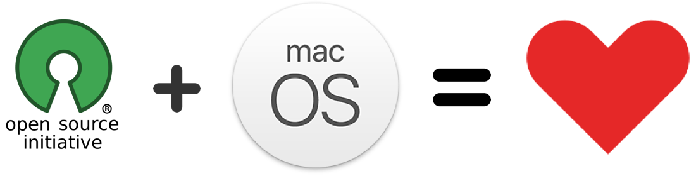
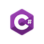
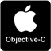
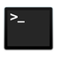

  
  
  
  <h1>Awesome macOS Open Source Applications</h1>
  
A curated list of open source applications for macOS

  

    
    
    
  

  

    
    
    
  

  <a href="#audio">Audio</a> •
  <a href="#backup">Backup</a> •
  <a href="#browser">Browser</a> •
  <a href="#chat">Chat</a> •
  <a href="#cryptocurrency">Crypto</a> •
  <a href="#database">Database</a> •
  <a href="#development">Dev</a> •
  <a href="#editors">Editors</a> •
  <a href="#graphics">Graphics</a> •
  <a href="#productivity">Productivity</a> •
  <a href="#utilities">Utilities</a>

List of awesome open source applications for macOS. This list contains a lot of native, and cross-platform apps. The main goal of this repository is to find free open source apps and start contributing. Feel free to [contribute](CONTRIBUTING.md) to the list, any suggestions are welcome!

To receive all new or popular applications you can join our [telegram channel](https://t.me/opensourcemacosapps).

## Support

Hey friend! Help me out for a couple of :beers:!  

## 📊 Statistics

| Metric | Count |
|--------|-------|
| 📱 Total Applications | 689 |
| 📂 Categories | 49 |
| 🔝 Top Languages | Swift: 305 • Objective-C: 137 • Javascript: 113 • C++: 59 • Typescript: 41 |

## Languages

You can see in which language an app is written. Currently there are following languages:

| Language | Icon |
|----------|------|
| C |  |
| C++ |  |
| C# |  |
| Clojure |  |
| CoffeeScript |  |
| CSS |  |
| Elm |  |
| Go |  |
| Haskell |  |
| Java |  |
| JavaScript |  |
| Lua |  |
| Objective-C |  |
| Python |  |
| Ruby |  |
| Rust |  |
| Shell |  |
| Swift |  |
| TypeScript |  |
| Metal |  |

## Contents
- [Audio](#audio)
- [Backup](#backup)
- [Browser](#browser)
- [Chat](#chat)
- [Cryptocurrency](#cryptocurrency)
- [Database](#database)
- [Development](#development)
- [Git](#git)
- [iOS / macOS](#ios--macos)
- [JSON Parsing](#json-parsing)
- [Web development](#web-development)
- [Other development](#other-development)
- [Downloader](#downloader)
- [Editors](#editors)
- [CSV](#csv)
- [JSON](#json)
- [Markdown](#markdown)
- [TeX](#tex)
- [Text](#text)
- [Extensions](#extensions)
- [Finder](#finder)
- [Games](#games)
- [Graphics](#graphics)
- [IDE](#ide)
- [Images](#images)
- [Keyboard](#keyboard)
- [Mail](#mail)
- [Menubar](#menubar)
- [Music](#music)
- [News](#news)
- [Notes](#notes)
- [Other](#other)
- [Podcast](#podcast)
- [Productivity](#productivity)
- [Screensaver](#screensaver)
- [Security](#security)
- [Sharing Files](#sharing-files)
- [Social Networking](#social-networking)
- [Streaming](#streaming)
- [System](#system)
- [Terminal](#terminal)
- [Touch Bar](#touch-bar)
- [Utilities](#utilities)
- [VPN & Proxy](#vpn--proxy)
- [Video](#video)
- [Wallpaper](#wallpaper)
- [Window Management](#window-management)

## Applications
### 🎵 Audio (39)
- [[Un]MuteMic](https://github.com/CocoaHeadsBrasil/MuteUnmuteMic) - macOS app to mute & unmute the input volume of your microphone. Perfect for podcasters.

  **Languages:**  Objective-C  C 

  

  
Screenshots

  

  

  

  

- [Audacity](https://github.com/audacity/audacity) - Free, open source, cross-platform audio software

  **Languages:**  C 

  **Website:** [https://www.audacityteam.org/](https://www.audacityteam.org/)

  

  
Screenshots

  

  

  

  

- [AUHost](https://github.com/vgorloff/AUHost) - Application which hosts AudioUnits v3 using AVFoundation API. 

  **Languages:**  Swift 

  

  
Screenshots

  

  

  

  

- [Aural Player](https://github.com/kartik-venugopal/aural-player) - Aural Player is a audio player application for the macOS platform. Inspired by the classic Winamp player for Windows, it is designed to be to-the-point and easy to use. 

  **Languages:**  Swift 

  

  
Screenshots

  

  

  

  

  *(5 more screenshots available in the repository)*

  

  

- [AutoMute](https://github.com/yonilevy/automute) - Automatically mute the sound when headphones disconnect / Mac awake from sleep.

  **Languages:**  Objective-C 

  **Website:** [https://yoni.ninja/automute/](https://yoni.ninja/automute/)

  

  
Screenshots

  

  

  

  

  

- [Background Music](https://github.com/kyleneideck/BackgroundMusic) - Background Music, a macOS audio utility: automatically pause your music, set individual apps' volumes and record system audio. 

  **Languages:**  C++ 

  

  
Screenshots

  

  

  

  

- [BlackHole](https://github.com/ExistentialAudio/BlackHole) - BlackHole is a modern macOS virtual audio driver that allows applications to pass audio to other applications with zero additional latency.

  **Languages:**  C 

- [CAM](https://github.com/hanayik/CAM) - macOS camera recording using ffmpeg 

  **Languages:**  JavaScript 

  

  
Screenshots

  

  

  

  

  *(1 more screenshots available in the repository)*

  

  

- [Clementine](https://github.com/clementine-player/Clementine) - Clementine is a modern music player and library organizer for Windows, Linux and macOS. 

  **Languages:**  C++ 

  **Website:** [https://www.clementine-player.org/](https://www.clementine-player.org/)

  

  
Screenshots

  

  

  

  

  *(1 more screenshots available in the repository)*

  

  

- [Cog](https://bitbucket.org/losnoco/cog/src) - Cog is an open source audio player for macOS. The basic layout is a single-paned playlist interface with two retractable drawers, one for navigating the user's music folders and another for viewing audio file properties, like bitrate.

  **Languages:**  Objective-C 

  **Website:** [https://cogx.org/](https://cogx.org/)

- [eqMac2](https://github.com/bitgapp/eqMac) - System-Wide Equalizer for the Mac. 

  **Languages:**  C++ 

  

  
Screenshots

  

  

  

  

  

- [fre:ac](https://github.com/enzo1982/freac) - The fre:ac audio converter project. 

  **Languages:**  C++ 

  

  
Screenshots

  

  

  

  

- [iTunes-Volume-Control](https://github.com/alberti42/iTunes-Volume-Control) - This app allows you to control the iTunes volume using volume up and volume down hotkeys. 

  **Languages:**  Objective-C 

  

  
Screenshots

  

  

  

  

- [jmc](https://github.com/jcm93/jmc) - jmc is new macOS media organizer. 

  **Languages:**  Swift 

  

  
Screenshots

  

  

  

  

  *(1 more screenshots available in the repository)*

  

  

- [Karaoke Forever](https://github.com/bhj/KaraokeEternal) - Host awesome karaoke parties where everyone can queue songs from their phone's browser. Plays MP3+G and MP4 with WebGL visualizations.

  **Languages:**  JavaScript 

  **Website:** [https://www.karaoke-eternal.com/](https://www.karaoke-eternal.com/)

  

  
Screenshots

  

  

  

  

- [LocalRadio](https://github.com/dsward2/LocalRadio) - LocalRadio is software for listening to "Software-Defined Radio" on your Mac and mobile devices. 

  **Languages:**  Objective-C 

  

  
Screenshots

  

  

  

  

- [LosslessCut](https://github.com/mifi/lossless-cut) - The swiss army knife of lossless video/audio editing without re-encoding.

  **Languages:**  JavaScript 

  **Website:** [https://mifi.no/losslesscut/](https://mifi.no/losslesscut/)

  

  
Screenshots

  

  

  

  

- [LyricGlow](https://github.com/ateymoori/lyricglow) - macOS application displaying synchronized lyrics with animated word-by-word glow effects for Spotify, Apple Music, and YouTube Music.

  **Languages:**  JavaScript 

  

  
Screenshots

  

  

  

  

  

  

- [Lyricism](https://github.com/lyc2345/Lyricism) - macOS app to show you lyric what currently iTunes or Spotify is playing. 

  **Languages:**  Objective-C  Swift 

  

  
Screenshots

  

  

  

  

  

  

- [LyricsX](https://github.com/ddddxxx/LyricsX) - Lyrics for iTunes, Spotify and Vox. 

  **Languages:**  Swift 

  

  
Screenshots

  

  

  

  

  *(1 more screenshots available in the repository)*

  

  

- [MonitorControl](https://github.com/MonitorControl/MonitorControl) - Control your external monitor brightness, contrast or volume directly from a menulet or with keyboard native keys.

  **Languages:**  Swift  Objective-C 

  

  
Screenshots

  

  

  

  

- [Mous Player](https://github.com/bsdelf/mous) - Simple yet powerful audio player for BSD/Linux/macOS. 

  **Languages:**  C++ 

  

  
Screenshots

  

  

  

  

  *(2 more screenshots available in the repository)*

  

  

- [MPV](https://github.com/mpv-player/mpv) - Lightweight, highly configurable media player.

  **Languages:**  C 

  **Website:** [https://mpv.io](https://mpv.io)

  

  
Screenshots

  

  

  

  

- [NoiseBuddy](https://github.com/insidegui/NoiseBuddy) - Control the listening mode on your AirPods Pro in the Touch Bar or Menu Bar.

  **Languages:**  Swift 

- [PlayStatus](https://github.com/nbolar/PlayStatus) - PlayStatus is a macOS app that allows the control of Spotify and iTunes music playback from the menu bar.

  **Languages:**  Swift 

  

  
Screenshots

  

  

  

  

- [Plug](https://github.com/wulkano/Plug) - Discover and listen to music from Hype Machine.

  **Languages:**  Swift 

  **Website:** [https://www.plugformac.com/](https://www.plugformac.com/)

  

  
Screenshots

  

  

  

  

- [Pulp](https://github.com/bazalp/pulp) - Audio Sample manager.

  **Languages:**  Rust  TypeScript 

  

  
Screenshots

  

  

  

  

- [Scope](https://github.com/billthefarmer/audiotools/tree/master/Scope/swift) - Audio Oscilloscope

  **Languages:**  Swift 

  **Website:** [https://billthefarmer.github.io/audiotools/](https://billthefarmer.github.io/audiotools/)

  

  
Screenshots

  

  

  

  

- [shairport-sync](https://github.com/mikebrady/shairport-sync) - macOS/Linux/FreeBSD/OpenBSD Airplay audio receiver.

  **Languages:**  C  C++ 

- [ShazamScrobbler](https://github.com/ShazamScrobbler/shazamscrobbler-macos) - Scrobble vinyl, radios, movies to Last.fm. 

  **Languages:**  Objective-C 

  

  
Screenshots

  

  

  

  

- [Sonora](https://github.com/sonoramac/Sonora) - Minimal, beautifully designed music player for macOS. 

  **Languages:**  Objective-C 

  

  
Screenshots

  

  

  

  

- [Spotify4BigSur](https://github.com/fabiusBile/Spotify4BigSur) - Spotify widget for Notification Center.

  **Languages:**  Swift 

  

  
Screenshots

  

  

  

  

- [SpotMenu](https://github.com/kmikiy/SpotMenu) - Spotify and iTunes in your menu bar.

  **Languages:**  Objective-C  Swift 

  

  
Screenshots

  

  

  

  

- [SpotSpot](https://github.com/will-stone/SpotSpot) - Spotify mini-player for macOS. 

  **Languages:**  JavaScript 

- [StargateDAW](https://github.com/stargatedaw/stargate) - An all-in-one digital audio workstation (DAW) and plugin suite

  **Languages:**  C  Python 

  

  
Screenshots

  

  

  

  

  *(3 more screenshots available in the repository)*

  

  

- [Suohai](https://github.com/Sunnyyoung/Suohai) - Audio input/output source lock for macOS. 

  **Languages:**  Swift 

  

  
Screenshots

  

  

  

  

- [Tickeys](https://github.com/yingDev/Tickeys) - Instant audio feedback for typing. macOS version. 

  **Languages:**  Rust 

  

  
Screenshots

  

  

  

  

  

  

- [Tuner](https://github.com/billthefarmer/ctuner) - Musical Instrument Tuner

  **Languages:**  Swift 

  **Website:** [https://billthefarmer.github.io/ctuner/ ](https://billthefarmer.github.io/ctuner/ )

  

  
Screenshots

  

  

  

  

  

  

- [waveSDR](https://github.com/getoffmyhack/waveSDR) - macOS native desktop Software Defined Radio application using the RTL-SDR USB device. 

  **Languages:**  Swift 

  

  
Screenshots

  

  

  

  

### 💾 Backup (6)
- [backy](https://github.com/vdbsh/backy) - Tiny multiprocessing utility for file backups.

  **Languages:**  Go 

- [BorgBase/Vorta](https://github.com/borgbase) - Simple and Secure Offsite Backups

  **Languages:**  Python 

  **Website:** [https://www.borgbase.com/](https://www.borgbase.com/)

- [Mackup](https://github.com/lra/mackup) - Keep your application settings in sync (macOS/Linux). 

  **Languages:**  Python 

- [shallow-backup](https://github.com/alichtman/shallow-backup) - Easily create lightweight documentation of installed applications, dotfiles, and more. 

  **Languages:**  Python 

  

  
Screenshots

  

  

  

  

- [Syncalicious](https://github.com/zenangst/Syncalicious) - Keeping multiple macOS preferences in sync can be painful, but it shouldn't be.

  **Languages:**  Swift 

- [UrBackup](https://github.com/uroni/urbackup_backend) - UrBackup is Client/Server network backup for Windows, macOS and Linux.

  **Languages:**  C++  C 

### 🌐 Browser (13)
- [Beaker Browser](https://github.com/beakerbrowser/beaker) - Beaker is an experimental peer-to-peer Web browser.  

  **Languages:**  JavaScript 

  

  
Screenshots

  

  

  

  

  

- [Brave Browser](https://github.com/brave/brave-browser) - Brave browser for Desktop and Laptop computers running Windows, macOS, and Linux. 

  **Languages:**  JavaScript 

- [browserosaurus](https://github.com/will-stone/browserosaurus) - macOS tool that prompts you to choose a browser when opening a link. 

  **Languages:**  JavaScript 

- [Chromium](https://chromium.googlesource.com/chromium/src/) - Chromium is an open-source browser project that aims to build a safer, faster, and more stable way for all users to experience the web.

  **Languages:**  JavaScript  C++  C 

  **Website:** [https://www.chromium.org/](https://www.chromium.org/)

- [Finicky](https://github.com/johnste/finicky) - Always opens the right browser. 

  **Languages:**  Swift 

- [Firefox](https://hg.mozilla.org/mozilla-central/) - Fast, privacy aware browser from a non-profit. Runs on Windows, macOS and Linux. 

  **Languages:**  JavaScript  Rust  C++ 

  **Website:** [https://www.mozilla.org/en-US/firefox/browsers/](https://www.mozilla.org/en-US/firefox/browsers/)

- [Helium](https://github.com/JadenGeller/Helium) - Floating browser window for macOS.

  **Languages:**  Objective-C  Swift 

- [Min Browser](https://github.com/minbrowser/min) - A fast and efficient minimal web browser.

  **Languages:**  JavaScript 

  **Website:** [https://minbrowser.org](https://minbrowser.org)

- [otter-browser](https://github.com/OtterBrowser/otter-browser) - Otter Browser aims to recreate the best aspects of the classic Opera (12.x) UI using Qt5.  

  **Languages:**  C++ 

  

  
Screenshots

  

  

  

  

- [Pennywise](https://github.com/kamranahmedse/pennywise) - Pennywise opens any website or media in a small floating window that remains on top of all other applications. It's a great alternative to Helium.

  **Languages:**  JavaScript 

  

  
Screenshots

  

  

  

  

  *(1 more screenshots available in the repository)*

  

  

- [Plash](https://github.com/sindresorhus/Plash) - Make any website your desktop wallpaper.

  **Languages:**  Swift 

  **Website:** [https://sindresorhus.com/plash](https://sindresorhus.com/plash)

  

  
Screenshots

  

  

  

  

- [Privacy Redirect for Safari](https://github.com/smmr-software/privacy-redirect-safari) - Redirect Twitter, YouTube, Reddit, Google Maps, Google Search, and Google Translate to privacy friendly alternatives.

  **Languages:**  Swift 

- [seb-mac](https://github.com/SafeExamBrowser/seb-mac) - Safe Exam Browser for macOS and iOS. 

  **Languages:**  C 

### 💬 Chat (20)
- [Adium](https://github.com/adium/adium) - Instant messaging application that can connect to XMPP (Jabber), IRC and more.

  **Languages:**  C 

  **Website:** [https://adium.im/](https://adium.im/)

  

  
Screenshots

  

  

  

  

- [Beagle IM](https://github.com/tigase/beagle-im) - Powerful XMPP client with support for file transfer, VoIP and end-to-end encryption.

  **Languages:**  Swift 

  **Website:** [https://beagle.im/](https://beagle.im/)

  

  
Screenshots

  

  

  

  

- [ChitChat](https://github.com/stonesam92/ChitChat) - Native Mac app wrapper for WhatsApp Web. 

  **Languages:**  Objective-C 

  

  
Screenshots

  

  

  

  

- [Electronic WeChat](https://github.com/geeeeeeeeek/electronic-wechat) - Better WeChat on macOS and Linux. 

  **Languages:**  JavaScript 

  

  
Screenshots

  

  

  

  

- [Element](https://github.com/vector-im/element-web) - Element is a collaboration app (currently Electron) for the [Matrix](https://matrix.org/) protocol.

  **Languages:**  JavaScript 

- [Franz](https://github.com/meetfranz/franz) - Franz is messaging application for services like WhatsApp, Slack, Messenger and many more. 

  **Languages:**  JavaScript 

  

  
Screenshots

  

  

  

  

- [Google Allo for Desktop](https://github.com/kelyvin/Google-Allo-For-Desktop) - Native macOS & Windows desktop app for Google Allo. 

  **Languages:**  JavaScript 

  

  
Screenshots

  

  

  

  

- [GroupMe](https://github.com/dcrousso/GroupMe) - Unofficial GroupMe App.

  **Languages:**  JavaScript  CSS 

  

  
Screenshots

  

  

  

  

- [MessagesHistoryBrowser](https://github.com/glaurent/MessagesHistoryBrowser) - macOS application to comfortably browse and search through your Messages.app history. 

  **Languages:**  Swift 

- [RocketChat](https://github.com/RocketChat/Rocket.Chat.Electron) - Free open source chat system for teams. An alternative to Slack that can also be self hosted.

  **Languages:**  JavaScript 

  **Website:** [https://www.rocket.chat/](https://www.rocket.chat/)

- [Seaglass](https://github.com/neilalexander/seaglass) - A truly native [Matrix](https://matrix.org/blog/home/) client for macOS. 

  **Languages:**  Swift 

  

  
Screenshots

  

  

  

  

- [Signal Desktop](https://github.com/signalapp/Signal-Desktop) - Electron app that links with your Signal Android or Signal iOS app. 

  **Languages:**  JavaScript 

- [Swiftcord](https://github.com/SwiftcordApp/Swiftcord) - Native Discord client built in Swift & SwiftUI. Light on your RAM and CPU.

  **Languages:**  Swift 

  

  
Screenshots

  

  

  

  

- [Telegram](https://github.com/overtake/TelegramSwift) - Source code of Telegram for macOS on Swift. 

  **Languages:**  Swift 

- [Telegram Desktop](https://github.com/telegramdesktop/tdesktop) - Telegram Desktop messaging app. 

  **Languages:**  C++ 

  

  
Screenshots

  

  

  

  

- [Textual](https://github.com/Codeux-Software/Textual) - Textual is an IRC client for macOS. 

  **Languages:**  Objective-C 

  

  
Screenshots

  

  

  

  

  *(1 more screenshots available in the repository)*

  

  

- [Thunderbird](https://hg.mozilla.org/mozilla-central) - Backed by Mozilla, Thunderbird is an extensible email, newsfeed, chat, and calendaring client.

  **Languages:**  C++  JavaScript  Rust 

  **Website:** [https://www.thunderbird.net/en-US/](https://www.thunderbird.net/en-US/)

  

  
Screenshots

  

  

  

  

  

  

- [Torchat-Mac](https://github.com/javerous/TorChat-Mac) - TorChat for Mac is a macOS native and unofficial port of torchat. 

  **Languages:**  Objective-C 

- [WhatsAppBar](https://github.com/aldychris/WhatsAppBar) - Send WhatsApp message from menu bar. 

  **Languages:**  Swift 

  

  
Screenshots

  

  

  

  

  

  

- [Wire Desktop](https://github.com/wireapp/wire-desktop) - Standalone Electron app for the chatapp Wire. 

  **Languages:**  JavaScript 

### 💰 Cryptocurrency (5)
- [Bitcoin Core](https://github.com/bitcoin/bitcoin) - Official Bitcoin Core software for running a full Bitcoin node.

  **Languages:** <code>C++</code>  Python  Shell 

  **Website:** [https://bitcoincore.org/](https://bitcoincore.org/)

  

  
Screenshots

  

  

  

  

- [CoinBar](https://github.com/adamwaite/CoinBar) - macOS menu bar application for tracking crypto coin prices. 

  **Languages:**  Swift 

  

  
Screenshots

  

  

  

  

  *(1 more screenshots available in the repository)*

  

  

- [Copay](https://github.com/bitpay/copay) - A secure bitcoin wallet platform for both desktop and mobile devices. 

  **Languages:**  TypeScript 

- [Crypto Bar](https://github.com/geraldoramos/crypto-bar) - macOS menu bar application built with Electron. 

  **Languages:**  JavaScript 

- [Float coin](https://github.com/kaunteya/FloatCoin) - Native menu bar app with floating window and support for many Exchanges. 

  **Languages:**  Swift 

  

  
Screenshots

  

  

  

  

### 🗄️ Database (19)
- [Bdash](https://github.com/bdash-app/bdash) - Simple SQL Client for lightweight data analysis.

  **Languages:**  JavaScript 

  

  
Screenshots

  

  

  

  

  

- [Beekeeper Studio](https://github.com/beekeeper-studio/beekeeper-studio) - SQL editor and manager with support for SQLite, MySQL, MariaDB, Postgres, CockroachDB, SQL Server, and Amazon Redshift.

  **Languages:**  JavaScript 

  **Website:** [https://www.beekeeperstudio.io](https://www.beekeeperstudio.io)

  

  
Screenshots

  

  

  

  

  

- [DB Browser for SQLite](https://github.com/sqlitebrowser/sqlitebrowser) - SQLite database management GUI. 

  **Languages:**  C++ 

  

  
Screenshots

  

  

  

  

- [DBeaver](https://github.com/dbeaver/dbeaver) - Universal database tool and SQL client. 

  **Languages:**  Java 

  

  
Screenshots

  

  

  

  

  *(1 more screenshots available in the repository)*

  

  

- [DbGate](https://github.com/dbgate/dbgate) - Database manager for MySQL, PostgreSQL, SQL Server, MongoDB, SQLite and others. Runs under Windows, Linux, Mac or as web application.

  **Languages:**  JavaScript  TypeScript 

  **Website:** [https://dbgate.org](https://dbgate.org)

  

  
Screenshots

  

  

  

  

  *(6 more screenshots available in the repository)*

  

  

- [Medis](https://github.com/luin/medis) - 💻 Medis is a beautiful, easy-to-use Mac database management application for Redis.

  **Languages:**  JavaScript 

  

  
Screenshots

  

  

  

  

- [mongoDB.app](https://github.com/gcollazo/mongodbapp) - The easiest way to get started with mongoDB on the Mac. 

  **Languages:**  Swift 

  

  
Screenshots

  

  

  

  

- [MongoHub](https://github.com/jeromelebel/MongoHub-Mac) - Add another lightweight Mac Native MongoDB client.

  **Languages:**  Objective-C  C 

- [Postbird](https://github.com/Paxa/postbird) - PostgreSQL GUI client for macOS. 

  **Languages:**  JavaScript 

  

  
Screenshots

  

  

  

  

  

  

- [Postgres.app](https://github.com/PostgresApp/PostgresApp) - The easiest way to get started with PostgreSQL on the Mac. 

  **Languages:**  Swift 

- [Redis Desktop Manager](https://github.com/uglide/RedisDesktopManager) - Cross-platform open source database management tool for Redis ®

  **Languages:**  C++ 

  

  
Screenshots

  

  

  

  

- [redis-pro](https://github.com/cmushroom/redis-pro) - Redis management with SwiftUI.

  **Languages:**  Swift 

  

  
Screenshots

  

  

  

  

- [Redis.app](https://github.com/jpadilla/redisapp) - The easiest way to get started with Redis on the Mac. 

  **Languages:**  Swift 

  

  
Screenshots

  

  

  

  

- [reventlou](https://github.com/b3z/reventlou) - Personal database as an information management system.

  **Languages:**  TypeScript  Swift 

  

  
Screenshots

  

  

  

  

- [Robo 3T](https://github.com/Studio3T/robomongo) - Robo 3T (formerly Robomongo) is the free lightweight GUI for MongoDB enthusiasts. 

  **Languages:**  C++ 

  

  
Screenshots

  

  

  

  

- [Sequel Ace](https://github.com/Sequel-Ace/Sequel-Ace) - Sequel Ace is a fast, easy-to-use Mac database management application for working with MySQL & MariaDB databases.

  **Languages:**  Objective-C 

  **Website:** [https://sequel-ace.com/](https://sequel-ace.com/)

- [Sequel Pro](https://github.com/sequelpro/sequelpro) - MySQL/MariaDB database management for macOS.  

  **Languages:**  Objective-C 

  

  
Screenshots

  

  

  

  

  

- [sqlectron](https://github.com/sqlectron/sqlectron-gui) - A simple and lightweight SQL client desktop/terminal with cross database and platform support.

  **Languages:**  TypeScript 

  **Website:** [https://sqlectron.github.io/](https://sqlectron.github.io/)

  

  
Screenshots

  

  

  

  

- [TablePro](https://github.com/TableProApp/TablePro) - Native macOS database client for MySQL, PostgreSQL, SQLite, MongoDB, Redis, and 15+ more.

  **Languages:**  Swift 

  **Website:** [https://tablepro.app](https://tablepro.app)

### 👨‍💻 Development (16)
- [Apache Netbeans](https://github.com/apache/netbeans) - Apache NetBeans is an IDE, Tooling Platform and Application Framework suitable for development in Java, JavaScript, PHP, HTML5, CSS, and more.

  **Languages:**  Java 

  **Website:** [https://netbeans.apache.org/](https://netbeans.apache.org/)

  

  
Screenshots

  

  

  

  

  

- [Brackets](https://github.com/brackets-cont/brackets) - Modern open-source code editor for HTML, CSS and JavaScript that's built in HTML, CSS and JavaScript.

  **Languages:**  JavaScript 

  **Website:** [https://brackets.io/](https://brackets.io/)

  

  
Screenshots

  

  

  

  

- [Clipboard](https://github.com/Slackadays/Clipboard) - An easy-to-use clipboard manager with time saving features that work across all terminals.

  **Languages:**  C++ 

  **Website:** [https://GetClipboard.app](https://GetClipboard.app)

  

  
Screenshots

  

  

  

  

  

- [ColorSet](https://github.com/DigiDNA/ColorSet) - ColorSet is a macOS utility and framework allowing developers to manage custom interface colors with ease.

  **Languages:**  Swift  C#  Objective-C 

  **Website:** [https://imazing.com/colorset](https://imazing.com/colorset)

  

  
Screenshots

  

  

  

  

- [DevLint](https://github.com/csprasad/DevLint) - A lightweight app for formatting and correcting Swift syntax.

  **Languages:**  Swift 

  

  
Screenshots

  

  

  

  

  

- [Eclipse](https://github.com/eclipse-platform/eclipse.platform) - Eclipse is an open-source integrated development environment (IDE) used in computer programming, featuring a base workspace and an extensible plug-in system for customizing the environment.

  **Languages:**  Java 

  **Website:** [https://www.eclipse.org](https://www.eclipse.org)

- [GitAhead](https://github.com/gitahead/gitahead/) - A graphical Git client designed to help you understand and manage your source code history.

  **Languages:**  C++  C 

  **Website:** [https://gitahead.github.io/gitahead.com/](https://gitahead.github.io/gitahead.com/)

- [Gridfy](https://github.com/Slllava/gridfy) - Quickly calculate column widths and get correct results for your grid.

  **Languages:**  JavaScript  TypeScript 

  **Website:** [https://gridfy.astroon.pro/](https://gridfy.astroon.pro/)

  

  
Screenshots

  

  

  

  

  

  

- [JustTags](https://github.com/kaphacius/just-tags) - JustTags in a macOS app for working with BERTLV EMV tags.

  **Languages:**  Swift 

  **Website:** [https://kaphacius.github.io/just-tags/](https://kaphacius.github.io/just-tags/)

  

  
Screenshots

  

  

  

  

  

- [KiCad](https://gitlab.com/kicad/code/kicad) - A software suite for electronic design automation.

  **Languages:**  C++  C 

  **Website:** [https://www.kicad.org/](https://www.kicad.org/)

- [Layout Designer for UICollectionView](https://github.com/amirdew/CollectionViewPagingLayout) - A simple but powerful tool that helps you make complex layouts for UICollectionView.

  **Languages:**  Swift 

  **Website:** [https://apps.apple.com/nl/app/layout-designer/id1507238011?l=en&mt=12](https://apps.apple.com/nl/app/layout-designer/id1507238011?l=en&mt=12)

  

  
Screenshots

  

  

  

  

- [LocationSimulator](https://github.com/Schlaubischlump/LocationSimulator) - Application to spoof your iOS or iPhoneSimulator location.

  **Languages:**  Swift 

  **Website:** [https://schlaubischlump.github.io/LocationSimulator](https://schlaubischlump.github.io/LocationSimulator)

  

  
Screenshots

  

  

  

  

- [M-Courtyard](https://github.com/Mcourtyard/m-courtyard) - Desktop app for fine-tuning LLMs on Apple Silicon Macs with zero code. Import documents, generate training datasets with AI, LoRA fine-tune, test, and export to Ollama — entirely offline.

  **Languages:**  TypeScript  Rust  Python 

  **Website:** [https://github.com/Mcourtyard/m-courtyard](https://github.com/Mcourtyard/m-courtyard)

  

  
Screenshots

  

  

  

  

  

  

- [Pasteboard Viewer](https://github.com/sindresorhus/Pasteboard-Viewer) - Inspect the system pasteboards.

  **Languages:**  Swift 

  **Website:** [https://sindresorhus.com/pasteboard-viewer](https://sindresorhus.com/pasteboard-viewer)

  

  
Screenshots

  

  

  

  

- [Stringz](https://github.com/mohakapt/Stringz) - A lightweight and powerful editor for localizing iOS, macOS, tvOS, and watchOS applications.

  **Languages:**  Swift 

  

  
Screenshots

  

  

  

  

  

- [utmapp](https://github.com/utmapp/) - Virtualization for other operating systems.

  **Languages:**  Swift  Objective-C 

  **Website:** [https://mac.getutm.app/](https://mac.getutm.app/)

  

  
Screenshots

  

  

  

  

#### 📦 Git (20)
- [Cashew](https://github.com/dhennessy/OpenCashew) - Cashew macOS Github Issue Tracker.

  **Languages:**  Objective-C  C 

- [Git Interactive Rebase Tool](https://github.com/MitMaro/git-interactive-rebase-tool) - Full feature terminal based sequence editor for interactive rebase.

  **Languages:**  Rust 

  **Website:** [https://gitrebasetool.mitmaro.ca/](https://gitrebasetool.mitmaro.ca/)

  

  
Screenshots

  

  

  

  

- [GitAhead](https://github.com/gitahead/gitahead/) - A graphical Git client designed to help you understand and manage your source code history.

  **Languages:**  C++  C 

  **Website:** [https://gitahead.github.io/gitahead.com/](https://gitahead.github.io/gitahead.com/)

- [GitBlamePR](https://github.com/maoyama/GitBlamePR) - Mac app that shows pull request last modified each line of a file

  **Languages:**  Swift 

- [Gitee](https://github.com/Nightonke/Gitee) - Gitee, macOS status bar application for Github.

  **Languages:**  Objective-C  Swift 

  

  
Screenshots

  

  

  

  

  *(11 more screenshots available in the repository)*

  

  

- [Github contributions](https://github.com/remirobert/Github-contributions) - GitHub contributions app, for iOS, WatchOS, and macOS. 

  **Languages:**  Swift 

  

  
Screenshots

  

  

  

  

- [GitHub Desktop](https://github.com/desktop/desktop) - Simple collaboration from your desktop. 

  **Languages:**  TypeScript 

  

  
Screenshots

  

  

  

  

- [GithubListener](https://github.com/ad/GithubListener) - Simple app that will notify about new commits to watched repositories. 

  **Languages:**  Swift 

  

  
Screenshots

  

  

  

  

- [GithubNotify](https://github.com/erik/github-notify) - Simple macOS app to alert you when you have unread GitHub notifications. 

  **Languages:**  Swift 

- [Gitify](https://github.com/manosim/gitify) - Your GitHub notifications on your menu bar.

  **Languages:**  JavaScript 

  **Website:** [https://www.gitify.io/](https://www.gitify.io/)

  

  
Screenshots

  

  

  

  

- [GitSync](https://github.com/eonist/GitSync) - Minimalistic Git client for Mac. 

  **Languages:**  Swift 

  

  
Screenshots

  

  

  

  

- [GitUp](https://github.com/git-up/GitUp) - The Git interface you've been missing all your life has finally arrived. 

  **Languages:**  Objective-C 

  

  
Screenshots

  

  

  

  

  *(2 more screenshots available in the repository)*

  

  

- [GitX](https://github.com/gitx/gitx) - Graphical client for the git version control system. 

  **Languages:**  Objective-C 

- [GPM](https://github.com/mtgto/GPM) - macOS application for easily operating GitHub Projects. 

  **Languages:**  Swift 

- [osagitfilter](https://github.com/doekman/osagitfilter) - Filter to put OSA languages (AppleScript, JavaScript) into git, as if they where plain text-files.

  **Languages:**  Shell <code>applescript</code> 

- [Streaker](https://github.com/jamieweavis/streaker) - GitHub contribution streak tracking menubar app. 

  **Languages:**  JavaScript 

  

  
Screenshots

  

  

  

  

- [TeamStatus-for-GitHub](https://github.com/marcinreliga/TeamStatus-for-GitHub) - macOS status bar application for tracking code review process within the team. 

  **Languages:**  Swift 

  

  
Screenshots

  

  

  

  

- [Tempo](https://github.com/maoyama/Tempo) - Replace the Git CLI with a clear UI and AI assist.

  **Languages:**  Swift 

  

  
Screenshots

  

  

  

  

  

- [Trailer](https://github.com/ptsochantaris/trailer) - Managing Pull Requests and Issues For GitHub & GitHub Enterprise. 

  **Languages:**  Swift 

  

  
Screenshots

  

  

  

  

- [Xit](https://github.com/Uncommon/Xit) - Xit is a graphical tool for working with git repositories. 

  **Languages:**  Swift 

  

  
Screenshots

  

  

  

  

#### 🔄 JSON Parsing (4)
- [j2s](https://github.com/zadr/j2s) - macOS app to convert JSON objects into Swift structs (currently targets Swift 4 and Codable). 

  **Languages:**  Swift 

- [JSON Mapper](https://github.com/AppCraft-LLC/json-mapper) - Simple macOS app to generate Swift Object Mapper classes from JSON. 

  **Languages:**  Swift 

- [JSON to Model class](https://github.com/chanonly123/Json-Model-Generator) - Template based highly customizable macOS app to generate classes from JSON string, supports many languages. 

  **Languages:**  Swift 

  

  
Screenshots

  

  

  

  

- [JSONExport](https://github.com/Ahmed-Ali/JSONExport) - Desktop application for macOS which enables you to export JSON objects as model classes with their associated constructors, utility methods, setters and getters in your favorite language. 

  **Languages:**  Swift 

  

  
Screenshots

  

  

  

  

#### 🔧 Other Development (5)
- [Boop](https://github.com/IvanMathy/Boop) - A scriptable scratchpad for developers.

  **Languages:**  Swift  JavaScript 

  **Website:** [https://boop.okat.best](https://boop.okat.best)

  

  
Screenshots

  

  

  

  

- [ChefInspector](https://github.com/Yasumoto/ChefInspector) - Node and Attribute viewer for Chef 

  **Languages:**  Swift 

  

  
Screenshots

  

  

  

  

- [macho-browser](https://github.com/dcsch/macho-browser) - Browser for macOS Mach-O binaries.  

  **Languages:**  Objective-C 

- [MQTTX](https://github.com/emqx/MQTTX) - An elegant Cross-platform MQTT 5.0 desktop client.

  **Languages:**  JavaScript  TypeScript 

  

  
Screenshots

  

  

  

  

  

- [vegvisir](https://github.com/ant4g0nist/vegvisir) - Browser based GUI for **LLDB** Debugger. 

  **Languages:**  JavaScript 

  

  
Screenshots

  

  

  

  

  *(5 more screenshots available in the repository)*

  

  

#### 🌍 Web Development (14)
- [aws-s3-uploader](https://github.com/RafalWilinski/s3-uploader) - Simple macOS app for uploading files to Amazon Web Services. 

  **Languages:**  JavaScript 

  

  
Screenshots

  

  

  

  

- [Corectl App for macOS](https://github.com/TheNewNormal/corectl.app) - Corectl App is a macOS Status bar App which works like a wrapper around the corectl command line tool corectld to control the server runtime process. 

  **Languages:**  Swift 

  

  
Screenshots

  

  

  

  

- [CoreOS VM](https://github.com/TheNewNormal/coreos-osx) - CoreOS VM is macOS status bar app which allows in an easy way to control CoreOS VM on your Mac. 

  **Languages:**  Objective-C 

  

  
Screenshots

  

  

  

  

- [HTTP Toolkit](https://github.com/httptoolkit/httptoolkit-desktop) - HTTP Toolkit is a cross-platform tool to intercept, debug & mock HTTP. 

  **Languages:**  TypeScript 

  **Website:** [https://httptoolkit.com/](https://httptoolkit.com/)

  

  
Screenshots

  

  

  

  

  

  

- [Insomnia](https://github.com/Kong/insomnia) - Insomnia is a cross-platform REST client, built on top of Electron. 

  **Languages:**  JavaScript 

  

  
Screenshots

  

  

  

  

- [iTunesConnect](https://github.com/trulyronak/itunesconnect) - macOS app to let you access iTunesConnect. 

  **Languages:**  Swift 

- [KubeMonitor](https://github.com/Daniel-Sanche/KubeMonitor) - KubeMonitor is a macOS app that displays information about your active Kubernetes cluster in your menu bar. 

  **Languages:**  Swift 

  

  
Screenshots

  

  

  

  

- [KubeSwitch](https://github.com/nsriram/KubeSwitch) - KubeSwitch lists the available kubernetes cluster contexts on the mac, in Mac's Menu bar.

  **Languages:**  Swift 

  

  
Screenshots

  

  

  

  

- [Lantern](https://github.com/RoyalIcing/Lantern) - Dedicated Mac app for website auditing and crawling. 

  **Languages:**  Swift 

- [LocalSites](https://github.com/plan44/localSites) - Simple Menu Bar (Status Bar) App for macOS listing local Bonjour websites (as Safari 11 no longer has Bonjour Bookmarks). 

  **Languages:**  Swift 

- [nodeScratchpad](https://github.com/vsaravind007/nodeScratchpad) - Evaluate Nodejs/JS code snippets from Menubar. 

  **Languages:**  Swift 

- [Requestly](https://github.com/requestly/requestly) - A lightweight open-source API Development, Testing & Mocking platform

  **Languages:**  JavaScript 

  **Website:** [https://requestly.com](https://requestly.com)

  

  
Screenshots

  

  

  

  

  

- [SimpleLocalize CLI](https://github.com/simplelocalize/simplelocalize-cli) - Open source tool for managing i18n keys in software projects.

  **Languages:**  Swift 

  **Website:** [https://simplelocalize.io](https://simplelocalize.io)

- [stts](https://github.com/inket/stts) - macOS app for monitoring the status of cloud services. 

  **Languages:**  Swift 

  

  
Screenshots

  

  

  

  

#### 📱 iOS / macOS (44)
- [AppBox](https://github.com/getappbox/AppBox-iOSAppsWirelessInstallation) - Tool for iOS developers to build and deploy Development, Ad-Hoc and In-house (Enterprise) applications directly to the devices from your Dropbox account. 

  **Languages:**  Objective-C 

  

  
Screenshots

  

  

  

  

  

  

- [AppIcons](https://github.com/kuyawa/AppIcons) - Tool for generating icons in all sizes as required by macOS and iOS apps. 

  **Languages:**  Swift 

  

  
Screenshots

  

  

  

  

- [AppStoreReviewTimes](https://github.com/arbel03/AppStoreReviewTimes) - Gives you indication about the average iOS / macOS app stores review times. 

  **Languages:**  Swift 

  

  
Screenshots

  

  

  

  

  

- [Asset Catalog Tinkerer](https://github.com/insidegui/AssetCatalogTinkerer) - App that lets you open .car files and browse/extract their images.

  **Languages:**  Objective-C  Swift 

  

  
Screenshots

  

  

  

  

  

  

- [Assets](https://github.com/e7711bbear/Assets) - Assets is a macOS app that manages assets for your development projects (Xcode, web, etc). 

  **Languages:**  Swift 

- [Attabench](https://github.com/attaswift/Attabench) - Attabench is a microbenchmarking app for macOS, designed to measure and visualize the performance of Swift code. 

  **Languages:**  Swift 

  

  
Screenshots

  

  

  

  

  

  

- [AVXCAssets Generator](https://github.com/angelvasa/AVXCAssets-Generator) - Takes path for your assets images and creates appiconset and imageset for you in just one click. 

  **Languages:**  Swift 

- [Board For GitHub](https://github.com/JustinFincher/BoardForGitHub) - Small application to monitor your GitHub project web page in a native macOS app :octocat:! 

  **Languages:**  Objective-C 

  

  
Screenshots

  

  

  

  

  

  

- [Brisk](https://github.com/br1sk/brisk) - macOS app for submitting radars. 

  **Languages:**  Swift 

  

  
Screenshots

  

  

  

  

  

- [calabash-launcher](https://github.com/xing/calabash-launcher) - iOS Calabash Launcher is a macOS app that helps you run and manage Calabash tests on your Mac. 

  **Languages:**  Swift 

  

  
Screenshots

  

  

  

  

  *(2 more screenshots available in the repository)*

  

  

- [Cleaner for Xcode](https://github.com/waylybaye/XcodeCleaner) - Cleaner for Xcode.app built with react-native-macOS. 

  **Languages:**  Objective-C 

- [Clendar](https://github.com/vinhnx/Clendar) - Clendar is an universal calendar app. Written in SwiftUI.

  **Languages:**  Swift 

  **Website:** [https://apps.apple.com/us/app/clendar-a-calendar-app/id1548102041](https://apps.apple.com/us/app/clendar-a-calendar-app/id1548102041)

  

  
Screenshots

  

  

  

  

  

- [CocoaRestClient](https://github.com/mmattozzi/cocoa-rest-client) - Native Apple macOS app for testing HTTP/REST endpoints. 

  **Languages:**  Objective-C 

  

  
Screenshots

  

  

  

  

  *(2 more screenshots available in the repository)*

  

  

- [Corona Tracker](https://github.com/MhdHejazi/CoronaTracker) - Coronavirus tracker app for iOS & macOS with maps & charts.

  **Languages:**  Swift 

  **Website:** [https://coronatracker.samabox.com/](https://coronatracker.samabox.com/)

  

  
Screenshots

  

  

  

  

  

- [DevLint](https://github.com/csprasad/DevLint) - A lightweight app for formatting and correcting Swift syntax.

  **Languages:**  Swift 

  

  
Screenshots

  

  

  

  

  

- [FilterShop](https://github.com/KrisYu/FilterShop) - macOS App to explore CoreImage Filters. 

  **Languages:**  Swift 

  

  
Screenshots

  

  

  

  

- [IconGenerator](https://github.com/onmyway133/IconGenerator) - macOS app to generate app icons. 

  **Languages:**  JavaScript 

  

  
Screenshots

  

  

  

  

  

- [Iconizer](https://github.com/raphaelhanneken/iconizer) - Create Xcode image catalogs (xcassets) on the fly. 

  **Languages:**  Swift 

  

  
Screenshots

  

  

  

  

- [Iconology](https://github.com/liamrosenfeld/Iconology) - Edit icons and then export to Xcode, icns, ico, favicon, macOS iconset, or a custom collection. 

  **Languages:**  Swift 

  **Website:** [https://apps.apple.com/us/app/iconology/id1463452867](https://apps.apple.com/us/app/iconology/id1463452867)

  

  
Screenshots

  

  

  

  

- [Icons.app](https://github.com/SAP/macos-icon-generator) - App for macOS which is designed to generate consistent sized icons of an existing application in various states, jiggling (shaking) etc. 

  **Languages:**  Objective-C 

- [InjectionIII](https://github.com/johnno1962/InjectionIII) - overdue Swift rewrite of Injection.

  **Languages:**  Objective-C  Swift 

- [Input Source Pro](https://github.com/runjuu/InputSourcePro/) - Input Source Pro is macOS utility designed for multilingual users who frequently switch input sources.

  **Languages:**  Swift 

  **Website:** [https://inputsource.pro](https://inputsource.pro)

- [iOS Images Extractor](https://github.com/devcxm/iOS-Images-Extractor) - iOS Images Extractor is a Mac app to normalize, decode, and extract images from iOS apps. 

  **Languages:**  Objective-C 

  

  
Screenshots

  

  

  

  

  

- [iSimulator](https://github.com/wigl/iSimulator) - iSimulator is a GUI utility to control the Simulator and manage the app installed on the simulator. 

  **Languages:**  Objective-C 

- [Knuff](https://github.com/KnuffApp/Knuff) - The debug application for Apple Push Notification Service (APNs). 

  **Languages:**  Objective-C 

  

  
Screenshots

  

  

  

  

- [LayerX](https://github.com/yuhua-chen/LayerX) - Intuitive app to display transparent images on screen. 

  **Languages:**  Swift 

  

  
Screenshots

  

  

  

  

- [Localizable.strings](https://github.com/cristibaluta/Localizable.strings) - Mac app to localize your iOS and macOS projects. 

  **Languages:**  Swift 

- [Localization Editor](https://github.com/igorkulman/iOSLocalizationEditor) - Simple macOS editor app to help you manage iOS app localizations by allowing you to edit all the translations side by side. 

  **Languages:**  Swift 

- [Localizations](https://github.com/e7711bbear/Localizations) - Localizations is an macOS app that manages your Xcode project localization files (.strings). 

  **Languages:**  Swift 

- [LocationSimulator](https://github.com/Schlaubischlump/LocationSimulator) - Application to spoof your iOS or iPhoneSimulator location.

  **Languages:**  Swift 

  **Website:** [https://schlaubischlump.github.io/LocationSimulator](https://schlaubischlump.github.io/LocationSimulator)

  

  
Screenshots

  

  

  

  

- [Menubar Colors](https://github.com/nvzqz/Menubar-Colors) - macOS app for convenient access to the system color panel. 

  **Languages:**  Swift 

  

  
Screenshots

  

  

  

  

- [Notarize](https://github.com/macmade/Notarize) - Notarization status monitoring tool for macOS, supporting multiple developer accounts

  **Languages:**  Swift 

  

  
Screenshots

  

  

  

  

- [PodsUpdater](https://github.com/kizitonwose/PodsUpdater) - macOS app which helps you manage dependency releases in your Podfile. 

  **Languages:**  Swift 

  

  
Screenshots

  

  

  

  

  

- [ProfilesManager](https://github.com/shaojiankui/ProfilesManager) - Apple iOS/macOS Provisioning Profiles management,.provisionprofile, .mobileprovision files manager tool for mac. 

  **Languages:**  Objective-C 

  

  
Screenshots

  

  

  

  

- [PushNotifications](https://github.com/onmyway133/PushNotifications) - macOS app to test push notifications on iOS and Android. 

  **Languages:**  JavaScript 

  

  
Screenshots

  

  

  

  

  *(6 more screenshots available in the repository)*

  

  

- [ResignTool](https://github.com/InjoyDeng/ResignTool) - This is an app for macOS that can (re)sign apps and bundle them into ipa files that are ready to be installed on an iOS device. 

  **Languages:**  Objective-C 

  

  
Screenshots

  

  

  

  

- [Resizr](https://github.com/onurgenes/Resizr) - MacOS application for creating AppIcon for iOS and Android apps.

  **Languages:**  Swift 

- [SmartPush](https://github.com/shaojiankui/SmartPush) - iOS Push Notification Debug App. 

  **Languages:**  Objective-C 

  

  
Screenshots

  

  

  

  

- [Stringz](https://github.com/mohakapt/Stringz) - A lightweight and powerful editor for localizing iOS, macOS, tvOS, and watchOS applications.

  **Languages:**  Swift 

  

  
Screenshots

  

  

  

  

  

- [TransporterPad](https://github.com/iseebi/TransporterPad) - iOS/Android app deployment tool for macOS. 

  **Languages:**  Swift 

- [WWDC](https://github.com/insidegui/WWDC) - Unofficial WWDC app for macOS. 

  **Languages:**  Swift 

- [WWDC.srt](https://github.com/ssamadgh/WWDCsrt) - Powerful app for downloading subtitle for each WWDC session video since 2013 in (srt) format. 

  **Languages:**  Swift 

  

  
Screenshots

  

  

  

  

  *(2 more screenshots available in the repository)*

  

  

- [Xcodes.app](https://github.com/RobotsAndPencils/XcodesApp) - The easiest way to install and switch between multiple versions of Xcode.

  **Languages:**  Swift 

  

  
Screenshots

  

  

  

  

- [xib2Storyboard](https://github.com/novemberfiveco/xib2Storyboard) - Tool to convert Xcode .xib to .storyboard files. 

  **Languages:**  Objective-C 

### ⬇️ Downloader (10)
- [App Downloader](https://github.com/yep/app-downloader) - Easily search and download macOS apps from the huge `homebrew cask` app catalog. 

  **Languages:**  Swift 

- [App Fair](https://github.com/App-Fair/App) - Find and install macOS apps from Homebrew Cask and Fairground App catalogs.

  **Languages:**  Swift 

  **Website:** [https://appfair.app](https://appfair.app)

  

  
Screenshots

  

  

  

  

  

  

- [Applite](https://github.com/milanvarady/Applite) - User-friendly GUI app for Homebrew Casks. Install, update, and uninstall apps with a single click.

  **Languages:**  Swift 

  **Website:** [https://aerolite.dev/applite](https://aerolite.dev/applite)

  

  
Screenshots

  

  

  

  

  

- [Extream Download Manager](https://github.com/subhra74/xdm) - a powerful tool to increase download speeds up to 500%

  **Languages:**  Java 

  **Website:** [https://subhra74.github.io/xdm/](https://subhra74.github.io/xdm/)

- [FileZilla](https://sourceforge.net/projects/filezilla/) - Free open-source FTP, FTPS, and SFTP client.

  **Languages:** <code>c++</code> 

  **Website:** [https://filezilla-project.org](https://filezilla-project.org)

- [Get It](https://github.com/Kevin-De-Koninck/Get-It) - Native macOS video/audio downloader. Think of it as a youtube downloader that works on many sites. 

  **Languages:**  Swift 

- [Motrix](https://github.com/agalwood/Motrix) - A full-featured download manager. 

  **Languages:**  JavaScript 

  **Website:** [https://motrix.app/](https://motrix.app/)

  

  
Screenshots

  

  

  

  

  *(1 more screenshots available in the repository)*

  

  

- [Pillager](https://github.com/Pjirlip/Pillager) - macOS Video Downloader written in Swift and Objective-C.

  **Languages:**  Objective-C  Swift 

  

  
Screenshots

  

  

  

  

  

- [udemy-downloader-gui](https://github.com/FaisalUmair/udemy-downloader-gui) - desktop application for downloading Udemy Courses. 

  **Languages:**  JavaScript 

- [YouTube Downloader for macOS](https://github.com/DenBeke/YouTube-Downloader-for-macOS) - Simple menu bar app to download YouTube movies on your Mac. I wrote this as a test project to learn more about app development on macOS. 

  **Languages:**  Swift 

  

  
Screenshots

  

  

  

  

### 📝 Editors (7)
- [AuroraEditor](https://github.com/AuroraEditor/AuroraEditor) - Lightweight Code Editor (IDE) for macOS. 

  **Languages:**  Swift 

  **Website:** [https://auroraeditor.com](https://auroraeditor.com)

  

  
Screenshots

  

  

  

  

- [Chime](https://github.com/ChimeHQ/Chime) - An editor for macOS

  **Languages:**  Swift 

  **Website:** [https://www.chimehq.com/](https://www.chimehq.com/)

  

  
Screenshots

  

  

  

  

- [CodeEdit](https://github.com/CodeEditApp/CodeEdit) - CodeEdit App for macOS – Elevate your code editing experience. Open source, free forever.

  **Languages:**  Swift 

  **Website:** [https://www.codeedit.app/](https://www.codeedit.app/)

  

  
Screenshots

  

  

  

  

- [DevLint](https://github.com/csprasad/DevLint) - A lightweight app for formatting and correcting Swift syntax.

  **Languages:**  Swift 

  

  
Screenshots

  

  

  

  

  

- [Geany](https://github.com/geany/geany) - Geany is a powerful, stable and lightweight programmer's text editor that provides tons of useful features without bogging down your workflow.

  **Languages:**  C <code>c++</code> 

  **Website:** [https://www.geany.org/](https://www.geany.org/)

  

  
Screenshots

  

  

  

  

- [mxMarkEdit](https://github.com/maxnd/mxMarkEdit) - A visual editor of Markdown document, tasks and tables.

  **Languages:** <code>free-pascal</code> 

  **Website:** [https://github.com/maxnd/mxMarkEdit](https://github.com/maxnd/mxMarkEdit)

  

  
Screenshots

  

  

  

  

  *(1 more screenshots available in the repository)*

  

  

- [Zed](https://github.com/zed-industries/zed) - Zed is an open source, high-performance, and multiplayer code editor

  **Languages:**  Rust 

  **Website:** [https://zed.dev](https://zed.dev)

#### 📊 CSV (1)
- [TableTool](https://github.com/jakob/TableTool) - A simple CSV editor for macOS.

  **Languages:**  Objective-C 

  **Website:** [https://apps.apple.com/app/table-tool/id1122008420](https://apps.apple.com/app/table-tool/id1122008420)

#### 📋 JSON (2)
- [JSON Editor](https://github.com/fand/json-editor-app) - Dead simple JSON editor using josdejong/jsoneditor

  **Languages:**  TypeScript 

  

  
Screenshots

  

  

  

  

- [JSON-Splora](https://github.com/wellsjo/JSON-Splora) - GUI for editing, visualizing, and manipulating JSON data. 

  **Languages:**  JavaScript 

  

  
Screenshots

  

  

  

  

  

#### 📝 Markdown (11)
- [Gingko](https://github.com/gingko/client) - Tree-structured markdown editor for macOS, Windows, and Linux. 

  **Languages:**  Elm 

  

  
Screenshots

  

  

  

  

- [linked](https://github.com/lostdesign/linked) - 🧾 Your daily journal app, diary or anything else to unclutter your mind. Let linked help you get focused by writing down what is in your mind on a daily basis. 

  **Languages:**  JavaScript <code>vue</code>  CSS 

  **Website:** [https://uselinked.com](https://uselinked.com)

  

  
Screenshots

  

  

  

  

  

- [MacDown](https://github.com/MacDownApp/macdown) - Markdown editor for macOS. 

  **Languages:**  Objective-C 

- [Mark Text](https://github.com/marktext/marktext/) - Realtime preview markdown editor for macOS Windows and Linux. 

  **Languages:**  JavaScript 

- [MarkEdit](https://github.com/MarkEdit-app/MarkEdit) - MarkEdit is a free and open-source Markdown editor, for macOS. It's just like TextEdit on Mac but dedicated to Markdown.

  **Languages:**  Swift  TypeScript 

  **Website:** [https://markedit.app/](https://markedit.app/)

  

  
Screenshots

  

  

  

  

  

  

- [mxMarkEdit](https://github.com/maxnd/mxMarkEdit) - A visual editor of Markdown document, tasks and tables.

  **Languages:** <code>free-pascal</code> 

  **Website:** [https://github.com/maxnd/mxMarkEdit](https://github.com/maxnd/mxMarkEdit)

  

  
Screenshots

  

  

  

  

  *(1 more screenshots available in the repository)*

  

  

- [Notenik](https://github.com/hbowie/notenik-swift) - Note-taking app with many organizational options.

  **Languages:**  Swift 

  **Website:** [https://notenik.app](https://notenik.app)

  

  
Screenshots

  

  

  

  

- [Obsidian plugins & themes](https://github.com/obsidianmd/obsidian-releases) - Community plugins list, theme list, and releases of Obsidian. 

  **Languages:**  JavaScript 

  **Website:** [https://obsidian.md/](https://obsidian.md/)

- [Pine](https://github.com/lukakerr/Pine) - A modern MacOS markdown editor. 

  **Languages:**  Swift 

  

  
Screenshots

  

  

  

  

  

  

- [QOwnNotes](https://github.com/pbek/QOwnNotes) - Plain-text file notepad and todo-list manager with markdown support and ownCloud / Nextcloud integration.

  **Languages:**  C++ 

  **Website:** [https://www.qownnotes.org/](https://www.qownnotes.org/)

  

  
Screenshots

  

  

  

  

- [Zettlr](https://github.com/Zettlr/Zettlr) - A Markdown Editor for the 21st century.

  **Languages:**  JavaScript  TypeScript 

  **Website:** [https://www.zettlr.com/](https://www.zettlr.com/)

  

  
Screenshots

  

  

  

  

#### 📐 TeX (2)
- [BibDesk](https://sourceforge.net/projects/bibdesk/) - Use BibDesk to edit and manage your bibliography

  **Languages:**  Objective-C 

  **Website:** [https://bibdesk.sourceforge.io](https://bibdesk.sourceforge.io)

  

  
Screenshots

  

  

  

  

  

- [Qilin Editor](https://github.com/qilin-editor/qilin-app) - Text editor for exact sciences with built-in KaTeX/AsciiMath support. 

  **Languages:**  JavaScript 

  

  
Screenshots

  

  

  

  

  

  

#### ✏️ Text (13)
- [AuroraEditor](https://github.com/AuroraEditor/AuroraEditor) - Lightweight Code Editor (IDE) for macOS. 

  **Languages:**  Swift 

  **Website:** [https://auroraeditor.com](https://auroraeditor.com)

  

  
Screenshots

  

  

  

  

- [CotEditor](https://github.com/coteditor/CotEditor) - Lightweight Plain-Text Editor for macOS. 

  **Languages:**  Swift 

  

  
Screenshots

  

  

  

  

- [Geany](https://github.com/geany/geany) - Geany is a powerful, stable and lightweight programmer's text editor that provides tons of useful features without bogging down your workflow.

  **Languages:**  C <code>c++</code> 

  **Website:** [https://www.geany.org/](https://www.geany.org/)

  

  
Screenshots

  

  

  

  

- [MacVim](https://github.com/macvim-dev/macvim) - Text editor for macOS. 

  **Languages:**  C 

- [micro](https://github.com/zyedidia/micro) - A terminal-based text editor that aims to be easy to use and intuitive, while also taking advantage of the capabilities of modern terminals.

  **Languages:**  Go 

  **Website:** [https://micro-editor.github.io](https://micro-editor.github.io)

  

  
Screenshots

  

  

  

  

  *(8 more screenshots available in the repository)*

  

  

- [mxMarkEdit](https://github.com/maxnd/mxMarkEdit) - A visual editor of Markdown document, tasks and tables.

  **Languages:** <code>free-pascal</code> 

  **Website:** [https://github.com/maxnd/mxMarkEdit](https://github.com/maxnd/mxMarkEdit)

  

  
Screenshots

  

  

  

  

  *(1 more screenshots available in the repository)*

  

  

- [Notesnook](https://github.com/streetwriters/notesnook) - A fully open source and end-to-end encrypted note taking alternative to Evernote.

  **Languages:**  JavaScript  TypeScript 

  **Website:** [https://notesnook.com](https://notesnook.com)

  

  
Screenshots

  

  

  

  

- [Noto](https://github.com/brunophilipe/noto) - Plain text editor for macOS with customizable themes. 

  **Languages:**  Swift 

  

  
Screenshots

  

  

  

  

  

- [reventlou](https://github.com/b3z/reventlou) - Personal database as an information management system.

  **Languages:**  TypeScript  Swift 

  

  
Screenshots

  

  

  

  

- [SubEthaEdit](https://github.com/subethaedit/SubEthaEdit) - General purpose plain text editor for macOS. Widely known for its live collaboration feature.

  **Languages:**  Objective-C 

  

  
Screenshots

  

  

  

  

  

- [TextMate](https://github.com/textmate/textmate) - TextMate is a graphical text editor for macOS. 

  **Languages:**  Objective-C 

  

  
Screenshots

  

  

  

  

- [Tincta](https://github.com/CodingFriends/Tincta) - One-window text editor with syntax highlighting.

  **Languages:**  Objective-C 

  **Website:** [https://codingfriends.github.io/Tincta/](https://codingfriends.github.io/Tincta/)

- [VimR](https://github.com/qvacua/vimr) - Refined Neovim experience for macOS. 

  **Languages:**  Swift 

### 🧩 Extensions (14)
- [AdGuard for Safari](https://github.com/adguardteam/adguardforsafari) - The most advanced ad blocking extension for Safari

  **Languages:**  JavaScript 

  **Website:** [https://adguard.com/en/welcome.html](https://adguard.com/en/welcome.html)

  

  
Screenshots

  

  

  

  

- [BetterPiP](https://github.com/Capevace/BetterPiP) - Use native picture-in-picture with browsers such as Google Chrome for HTML5 videos. 

  **Languages:**  Swift 

  

  
Screenshots

  

  

  

  

- [Is It Private?](https://github.com/ffittschen/IsItPrivate) - A Safari Extension providing a toolbar icon that changes its visual appearance if Private Browsing is enabled.

  **Languages:**  Swift 

  **Website:** [https://florian.codes/projects/is-it-private/](https://florian.codes/projects/is-it-private/)

  

  
Screenshots

  

  

  

  

- [Middleclick](https://github.com/artginzburg/MiddleClick-Ventura) - Emulate a scroll wheel click with three finger Click or Tap on MacBook trackpad and Magic Mouse

  **Languages:**  C 

  

  
Screenshots

  

  

  

  

- [nef](https://github.com/bow-swift/nef-plugin) - This Xcode extension enables you to make a code selection and export it to a snippets. Available on Mac AppStore.

  **Languages:**  Swift 

  **Website:** [https://nef.bow-swift.io/](https://nef.bow-swift.io/)

  

  
Screenshots

  

  

  

  

  

- [PageExtender](https://github.com/fphilipe/PageExtender.app) - Extend pages with your own CSS and JS files.

  **Languages:**  Swift  JavaScript 

  

  
Screenshots

  

  

  

  

- [PiPifier](https://github.com/arnoappenzeller/PiPifier) - PiPifier is a native macOS 10.12 Safari extension that lets you use every HTML5 video in Picture in Picture mode. 

  **Languages:**  Swift 

  

  
Screenshots

  

  

  

  

  

  

- [PiPTool](https://github.com/bfmatei/PiPTool) - Add the Picture-in-Picture Functionality to YouTube, Netflix, Plex and other video broadcasting services in macOS. 

  **Languages:**  JavaScript 

- [Privacy Redirect for Safari](https://github.com/smmr-software/privacy-redirect-safari) - Redirect Twitter, YouTube, Reddit, Google Maps, Google Search, and Google Translate to privacy friendly alternatives.

  **Languages:**  Swift 

- [Sessions](https://github.com/AlexPerathoner/Sessions) - Safari extension to save your working sessions

  **Languages:**  Swift 

  

  
Screenshots

  

  

  

  

- [Swimat](https://github.com/Jintin/Swimat) - Swimat is an Xcode plug-in to format your Swift code.

  **Languages:**  Swift 

  **Website:** [https://jintin.github.io/Swimat/](https://jintin.github.io/Swimat/)

  

  
Screenshots

  

  

  

  

- [ThenGenerator](https://github.com/87kangsw/ThenGenerator) - Xcode Source Editor Extension for 'Then'

  **Languages:**  Swift 

  

  
Screenshots

  

  

  

  

- [Ultra TabSaver](https://github.com/Swift-open-source/UltraTabSaver) - Ultra TabSaver is an open-source Tab Manager for Safari

  **Languages:**  Swift 

  

  
Screenshots

  

  

  

  

- [Yape](https://github.com/leonspok/Yape) - Yet Another PiP Extension. Finds all HTML5 videos on a webpage and allows you to play them in Picture-in-Picture mode from the Safari toolbar.

  **Languages:**  Swift 

  

  
Screenshots

  

  

  

  

  

### 🔍 Finder (13)
- [cd to... ](https://github.com/jbtule/cdto) - Finder Toolbar app to open the current directory in the Terminal

  **Languages:**  Objective-C 

- [Clipy](https://github.com/Clipy/Clipy) - Clipy is a Clipboard extension app for macOS. 

  **Languages:**  Swift 

  

  
Screenshots

  

  

  

  

  

- [CopyQ](https://github.com/hluk/CopyQ) - Clipboard manager with advanced features

  **Languages:**  C++ 

- [dupeGuru](https://github.com/arsenetar/dupeguru/) - dupeGuru is a tool to find duplicate files on your computer. It can scan using file names and file contents.

  **Languages:**  Objective-C 

  **Website:** [https://dupeguru.voltaicideas.net/](https://dupeguru.voltaicideas.net/)

- [Duplicate Finder](https://github.com/powerwolf543/DuplicateFinder) - It's a useful tool that would help you to find all duplicate files which have the same names in the specific folder.

  **Languages:**  Swift 

  

  
Screenshots

  

  

  

  

- [Finder Go](https://github.com/onmyway133/FinderGo) - macOS app and Finder Sync Extension to open Terminal, iTerm, Hyper from Finder. 

  **Languages:**  Swift 

- [FiScript](https://github.com/Mortennn/FiScript) - Execute custom scripts from the MacOS context menu (CTRL+click) in Finder. 

  **Languages:**  Swift 

  

  
Screenshots

  

  

  

  

  

- [muCommander](https://github.com/mucommander/mucommander) - A lightweight, cross-platform file manager with a dual-pane interface.

  **Languages:**  Java 

  **Website:** [https://www.mucommander.com/](https://www.mucommander.com/)

- [OpenInCode](https://github.com/sozercan/OpenInCode) - Finder toolbar app to open current folder in Visual Studio Code. 

  **Languages:**  Objective-C 

  

  
Screenshots

  

  

  

  

- [OpenInTerminal](https://github.com/Ji4n1ng/OpenInTerminal) - Finder Toolbar app for macOS to open the current directory in Terminal, iTerm, Hyper or Alacritty.

  **Languages:**  Swift 

  

  
Screenshots

  

  

  

  

  

- [Quick Look plugins](https://github.com/sindresorhus/quick-look-plugins) - List of useful Quick Look plugins for developers.

  **Languages:**  Objective-C  C 

  

  
Screenshots

  

  

  

  

  *(5 more screenshots available in the repository)*

  

  

- [SaneClick](https://github.com/sane-apps/SaneClick) - Finder extension with 51+ right-click actions for file management, image conversion, and developer tools.

  **Languages:**  Swift 

  **Website:** [https://saneclick.com](https://saneclick.com)

  

  
Screenshots

  

  

  

  

- [zoxide](https://github.com/ajeetdsouza/zoxide) - zoxide is a smarter cd command for your terminal.

  **Languages:**  Rust 

  

  
Screenshots

  

  

  

  

### 🎮 Games (13)
- [0 A.D.](https://svn.wildfiregames.com/public/ps/trunk/) - Real-time strategy game of ancient warfare

  **Languages:**  C++ 

  **Website:** [https://play0ad.com](https://play0ad.com)

  

  
Screenshots

  

  

  

  

  

- [Amazing Tic Tac Toe](https://github.com/Aries-Sciences-LLC/Tic-Tac-Toe) - Fun Tic Tac Toe game equipped with multiplayer (local and online) and leveled single player available on the App Store.

  **Languages:**  Swift  Objective-C 

  **Website:** [https://ariessciences.com/highlight?product=tic-tac-toe](https://ariessciences.com/highlight?product=tic-tac-toe)

  

  
Screenshots

  

  

  

  

  

- [Battle for Wesnoth](https://github.com/wesnoth/wesnoth) - Turn-based tactical strategy game, featuring both single-player and online multiplayer combat. 

  **Languages:**  C++ 

- [Boxer](https://github.com/alunbestor/Boxer) - The DOS game emulator that’s fit for your Mac.

  **Languages:**  C++  Objective-C 

- [Chess](https://opensource.apple.com/source/Chess/Chess-410.4.1/) - The chess app that comes with macOS.

  **Languages:** <code>objective-c</code> 

  **Website:** [https://www.apple.com/](https://www.apple.com/)

  

  
Screenshots

  

  

  

  

- [Dolphin](https://github.com/dolphin-emu/dolphin) - Powerful emulator for Nintendo GameCube and Wii games. 

  **Languages:**  C++ 

- [Dynamic Dark Mode](https://github.com/ApolloZhu/Dynamic-Dark-Mode) - Dynamic Dark Mode is the app you are looking for to power up Dark Mode on macOS Mojave and beyond.

  **Languages:**  Swift 

  **Website:** [https://apollozhu.github.io/Dynamic-Dark-Mode/](https://apollozhu.github.io/Dynamic-Dark-Mode/)

  

  
Screenshots

  

  

  

  

- [OpenEmu](https://github.com/OpenEmu/OpenEmu) - Retro video game emulation for macOS. 

  **Languages:**  Objective-C 

  

  
Screenshots

  

  

  

  

- [OpenRCT2](https://github.com/OpenRCT2/OpenRCT2) - Re-implementation of RollerCoaster Tycoon 2. 

  **Languages:**  C++ 

  

  
Screenshots

  

  

  

  

- [Sabaki](https://github.com/SabakiHQ/Sabaki) - An elegant Go/Baduk/Weiqi board and SGF editor for a more civilized age.

  **Languages:**  JavaScript 

  **Website:** [http://sabaki.yichuanshen.de](http://sabaki.yichuanshen.de)

- [Screentendo](https://github.com/AaronRandall/Screentendo) - Turn your screen into a playable level of Mario. 

  **Languages:**  Objective-C 

  

  
Screenshots

  

  

  

  

- [Stockfish](https://github.com/daylen/stockfish-mac) - Beautiful, powerful chess application.

  **Languages:**  C++  Objective-C 

- [Widelands](https://github.com/widelands/widelands) - Widelands is a free, open source real-time strategy game with singleplayer campaigns and a multiplayer mode. The game was inspired by Settlers II™ (© Bluebyte) but has significantly more variety and depth to it.

  **Languages:** <code>c++</code>  Python  Lua  JavaScript 

  **Website:** [https://www.widelands.org](https://www.widelands.org)

  

  
Screenshots

  

  

  

  

### 🎨 Graphics (17)
- [Aseprite](https://github.com/aseprite/aseprite) - Animated sprite editor & pixel art tool (Windows, macOS, Linux).

  **Languages:**  C++  C 

- [Blender](https://projects.blender.org/) - Blender is the free and open source 3D creation suite. It supports the entirety of the 3D pipeline: modeling, rigging, animation, simulation, rendering, compositing, motion tracking, and video editing.

  **Languages:**  C  C++  Python 

  **Website:** [https://www.blender.org](https://www.blender.org)

  

  
Screenshots

  

  

  

  

  *(3 more screenshots available in the repository)*

  

  

- [CaptuocrToy](https://github.com/sfragrance/CaptuocrToy) - Tool to capture screenshot and recognize text by online ocr apis. 

  **Languages:**  Swift 

  

  
Screenshots

  

  

  

  

- [ColorSet](https://github.com/DigiDNA/ColorSet) - ColorSet is a macOS utility and framework allowing developers to manage custom interface colors with ease.

  **Languages:**  Swift  C#  Objective-C 

  **Website:** [https://imazing.com/colorset](https://imazing.com/colorset)

  

  
Screenshots

  

  

  

  

- [FreeCAD](https://github.com/FreeCAD/FreeCAD) - FreeCAD is an open-source 3D parametric modeler

  **Languages:** <code>c++</code>  Python 

  **Website:** [https://www.freecad.org/](https://www.freecad.org/)

  

  
Screenshots

  

  

  

  

- [Gaphor](https://github.com/gaphor/gaphor) - Gaphor is the simple modeling tool for UML and SysML.

  **Languages:**  Python 

  **Website:** [https://gaphor.org](https://gaphor.org)

- [GifCapture](https://github.com/onmyway133/GifCapture) - Gif capture app for macOS. 

  **Languages:**  Swift 

  

  
Screenshots

  

  

  

  

  *(1 more screenshots available in the repository)*

  

  

- [Gifcurry](https://github.com/lettier/gifcurry) - Video to GIF maker with a graphical interface capable of cropping, adding text, seeking, and trimming. 

  **Languages:**  Haskell 

  

  
Screenshots

  

  

  

  

  

- [Gifski](https://github.com/sindresorhus/Gifski) - Convert videos to high-quality GIFs. 

  **Languages:**  Swift 

  

  
Screenshots

  

  

  

  

  *(1 more screenshots available in the repository)*

  

  

- [InfiniteCanvas](https://github.com/CleanCocoa/InfiniteCanvas) - Proof of concept Mac drawing application. 

  **Languages:**  Swift 

  

  
Screenshots

  

  

  

  

- [Krita](https://invent.kde.org/graphics/krita) - Krita is a cross-platform application for creating digital art files from scratch like illustrations, concept art, matte painting, textures, comics and animations.

  **Languages:**  C++  Python  C 

  **Website:** [https://krita.org/en/](https://krita.org/en/)

  

  
Screenshots

  

  

  

  

- [LibreCAD](https://github.com/LibreCAD/LibreCAD) - LibreCAD is a free Open Source CAD application for Windows, Apple and Linux. Support and documentation are free from our large, dedicated community of users, contributors and developers.

  **Languages:** <code>c++</code>  C 

  **Website:** [https://librecad.org](https://librecad.org)

  

  
Screenshots

  

  

  

  

- [macSVG](https://github.com/dsward2/macSVG) - macOS application for designing HTML5 SVG (Scalable Vector Graphics) art and animation with a WebKit web view. 

  **Languages:**  Objective-C 

  

  
Screenshots

  

  

  

  

- [Material Colors Native](https://github.com/BafS/Material-Colors-native) - Choose your Material colours and copy the hex code. 

  **Languages:**  Objective-C 

  

  
Screenshots

  

  

  

  

- [Nugget](https://github.com/cartesiancs/nugget-app) - Video editing software designed for motion effects and versatility.

  **Languages:**  TypeScript 

  

  
Screenshots

  

  

  

  

- [Pencil2D Animation](https://github.com/pencil2d/pencil) - Pencil2D is an animation/drawing software for macOS, Windows, and Linux. It lets you create traditional hand-drawn animation (cartoon) using both bitmap and vector graphics. 

  **Languages:**  C++ 

- [ScreenToLayers for macOS](https://github.com/duyquoc/ScreenToLayers) - ScreenToLayers is a macOS application to easily capture your screen as a layered PSD file.

  **Languages:**  Objective-C  CSS 

  

  
Screenshots

  

  

  

  

### 💻 IDE (14)
- [Apache Netbeans](https://github.com/apache/netbeans) - Apache NetBeans is an IDE, Tooling Platform and Application Framework suitable for development in Java, JavaScript, PHP, HTML5, CSS, and more.

  **Languages:**  Java 

  **Website:** [https://netbeans.apache.org/](https://netbeans.apache.org/)

  

  
Screenshots

  

  

  

  

  

- [AuroraEditor](https://github.com/AuroraEditor/AuroraEditor) - Lightweight Code Editor (IDE) for macOS. 

  **Languages:**  Swift 

  **Website:** [https://auroraeditor.com](https://auroraeditor.com)

  

  
Screenshots

  

  

  

  

- [Brackets](https://github.com/brackets-cont/brackets) - Modern open-source code editor for HTML, CSS and JavaScript that's built in HTML, CSS and JavaScript.

  **Languages:**  JavaScript 

  **Website:** [https://brackets.io/](https://brackets.io/)

  

  
Screenshots

  

  

  

  

- [CodeEdit](https://github.com/CodeEditApp/CodeEdit) - CodeEdit App for macOS – Elevate your code editing experience. Open source, free forever.

  **Languages:**  Swift 

  **Website:** [https://www.codeedit.app/](https://www.codeedit.app/)

  

  
Screenshots

  

  

  

  

- [Eclipse](https://github.com/eclipse-platform/eclipse.platform) - Eclipse is an open-source integrated development environment (IDE) used in computer programming, featuring a base workspace and an extensible plug-in system for customizing the environment.

  **Languages:**  Java 

  **Website:** [https://www.eclipse.org](https://www.eclipse.org)

- [Geany](https://github.com/geany/geany) - Geany is a powerful, stable and lightweight programmer's text editor that provides tons of useful features without bogging down your workflow.

  **Languages:**  C <code>c++</code> 

  **Website:** [https://www.geany.org/](https://www.geany.org/)

  

  
Screenshots

  

  

  

  

- [IntelliJ IDEA Community Edition](https://github.com/JetBrains/intellij-community) - IntelliJ IDEA is an integrated development environment written in Java for developing computer software

  **Languages:**  Java 

  **Website:** [https://www.jetbrains.com/idea/](https://www.jetbrains.com/idea/)

  

  
Screenshots

  

  

  

  

- [LiveCode](https://github.com/livecode/livecode) - Cross-platform development IDE.

  **Languages:**  C 

  **Website:** [https://livecode.org/](https://livecode.org/)

- [Oni](https://github.com/onivim/oni) - Oni is a modern take on modal editing code editor focused on developer productivity. 

  **Languages:**  JavaScript  TypeScript 

- [Vim](https://github.com/vim/vim) - ubiquitous text editor

  **Languages:**  C <code>Vim script</code> 

  **Website:** [https://www.vim.org/](https://www.vim.org/)

  

  
Screenshots

  

  

  

  

- [Visual Studio Code](https://github.com/Microsoft/vscode) - Code editor developed by Microsoft. 

  **Languages:**  TypeScript 

  

  
Screenshots

  

  

  

  

- [VSCodium](https://github.com/VSCodium/vscodium) - VSCodium is a community-driven, freely-licensed binary distribution of Microsoft's VS Code with all telemetry removed. 

  **Languages:**  TypeScript 

  **Website:** [https://vscodium.com/](https://vscodium.com/)

- [Zed](https://github.com/zed-industries/zed) - Zed is an open source, high-performance, and multiplayer code editor

  **Languages:**  Rust 

  **Website:** [https://zed.dev](https://zed.dev)

- [ZeroBraneStudio](https://github.com/pkulchenko/ZeroBraneStudio) - ZeroBrane Studio is a lightweight cross-platform Lua IDE with code completion, syntax highlighting, remote debugger, code analyzer, live coding, and debugging support for various Lua engines. 

  **Languages:**  Lua 

  

  
Screenshots

  

  

  

  

### 🖼️ Images (17)
- [APNGb](https://github.com/shgodoroja/APNGb) - macOS app which assembles and disassembles animated png files. 

  **Languages:**  Swift 

- [Crunch](https://github.com/chrissimpkins/Crunch) - Insane(ly slow but wicked good) PNG image optimization. 

  **Languages:**  Python 

- [ExifCleaner](https://github.com/szTheory/exifcleaner) - Remove image metadata with drag and drop, multi-core batch processing, and dark mode.

  **Languages:**  JavaScript 

  **Website:** [https://exifcleaner.com](https://exifcleaner.com)

  

  
Screenshots

  

  

  

  

  

  

- [Flameshot](https://github.com/flameshot-org/flameshot) - Powerful yet simple to use screenshot software.

  **Languages:**  C++ 

  **Website:** [https://flameshot.org](https://flameshot.org)

  

  
Screenshots

  

  

  

  

- [Freehand](https://github.com/wddwycc/Freehand) - macOS Status Bar App for quick sketch. 

  **Languages:**  Swift 

  

  
Screenshots

  

  

  

  

- [Gimp](https://github.com/GNOME/gimp) - Gimp is GNU Image Manipulation Program. 

  **Languages:**  C 

- [Iconology](https://github.com/liamrosenfeld/Iconology) - Edit icons and then export to Xcode, icns, ico, favicon, macOS iconset, or a custom collection. 

  **Languages:**  Swift 

  **Website:** [https://apps.apple.com/us/app/iconology/id1463452867](https://apps.apple.com/us/app/iconology/id1463452867)

  

  
Screenshots

  

  

  

  

- [ImageAlpha](https://github.com/kornelski/ImageAlpha) - Mac GUI for pngquant, pngnq and posterizer.

  **Languages:**  Objective-C  Python 

  

  
Screenshots

  

  

  

  

- [Imagine](https://github.com/meowtec/Imagine) - Imagine is a desktop app for compression of PNG and JPEG, with a modern and friendly UI. 

  **Languages:**  TypeScript 

- [Inkscape](https://gitlab.com/inkscape/inkscape) - Inkscape is a Free and open source vector graphics editor.

  **Languages:** <code>c++</code> 

  **Website:** [https://inkscape.org/](https://inkscape.org/)

  

  
Screenshots

  

  

  

  

- [InVesalius](https://github.com/invesalius/invesalius3/) - 3D medical imaging reconstruction software

  **Languages:**  Python 

  

  
Screenshots

  

  

  

  

  

  

- [Katana](https://github.com/bluegill/katana) - Katana is a simple screenshot utility for macOS that lives in your menubar.

  **Languages:**  JavaScript  CSS 

- [Krita](https://invent.kde.org/graphics/krita) - Krita is a cross-platform application for creating digital art files from scratch like illustrations, concept art, matte painting, textures, comics and animations.

  **Languages:**  C++  Python  C 

  **Website:** [https://krita.org/en/](https://krita.org/en/)

  

  
Screenshots

  

  

  

  

- [PhotoMiner](https://github.com/gergelysanta/photominer) - macOS app for finding and lost forgotten photos on your disks. 

  **Languages:**  Swift 

  

  
Screenshots

  

  

  

  

  *(3 more screenshots available in the repository)*

  

  

- [Screenbar](https://github.com/crilleengvall/Screenbar) - macOS menubar app for automating screenshots. 

  **Languages:**  Swift 

  

  
Screenshots

  

  

  

  

- [Seashore](https://github.com/robaho/seashore) - Easy to use macOS image editing application for the rest of us.

  **Languages:**  Objective-C 

  

  
Screenshots

  

  

  

  

- [WebPonize](https://github.com/1000ch/WebPonize) - WebPonize is a macOS App for converting PNG, JPEG, animated (or not) GIF images into WebP.

  **Languages:**  Swift  C 

### ⌨️ Keyboard (10)
- [AnnePro-mac](https://github.com/msvisser/AnnePro-mac) - macOS application for controlling AnnePro keyboard over bluetooth. 

  **Languages:**  Swift 

- [Fluor](https://github.com/Pyroh/Fluor) - Handy tool for macOS allowing you to switch Fn keys' mode based on active application. 

  **Languages:**  Swift 

- [GokuRakuJoudo](https://github.com/yqrashawn/GokuRakuJoudo) - Karabiner-Elements configuration manager, rescue to bloated karabiner.json 

  **Languages:**  Clojure 

- [Input Source Pro](https://github.com/runjuu/InputSourcePro/) - Input Source Pro is macOS utility designed for multilingual users who frequently switch input sources.

  **Languages:**  Swift 

  **Website:** [https://inputsource.pro](https://inputsource.pro)

- [Karabiner](https://github.com/tekezo/Karabiner) - Karabiner (KeyRemap4MacBook) is a powerful utility for keyboard customization.

  **Languages:**  C++  Objective-C 

- [Karabiner-Elements](https://github.com/pqrs-org/Karabiner-Elements) - Karabiner-Elements is a powerful utility for keyboard customization on macOS Sierra (10.12) or later.

  **Languages:**  C++  Objective-C 

- [Kawa](https://github.com/hatashiro/kawa) - Better input source switcher for macOS. 

  **Languages:**  Swift 

  

  
Screenshots

  

  

  

  

  

- [Keycastr](https://github.com/keycastr/keycastr) - Keystroke visualizer.

  **Languages:** <code>Objective-C</code> 

  

  
Screenshots

  

  

  

  

- [Thor](https://github.com/gbammc/Thor) - Switch the right application ASAP. 

  **Languages:**  Swift 

  

  
Screenshots

  

  

  

  

  

- [Unshaky](https://github.com/aahung/Unshaky) - A software attempt to address the "double key press" issue on Apple's butterfly keyboard 

  **Languages:**  Swift 

  **Website:** [https://unshaky.nestederror.com/](https://unshaky.nestederror.com/)

  

  
Screenshots

  

  

  

  

  

### 📧 Mail (7)
- [Correo](https://github.com/amitmerchant1990/correo) - Menubar/taskbar Gmail App for Windows and macOS. 

  **Languages:**  JavaScript 

- [dejalu](https://github.com/dinhvh/dejalu) - Fast and Simple Email Client.

  **Languages:**  C++  Objective-C 

  

  
Screenshots

  

  

  

  

- [ElectronMail](https://github.com/vladimiry/ElectronMail) - Unofficial desktop app for ProtonMail and Tutanota end-to-end encrypted email providers.

  **Languages:**  TypeScript 

  

  
Screenshots

  

  

  

  

  

- [Mailspring](https://github.com/Foundry376/Mailspring) - 💌 A beautiful, fast and maintained fork of @nylas Mail by one of the original authors

  **Languages:**  JavaScript 

  **Website:** [https://getmailspring.com/](https://getmailspring.com/)

- [Rambox](https://github.com/ramboxapp/community-edition) - Cross Platform messaging and emailing app that combines common web applications into one.

  **Languages:**  JavaScript  CSS 

- [SimpleLogin](https://github.com/simple-login/mac-app) - Email Alias solution: protect your real email address.

  **Languages:**  Swift 

- [Thunderbird](https://hg.mozilla.org/mozilla-central) - Backed by Mozilla, Thunderbird is an extensible email, newsfeed, chat, and calendaring client.

  **Languages:**  C++  JavaScript  Rust 

  **Website:** [https://www.thunderbird.net/en-US/](https://www.thunderbird.net/en-US/)

  

  
Screenshots

  

  

  

  

  

  

### 🏥 Medical (1)
- [InVesalius](https://github.com/invesalius/invesalius3/) - 3D medical imaging reconstruction software

  **Languages:**  Python 

  

  
Screenshots

  

  

  

  

  

  

### 📊 Menubar (52)
- [Airpass](https://github.com/alvesjtiago/airpass) - Status bar Mac application to overcome time constrained WiFi networks. 

  **Languages:**  JavaScript 

- [Akku](https://github.com/jariz/Akku) - The missing macOS bluetooth headset battery indicator app.

  **Languages:**  Swift  Python  Ruby 

  

  
Screenshots

  

  

  

  

- [AnyBar](https://github.com/tonsky/AnyBar) - macOS menubar status indicator. 

  **Languages:**  Objective-C 

- [app-menu](https://github.com/barseghyanartur/app-menu) - The missing Applications Menu for macOS.

  **Languages:**  Swift 

  

  
Screenshots

  

  

  

  

  

- [baRSS – Menu Bar RSS Reader](https://github.com/relikd/barss) - RSS & Atom feed reader that lives in the system status bar.

  **Languages:**  Objective-C 

  

  
Screenshots

  

  

  

  

- [BarTranslate](https://github.com/ThijmenDam/BarTranslate) - A handy (native) menu bar translator app that supports Google Translate.

  **Languages:**  Swift 

  **Website:** [https://thijmendam.github.io/BarTranslate/](https://thijmendam.github.io/BarTranslate/)

  

  
Screenshots

  

  

  

  

  

- [Bye-AppQuit](https://github.com/designsbymuzeer/Bye-Mac-App) - A minimal native macOS app to quickly view and Bulk kill running processes.

  **Languages:**  Swift 

  **Website:** [https://github.com/designsbymuzeer/Bye-Mac-App](https://github.com/designsbymuzeer/Bye-Mac-App)

  

  
Screenshots

  

  

  

  

- [ClipFlow](https://github.com/praneeth552/clipflow) - Clipboard history manager for macOS with terminal-style navigation, image previews, and cursor-following popup.

  **Languages:**  Swift 

  **Website:** [https://github.com/praneeth552/clipflow](https://github.com/praneeth552/clipflow)

  

  
Screenshots

  

  

  

  

  

- [CloudyTabs](https://github.com/josh-/CloudyTabs) - Simple menu bar macOS application for displaying lists of your iCloud Tabs and Reading List. 

  **Languages:**  Objective-C 

  

  
Screenshots

  

  

  

  

- [DatWeatherDoe](https://github.com/inderdhir/DatWeatherDoe) - Simple menu bar weather app for macOS written in Swift. 

  **Languages:**  Swift 

- [DisplayMenu](https://github.com/Kwpolska/DisplayMenu) - Simple (bare-bones) macOS menubar extra to apply display presets. 

  **Languages:**  Swift 

- [Dozer](https://github.com/Mortennn/Dozer) - Hide MacOS menubar items.

  **Languages:**  Swift 

  

  
Screenshots

  

  

  

  

- [eul](https://github.com/gao-sun/eul) - macOS status monitoring app written in SwiftUI.

  **Languages:**  Swift 

  

  
Screenshots

  

  

  

  

- [Grayscale Mode](https://github.com/rkbhochalya/grayscale-mode) - Manage grayscale mode from menu bar.

  **Languages:**  Swift 

  

  
Screenshots

  

  

  

  

  

- [gSwitch](https://github.com/CodySchrank/gSwitch) - macOS status bar app that allows control over the gpu on dual gpu macbooks. 

  **Languages:**  Swift 

- [Hidden Bar](https://github.com/dwarvesf/hidden) - An ultra-light MacOS utility that helps hide menu bar icons

  **Languages:**  Swift 

  

  
Screenshots

  

  

  

  

- [Ice](https://github.com/jordanbaird/Ice) - Powerful menu bar manager for macOS

  **Languages:**  Swift 

  **Website:** [https://icemenubar.app/](https://icemenubar.app/)

  

  
Screenshots

  

  

  

  

- [iGlance](https://github.com/iglance/iGlance) - macOS System Monitor (cpu, memory, network, fan and battery) for the Status Bar. 

  **Languages:**  Swift 

- [Itsycal](https://github.com/sfsam/Itsycal) - A tiny calendar for that lives in the Mac menu bar.

  **Languages:**  Objective-C 

  **Website:** [https://www.mowglii.com/itsycal/](https://www.mowglii.com/itsycal/)

  

  
Screenshots

  

  

  

  

- [KubeContext](https://github.com/turkenh/KubeContext) - import, manage and switch between your Kubernetes contexts on Mac. 

  **Languages:**  Swift 

  

  
Screenshots

  

  

  

  

  

- [LinkLiar](https://github.com/halo/LinkLiar) - Keep your MAC address random for privacy (intuitive GUI for ifconfig)

  **Languages:**  Swift 

  **Website:** [https://halo.github.io/LinkLiar/](https://halo.github.io/LinkLiar/)

  

  
Screenshots

  

  

  

  

- [MacNTop](https://github.com/CorvidLabs/MacNTop) - macOS menu bar system monitor with retro CRT aesthetics.

  **Languages:**  Swift 

  **Website:** [https://github.com/CorvidLabs/MacNTop](https://github.com/CorvidLabs/MacNTop)

- [Market Bar](https://github.com/mnndnl/market-bar ) - Tiny stocks watcher for the menu bar.

  **Languages:**  Swift 

- [MeetingBar](https://github.com/leits/MeetingBar) - Menu bar app for your calendar meetings

  **Languages:**  Swift 

  

  
Screenshots

  

  

  

  

- [Menubar Brightness](https://github.com/lucasbento/menubar-brightness) - macOS app to change the screen brightness on the menubar. 

  **Languages:**  JavaScript 

- [MenuMeters](https://github.com/yujitach/MenuMeters) - CPU, memory, disk, and network monitoring tools for macOS.  

  **Languages:**  Objective-C 

- [MiniSim](https://github.com/okwasniewski/MiniSim) - MacOS menu bar app for launching iOS  and Android 🤖 emulators.

  **Languages:**  Swift 

  **Website:** [https://www.minisim.app/](https://www.minisim.app/)

  

  
Screenshots

  

  

  

  

- [Monitor Bar](https://github.com/tidiemme/monitorbar) - Monitor Bar app supports three modes, compact, normal, extra. It monitors battery, Disk, Memory, CPU, Network bandwidth, Wi-Fi.

  **Languages:**  Swift 

- [Night Shift Control](https://github.com/isaiasmatewos/night-shift-control) - Night Shift Control is a simple macOS menubar app for controlling Night Shift. It's aim is to bring features from f.lux which are missing from Night Shift such as disabling Night Shift for certain apps. 

  **Languages:**  Swift 

  

  
Screenshots

  

  

  

  

- [Nocturnal](https://github.com/joshjon/nocturnal) - Menu bar app featuring darker than dark dimming, Night Shift fine tuning, and the ability to turn off TouchBar on MacBook Pro. 

  **Languages:**  Swift 

  

  
Screenshots

  

  

  

  

- [NoiseBuddy](https://github.com/insidegui/NoiseBuddy) - Control the listening mode on your AirPods Pro in the Touch Bar or Menu Bar.

  **Languages:**  Swift 

- [OnlySwitch](https://github.com/jacklandrin/OnlySwitch) - All-in-One status bar button, hide MacBook Pro's notch, dark mode, AirPods, Shortcuts

  **Languages:**  Swift 

  **Website:** [https://www.jacklandrin.com/2021/12/01/onlyswitch/](https://www.jacklandrin.com/2021/12/01/onlyswitch/)

  

  
Screenshots

  

  

  

  

- [Pareto Security](https://github.com/paretoSecurity/pareto-mac/) - A MenuBar app to automatically audit your Mac for basic security hygiene.

  **Languages:**  Swift 

  **Website:** [https://paretosecurity.com/](https://paretosecurity.com/)

  

  
Screenshots

  

  

  

  

- [Pi Stats](https://github.com/Bunn/PiStats) - macOS app to visualize Pi-hole information.

  **Languages:**  Swift  Objective-C 

  

  
Screenshots

  

  

  

  

- [Pika](https://github.com/superhighfives/pika) - Is an easy to use, open-source, native colour picker for macOS.

  **Languages:**  Swift <code>metal</code> 

  **Website:** [https://superhighfives.com/pika](https://superhighfives.com/pika)

  

  
Screenshots

  

  

  

  

- [PlayStatus](https://github.com/nbolar/PlayStatus) - PlayStatus is a macOS app that allows the control of Spotify and iTunes music playback from the menu bar.

  **Languages:**  Swift 

  

  
Screenshots

  

  

  

  

- [PSIBar](https://github.com/nikhilsh/PSIBar) - Quickly hacked up PSI macOS status bar app. 

  **Languages:**  Swift 

- [Quick Weather](https://github.com/Aries-Sciences-LLC/Quick-Weather) - Simple and elegant menubar weather app on the App Store.

  **Languages:**  Swift 

  **Website:** [https://ariessciences.com/highlight?product=quick-weather](https://ariessciences.com/highlight?product=quick-weather)

  

  
Screenshots

  

  

  

  

  

- [Quickeys](https://github.com/alexrosenfeld10/Quickeys) - A mac menu bar app that provides note taking functionality though a quick dropdown menu. 

  **Languages:**  Swift 

  

  
Screenshots

  

  

  

  

- [RustCast](https://github.com/unsecretised/rustcast) - Blazingly fast, customisable multi tool, application launcher

  **Languages:**  Rust 

  **Website:** [https://rustcast.umangsurana.com](https://rustcast.umangsurana.com)

  

  
Screenshots

  

  

  

  

- [SaneBar](https://github.com/sane-apps/SaneBar) - Privacy-first menu bar manager with Touch ID lock, Always-Hidden Zone, and automation triggers.

  **Languages:**  Swift 

  **Website:** [https://sanebar.com](https://sanebar.com)

  

  
Screenshots

  

  

  

  

  

- [ScreenHint](https://github.com/salemhilal/ScreenHint) - A simple screenshotting utility for thinking clearly.

  **Languages:**  Swift 

  **Website:** [https://screenhint.com](https://screenhint.com)

  

  
Screenshots

  

  

  

  

  

  

- [SensibleSideButtons](https://github.com/archagon/sensible-side-buttons) - Small menu bar utility that lets you use your third-party mouse's side buttons for navigation across a variety of apps.

  **Languages:**  Objective-C  C 

- [Shifty](https://github.com/thompsonate/Shifty) - macOS menu bar app that gives you more control over Night Shift. 

  **Languages:**  Swift 

  

  
Screenshots

  

  

  

  

- [SlimHUD - Cyanocitta](https://github.com/AlexPerathoner/SlimHUD) - Replacement for MacOS' volume, brightness and keyboard backlight HUDs.

  **Languages:**  Swift 

  

  
Screenshots

  

  

  

  

  

- [Stats](https://github.com/exelban/stats) - macOS system monitor in your menu bar

  **Languages:**  Swift 

  

  
Screenshots

  

  

  

  

- [SwiftBar](https://github.com/swiftbar/SwiftBar) - Powerful macOS menu bar customization tool.

  **Languages:**  Swift 

  **Website:** [https://swiftbar.app](https://swiftbar.app)

- [TimeScribe](https://github.com/WINBIGFOX/timescribe) - Simple and free working time recording.

  **Languages:**  CSS  JavaScript  TypeScript 

  **Website:** [https://timescribe.app](https://timescribe.app)

  

  
Screenshots

  

  

  

  

  *(2 more screenshots available in the repository)*

  

  

- [TimeScribe](https://github.com/WINBIGFOX/timescribe) - Simple and free working time recording.

  **Languages:**  CSS  JavaScript  TypeScript 

  **Website:** [https://timescribe.app](https://timescribe.app)

  

  
Screenshots

  

  

  

  

  *(2 more screenshots available in the repository)*

  

  

- [Vercel Deployment Menu Bar](https://github.com/andrewk17/vercel-deployment-menu-bar) - Open-source macOS menu bar app to monitor Vercel deployment status in real time.

  **Languages:**  Swift 

  **Website:** [https://vercel-deployment-menu-bar.vercel.app/](https://vercel-deployment-menu-bar.vercel.app/)

  

  
Screenshots

  

  

  

  

- [VPN Bypass](https://github.com/GeiserX/VPN-Bypass) - Route specific domains and services around your corporate VPN while keeping the rest of your traffic protected.

  **Languages:**  Swift 

  **Website:** [https://github.com/GeiserX/VPN-Bypass](https://github.com/GeiserX/VPN-Bypass)

  

  
Screenshots

  

  

  

  

  

- [xbar](https://github.com/matryer/xbar) - Put the output from any script or program into your macOS Menu Bar. 

  **Languages:**  Objective-C 

### 🎧 Music (16)
- [Carol](https://github.com/AnaghSharma/Carol) - A minimal and beautiful lyrics app that stays in the menu bar of macOS. 

  **Languages:**  C# 

- [ChordDetector](https://github.com/cemolcay/ChordDetector) - Tiny menu bar app that listens iTunes and Spotify to detect chords of songs! 

  **Languages:**  Swift 

- [DeezPlayer](https://github.com/imanel/deezplayer) - Deezer Desktop app for Windows, Linux and macOS. 

  **Languages:**  CoffeeScript 

- [iTunes Graphs](https://github.com/Zac-Garby/iTunes-Graphs) - macOS app to visualise your iTunes library as graphs. 

  **Languages:**  Swift 

  

  
Screenshots

  

  

  

  

  

- [Karaoke Forever](https://github.com/bhj/KaraokeEternal) - Host awesome karaoke parties where everyone can queue songs from their phone's browser. Plays MP3+G and MP4 with WebGL visualizations.

  **Languages:**  JavaScript 

  **Website:** [https://www.karaoke-eternal.com/](https://www.karaoke-eternal.com/)

  

  
Screenshots

  

  

  

  

- [Lilypond UI](https://github.com/doches/lilypond-ui) - Create beautiful musical scores with LilyPond.

  **Languages:**  JavaScript 

  

  
Screenshots

  

  

  

  

- [lyricsify](https://github.com/mamal72/lyricsify-mac) - Simple Spotify lyrics viewer menu bar app for macOS in Swift. 

  **Languages:**  Swift 

  

  
Screenshots

  

  

  

  

  

- [MPV](https://github.com/mpv-player/mpv) - Lightweight, highly configurable media player.

  **Languages:**  C 

  **Website:** [https://mpv.io](https://mpv.io)

  

  
Screenshots

  

  

  

  

- [NoiseBuddy](https://github.com/insidegui/NoiseBuddy) - Control the listening mode on your AirPods Pro in the Touch Bar or Menu Bar.

  **Languages:**  Swift 

- [PlayStatus](https://github.com/nbolar/PlayStatus) - PlayStatus is a macOS app that allows the control of Spotify and iTunes music playback from the menu bar.

  **Languages:**  Swift 

  

  
Screenshots

  

  

  

  

- [Plug](https://github.com/wulkano/Plug) - Discover and listen to music from Hype Machine.

  **Languages:**  Swift 

  **Website:** [https://www.plugformac.com/](https://www.plugformac.com/)

  

  
Screenshots

  

  

  

  

- [SoundCleod](https://github.com/salomvary/soundcleod) - SoundCloud for macOS and Windows. 

  **Languages:**  JavaScript 

  

  
Screenshots

  

  

  

  

  

- [spicetify-cli](https://github.com/spicetify/spicetify-cli) - Command-line tool to customize the official Spotify client. Supports Windows, MacOS and Linux.

  **Languages:**  JavaScript 

  **Website:** [https://spicetify.app/](https://spicetify.app/)

  

  
Screenshots

  

  

  

  

- [Spotify-Cli-Mac](https://github.com/ersel/spotify-cli-mac) - Control Spotify without leaving your terminal. :notes: 

  **Languages:**  JavaScript 

  

  
Screenshots

  

  

  

  

- [StargateDAW](https://github.com/stargatedaw/stargate) - An all-in-one digital audio workstation (DAW) and plugin suite

  **Languages:**  C  Python 

  

  
Screenshots

  

  

  

  

  *(3 more screenshots available in the repository)*

  

  

- [YouTube-Music](https://github.com/steve228uk/YouTube-Music) - macOS wrapper for music.youtube.com. 

  **Languages:**  Swift 

  

  
Screenshots

  

  

  

  

  *(1 more screenshots available in the repository)*

  

  

### 📰 News (6)
- [baRSS – Menu Bar RSS Reader](https://github.com/relikd/barss) - RSS & Atom feed reader that lives in the system status bar.

  **Languages:**  Objective-C 

  

  
Screenshots

  

  

  

  

- [Diurna](https://github.com/ngquerol/Diurna) - Basic/Classic Hacker News app, used as a Cocoa & Swift learning platform. 

  **Languages:**  Swift 

  

  
Screenshots

  

  

  

  

- [hacker-menu](https://github.com/owenthereal/hacker-menu) - Hacker News Delivered to Desktop. 

  **Languages:**  JavaScript 

  

  
Screenshots

  

  

  

  

- [NetNewsWire](https://github.com/Ranchero-Software/NetNewsWire) - Feed reader for macOS. 

  **Languages:**  Swift 

- [Vienna](https://github.com/ViennaRSS/vienna-rss) - Vienna is a RSS/Atom newsreader for macOS. 

  **Languages:**  Objective-C 

- [Winds](https://github.com/GetStream/Winds) - A Beautiful Open Source RSS & Podcast App Powered by Getstream.io

  **Languages:**  JavaScript 

  **Website:** [https://getstream.io/winds/](https://getstream.io/winds/)

  

  
Screenshots

  

  

  

  

  *(2 more screenshots available in the repository)*

  

  

### 📔 Notes (19)
- [BibDesk](https://sourceforge.net/projects/bibdesk/) - Use BibDesk to edit and manage your bibliography

  **Languages:**  Objective-C 

  **Website:** [https://bibdesk.sourceforge.io](https://bibdesk.sourceforge.io)

  

  
Screenshots

  

  

  

  

  

- [Boostnote](https://github.com/BoostIO/BoostNote-Legacy) - Note-taking application made for programmers just like you. 

  **Languages:**  JavaScript 

  

  
Screenshots

  

  

  

  

- [Dnote](https://github.com/dnote/dnote) - A simple command line notebook with multi-device sync and web interface.

  **Languages:**  Go  TypeScript 

  **Website:** [https://www.getdnote.com/](https://www.getdnote.com/)

  

  
Screenshots

  

  

  

  

- [FromScratch](https://github.com/Kilian/fromscratch) - Little app that you can use as a quick note taking or todo app.

  **Languages:**  JavaScript  CSS 

- [FSNotes](https://github.com/glushchenko/fsnotes) - Notes manager for macOS/iOS: modern notational velocity (nvALT) on steroids. 

  **Languages:**  Swift 

  

  
Screenshots

  

  

  

  

  

- [joplin](https://github.com/laurent22/joplin) - Note taking and to-do application with synchronization capabilities for Windows, macOS, Linux, Android and iOS. 

  **Languages:**  JavaScript 

- [Jupyter Notebook Viewer](https://github.com/tuxu/nbviewer-app) - Notebook viewer for macOS. 

  **Languages:**  Swift 

- [linked](https://github.com/lostdesign/linked) - 🧾 Your daily journal app, diary or anything else to unclutter your mind. Let linked help you get focused by writing down what is in your mind on a daily basis. 

  **Languages:**  JavaScript <code>vue</code>  CSS 

  **Website:** [https://uselinked.com](https://uselinked.com)

  

  
Screenshots

  

  

  

  

  

- [notable](https://github.com/jmcfarlane/notable) - Simple note taking application. 

  **Languages:**  JavaScript 

  

  
Screenshots

  

  

  

  

  *(4 more screenshots available in the repository)*

  

  

- [Notenik](https://github.com/hbowie/notenik-swift) - Note-taking app with many organizational options.

  **Languages:**  Swift 

  **Website:** [https://notenik.app](https://notenik.app)

  

  
Screenshots

  

  

  

  

- [Notes](https://github.com/SauvageP/Notes) - Notes is a macOS application built to create notes, using text amongst other formats: images, videos, contacts, and etc. 

  **Languages:**  Swift 

- [Notesnook](https://github.com/streetwriters/notesnook) - A fully open source and end-to-end encrypted note taking alternative to Evernote.

  **Languages:**  JavaScript  TypeScript 

  **Website:** [https://notesnook.com](https://notesnook.com)

  

  
Screenshots

  

  

  

  

- [NoteTaker](https://github.com/insidegui/NoteTaker) - Simple note taking app for macOS and iOS which uses Realm and CloudKit for syncing. 

  **Languages:**  Swift 

  

  
Screenshots

  

  

  

  

- [QOwnNotes](https://github.com/pbek/QOwnNotes) - Plain-text file notepad and todo-list manager with markdown support and ownCloud / Nextcloud integration.

  **Languages:**  C++ 

  **Website:** [https://www.qownnotes.org/](https://www.qownnotes.org/)

  

  
Screenshots

  

  

  

  

- [Simplenote](https://github.com/Automattic/simplenote-macos) - Simplest way to keep notes. 

  **Languages:**  Objective-C 

  

  
Screenshots

  

  

  

  

- [Standard Notes](https://github.com/standardnotes/app) - Safe place for your notes, thoughts, and life's work.

  **Languages:**  JavaScript  CSS 

- [Stik](https://github.com/0xMassi/stik_app) - Instant thought capture for macOS. Global hotkey summons a post-it note, type and close. Notes stored as plain markdown files.

  **Languages:**  Rust  TypeScript 

  **Website:** [https://stik.ink](https://stik.ink)

- [tmpNote](https://github.com/buddax2/tmpNote) - Very simple macOS app to make temporary notes. 

  **Languages:**  Swift 

  

  
Screenshots

  

  

  

  

- [Tusk](https://github.com/klaudiosinani/tusk) - Unofficial, third-party, community driven Evernote app with a handful of useful features.

  **Languages:**  JavaScript  CSS 

### 📦 Other (25)
- [Betaflight Configurator](https://github.com/betaflight/betaflight-configurator) - Cross platform configuration tool for the Betaflight firmware.

  **Languages:**  JavaScript 

  **Website:** [https://betaflight.com/](https://betaflight.com/)

  

  
Screenshots

  

  

  

  

- [Cakebrew](https://github.com/brunophilipe/Cakebrew) - Manage your Homebrew formulas with style using Cakebrew. 

  **Languages:**  Objective-C 

  

  
Screenshots

  

  

  

  

- [ChipMunk](https://github.com/esrlabs/chipmunk) - Log analysis tool. 

  **Languages:**  TypeScript  Rust 

- [DevDocs for macOS](https://github.com/dteoh/devdocs-macos) - An unofficial DevDocs API documentation viewer.

  **Languages:**  Swift 

  

  
Screenshots

  

  

  

  

- [Gas Mask](https://github.com/2ndalpha/gasmask) - Hosts file manager for macOS. 

  **Languages:**  Objective-C 

- [Gramps](https://github.com/gramps-project/gramps) - A genealogy program that is both intuitive for hobbyists and feature-complete for professional genealogists.

  **Languages:**  Python 

  **Website:** [https://gramps-project.org](https://gramps-project.org)

- [Hosts](https://github.com/specialunderwear/Hosts.prefpane) - Cocoa GUI for /etc/hosts. 

  **Languages:**  Objective-C 

- [ImageOptim](https://github.com/ImageOptim/ImageOptim) - GUI image optimizer for Mac. 

  **Languages:**  Objective-C 

- [Keyframes Player](https://github.com/insidegui/KeyframesPlayer) - Simple macOS app to preview animations created with Facebook's keyframes framework. 

  **Languages:**  Swift 

  

  
Screenshots

  

  

  

  

- [Lepton](https://github.com/hackjutsu/Lepton) - Democratizing Code Snippets Management (macOS/Win/Linux). 

  **Languages:**  JavaScript 

- [Letters](https://github.com/klaaspieter/letters) - Teach your kids the alphabet and how to type.

  **Languages:**  Swift 

  

  
Screenshots

  

  

  

  

  *(1 more screenshots available in the repository)*

  

  

- [macGist](https://github.com/Bunn/macGist) - Simple app to send pasteboard items to GitHub's Gist. 

  **Languages:**  Swift 

- [Numi](https://github.com/nikolaeu/numi) - Beautiful calculator app for macOS

  **Languages:**  JavaScript 

  **Website:** [https://numi.app/](https://numi.app/)

  

  
Screenshots

  

  

  

  

- [Platypus](https://github.com/sveinbjornt/Platypus) - Mac developer tool that creates application bundles from command line scripts. 

  **Languages:**  Objective-C 

- [QorumLogs](https://github.com/Esqarrouth/QorumLogs) - Swift Logging Utility for Xcode & Google Docs. 

  **Languages:**  Swift 

- [React Native Debugger](https://github.com/jhen0409/react-native-debugger) - Desktop app for inspecting your React Native projects. macOS, Linux, and Windows. 

  **Languages:**  JavaScript 

  

  
Screenshots

  

  

  

  

- [Reactotron](https://github.com/infinitered/reactotron) - Desktop app for inspecting your React JS and React Native projects. macOS, Linux, and Windows. 

  **Languages:**  JavaScript 

- [RktMachine](https://github.com/woofwoofinc/rktmachine) - Menu bar macOS app for running rkt in a macOS hypervisor CoreOS VM. 

  **Languages:**  Swift 

  

  
Screenshots

  

  

  

  

  

- [Ruby.app](https://github.com/gosu/ruby-app) - macOS app that contains a full Ruby installation (for use with Ruby/Gosu). 

  **Languages:**  Ruby 

- [Shuttle](https://github.com/fitztrev/shuttle) - Simple SSH shortcut menu for macOS. 

  **Languages:**  Objective-C 

  

  
Screenshots

  

  

  

  

- [SwiftyBeaver](https://github.com/SwiftyBeaver/SwiftyBeaver) - Convenient logging during development & release in Swift. 

  **Languages:**  Swift 

- [SwitchShuttle](https://github.com/s00d/switchshuttle) - Simple commands shortcut menu for macOS. 

  **Languages:**  Rust 

  

  
Screenshots

  

  

  

  

- [syncthing-macosx](https://github.com/syncthing/syncthing-macos) - Frugal nativemacOS macOS Syncthing application bundle. 

  **Languages:**  Objective-C 

  

  
Screenshots

  

  

  

  

- [Unused](https://github.com/jeffhodnett/Unused) - Mac app for checking Xcode projects for unused resources.  

  **Languages:**  Objective-C 

- [Vagrant Manager](https://github.com/lanayotech/vagrant-manager) - Manage your vagrant machines in one place with Vagrant Manager for macOS.  

  **Languages:**  Objective-C 

  

  
Screenshots

  

  

  

  

### ▶️ Player (6)
- [IINA](https://github.com/iina/iina) - The modern video player for macOS. 

  **Languages:**  Swift 

  **Website:** [https://iina.io](https://iina.io)

- [MacMorpheus](https://github.com/emoRaivis/MacMorpheus) - 3D 180/360 video player for macOS for PSVR with head tracking. 

  **Languages:**  Objective-C 

  

  
Screenshots

  

  

  

  

- [Movie Monad](https://github.com/lettier/movie-monad) - Desktop video player built with Haskell that uses GStreamer and GTK+. 

  **Languages:**  Haskell 

  

  
Screenshots

  

  

  

  

  

- [MPlayerX](https://github.com/niltsh/MPlayerX) - Media player on macOS. 

  **Languages:**  Objective-C 

- [MPV](https://github.com/mpv-player/mpv) - Lightweight, highly configurable media player.

  **Languages:**  C 

  **Website:** [https://mpv.io](https://mpv.io)

  

  
Screenshots

  

  

  

  

- [Plug](https://github.com/wulkano/Plug) - Discover and listen to music from Hype Machine.

  **Languages:**  Swift 

  **Website:** [https://www.plugformac.com/](https://www.plugformac.com/)

  

  
Screenshots

  

  

  

  

### 🎙️ Podcast (7)
- [Cumulonimbus](https://github.com/z-------------/CPod) - Simple, beautiful podcast app. 

  **Languages:**  JavaScript 

  

  
Screenshots

  

  

  

  

- [Doughnut](https://github.com/dyerc/Doughnut) - Podcast player and library for mac

  **Languages:**  Swift 

  

  
Screenshots

  

  

  

  

- [gPodder](https://github.com/gpodder/gpodder) - gPodder is a simple, open source podcast client.

  **Languages:**  Python 

  **Website:** [https://gpodder.github.io/](https://gpodder.github.io/)

  

  
Screenshots

  

  

  

  

- [mkchromecast](https://github.com/muammar/mkchromecast) - Cast macOS and Linux Audio/Video to your Google Cast and Sonos Devices. 

  **Languages:**  Python 

- [PodcastMenu](https://github.com/insidegui/PodcastMenu) - PodcastMenu is a simple app which puts [Overcast](https://overcast.fm/) on your Mac's menu bar so you can listen to your favorite podcasts while you work. 

  **Languages:**  Swift 

- [Podlive for macOS](https://github.com/Podlive/podlive-macos) - macOS client to listen to live streaming podcasts (only). It currently supports all livestreams broadcasting via Ultraschall with [Studio Link On Air](https://studio-link.de). 

  **Languages:**  Objective-C 

  

  
Screenshots

  

  

  

  

- [Winds](https://github.com/GetStream/Winds) - A Beautiful Open Source RSS & Podcast App Powered by Getstream.io

  **Languages:**  JavaScript 

  **Website:** [https://getstream.io/winds/](https://getstream.io/winds/)

  

  
Screenshots

  

  

  

  

  *(2 more screenshots available in the repository)*

  

  

### ⏱️ Productivity (78)
- [ActivityWatch](https://github.com/ActivityWatch/activitywatch) - Open-source automated time tracker that tracks how you spend time on your devices.

  **Languages:**  Python  TypeScript 

  **Website:** [https://activitywatch.net](https://activitywatch.net)

- [Ao](https://github.com/klaudiosinani/ao) - Elegant Microsoft To-Do desktop app.

  **Languages:**  JavaScript  CSS 

- [App Fair](https://github.com/App-Fair/App) - Find and install macOS apps from Homebrew Cask and Fairground App catalogs.

  **Languages:**  Swift 

  **Website:** [https://appfair.app](https://appfair.app)

  

  
Screenshots

  

  

  

  

  

  

- [BibDesk](https://sourceforge.net/projects/bibdesk/) - Use BibDesk to edit and manage your bibliography

  **Languages:**  Objective-C 

  **Website:** [https://bibdesk.sourceforge.io](https://bibdesk.sourceforge.io)

  

  
Screenshots

  

  

  

  

  

- [Blink Eye](https://github.com/nomandhoni-cs/blink-eye) - An Open-Source minimalist Eye Care reminder & Break Timer app for Windows, macOS, and Linux.

  **Languages:**  TypeScript  Rust 

  **Website:** [https://blinkeye.vercel.app/](https://blinkeye.vercel.app/)

  

  
Screenshots

  

  

  

  

  *(1 more screenshots available in the repository)*

  

  

- [Bye-AppQuit](https://github.com/designsbymuzeer/Bye-Mac-App) - A minimal native macOS app to quickly view and Bulk kill running processes.

  **Languages:**  Swift 

  **Website:** [https://github.com/designsbymuzeer/Bye-Mac-App](https://github.com/designsbymuzeer/Bye-Mac-App)

  

  
Screenshots

  

  

  

  

- [Calculeta](https://github.com/varol/Calculeta) - Calculator for macOS which working on statusbar.

  **Languages:**  Swift 

- [Cerebro](https://github.com/cerebroapp/cerebro) - Cross-platform launcher app. 

  **Languages:**  JavaScript 

- [Clendar](https://github.com/vinhnx/Clendar) - Clendar is an universal calendar app. Written in SwiftUI.

  **Languages:**  Swift 

  **Website:** [https://apps.apple.com/us/app/clendar-a-calendar-app/id1548102041](https://apps.apple.com/us/app/clendar-a-calendar-app/id1548102041)

  

  
Screenshots

  

  

  

  

  

- [Clipboard](https://github.com/Slackadays/Clipboard) - An easy-to-use clipboard manager with time saving features that work across all terminals.

  **Languages:**  C++ 

  **Website:** [https://GetClipboard.app](https://GetClipboard.app)

  

  
Screenshots

  

  

  

  

  

- [ClipMenu](https://github.com/naotaka/ClipMenu) - Clipboard manager for macOS. 

  **Languages:**  Objective-C 

  

  
Screenshots

  

  

  

  

- [Clocker](https://github.com/n0shake/Clocker) - macOS app to plan and organize through timezones. 

  **Languages:**  Objective-C 

- [Condution](https://github.com/Shabang-Systems/Condution) - Create tasks, manage due dates, and filter with powerful perspectives.

  **Languages:**  JavaScript 

  **Website:** [https://www.condution.com](https://www.condution.com)

  

  
Screenshots

  

  

  

  

- [ControlPlane](https://github.com/dustinrue/ControlPlane) - Automate running tasks based on where you are or what you do. 

  **Languages:**  Objective-C 

- [DevUtils.app](https://github.com/DevUtilsApp/DevUtils-app) - Developer Utilities for macOS, helps you with your tiny daily tasks with just a single click! i.e., JSON Formatter, UUID Generator...

  **Languages:**  Swift 

  **Website:** [https://devutils.com](https://devutils.com)

  

  
Screenshots

  

  

  

  

- [Dockit](https://github.com/xicheng148/Dockit) - An application that can dock any window to the edge of the screen.

  **Languages:**  Swift 

  **Website:** [[official site](https://dockit-docs.pages.dev/?s=open-sourse-mac-os-apps)]([official site](https://dockit-docs.pages.dev/?s=open-sourse-mac-os-apps))

  

  
Screenshots

  

  

  

  

- [DropPoint](https://github.com/GameGodS3/DropPoint) - Make drag-and-drop easier using DropPoint. Helps to drag content without having to open side-by-side windows.

  **Languages:**  JavaScript 

  

  
Screenshots

  

  

  

  

  

- [espanso](https://github.com/espanso/espanso) - Cross-platform Text Expander, a powerful replacement for Alfred Snippets

  **Languages:**  Rust 

  **Website:** [https://espanso.org](https://espanso.org)

  

  
Screenshots

  

  

  

  

- [far2l](https://github.com/elfmz/far2l) - Linux/Mac fork of FAR Manager v2

  **Languages:**  C  C++ 

- [File Architect](https://github.com/filearchitect/app) - Create file and folder structures from plain text descriptions.

  **Languages:**  TypeScript  Rust 

  **Website:** [https://filearchitect.com](https://filearchitect.com)

  

  
Screenshots

  

  

  

  

- [Flycut](https://github.com/TermiT/flycut) - Clean and simple clipboard manager for developers. 

  **Languages:**  Objective-C 

- [Freeter](https://github.com/FreeterApp/Freeter) - App that allows you to gather everything you need for work in one place, organized by projects and workflows, and have a quick access to them.

  **Languages:**  TypeScript 

  **Website:** [https://freeter.io/](https://freeter.io/)

  

  
Screenshots

  

  

  

  

- [Ice](https://github.com/jordanbaird/Ice) - Ice is a versatile menu bar manager that goes beyond hiding and showing items to offer a rich set of productivity features.

  **Languages:**  Swift 

  **Website:** [https://icemenubar.app/](https://icemenubar.app/)

  

  
Screenshots

  

  

  

  

  

- [Itsycal](https://github.com/sfsam/Itsycal) - A tiny calendar for that lives in the Mac menu bar.

  **Languages:**  Objective-C 

  **Website:** [https://www.mowglii.com/itsycal/](https://www.mowglii.com/itsycal/)

  

  
Screenshots

  

  

  

  

- [KeyHolder](https://github.com/Clipy/KeyHolder) - Record shortcuts in macOS, like Alfred.app. 

  **Languages:**  Swift 

- [Kiwix](https://github.com/kiwix/apple) - Kiwix for iOS and macOS, build on Swift. 

  **Languages:**  Swift 

- [Layout Designer for UICollectionView](https://github.com/amirdew/CollectionViewPagingLayout) - A simple but powerful tool that helps you make complex layouts for UICollectionView.

  **Languages:**  Swift 

  **Website:** [https://apps.apple.com/nl/app/layout-designer/id1507238011?l=en&mt=12](https://apps.apple.com/nl/app/layout-designer/id1507238011?l=en&mt=12)

  

  
Screenshots

  

  

  

  

- [linked](https://github.com/lostdesign/linked) - 🧾 Your daily journal app, diary or anything else to unclutter your mind. Let linked help you get focused by writing down what is in your mind on a daily basis. 

  **Languages:**  JavaScript <code>vue</code>  CSS 

  **Website:** [https://uselinked.com](https://uselinked.com)

  

  
Screenshots

  

  

  

  

  

- [Linked Ideas](https://github.com/fespinoza/LinkedIdeas) - macOS application to write down and connect ideas. 

  **Languages:**  Swift 

  

  
Screenshots

  

  

  

  

- [Mac Screenshot Tracker](https://github.com/instance01/mac-screenshot-tracker) - An open source, free and hackable screenshot tracker. Re-watch what you've been working on!

  **Languages:**  Python 

  

  
Screenshots

  

  

  

  

  

- [Maccy](https://github.com/p0deje/Maccy) - Lightweight search-as-you-type clipboard manager. 

  **Languages:**  Swift 

  

  
Screenshots

  

  

  

  

- [macOrganizer](https://github.com/shubhambatra3019/macOrganizer) - macOS app for organizing files or removing unnecessary files. 

  **Languages:**  Swift 

- [Manta](https://github.com/hql287/Manta) - Flexible invoicing desktop app with beautiful & customizable templates. 

  **Languages:**  JavaScript 

- [MeetingBar](https://github.com/leits/MeetingBar) - Menu bar app for your calendar meetings

  **Languages:**  Swift 

  

  
Screenshots

  

  

  

  

- [Middleclick](https://github.com/artginzburg/MiddleClick-Ventura) - Emulate a scroll wheel click with three finger Click or Tap on MacBook trackpad and Magic Mouse

  **Languages:**  C 

  

  
Screenshots

  

  

  

  

- [Numi](https://github.com/nikolaeu/numi) - Beautiful calculator app for macOS

  **Languages:**  JavaScript 

  **Website:** [https://numi.app/](https://numi.app/)

  

  
Screenshots

  

  

  

  

- [OmniPrompt](https://github.com/nsmet/omniprompt-gpt-mac-app) - Your ultimate GPT companion for seamless access on your Mac

  **Languages:**  Swift 

  **Website:** [https://omniprompt.app/](https://omniprompt.app/)

- [Paperless Desktop](https://github.com/thomasbrueggemann/paperless-desktop) - Desktop app that uses the paperless API to manage your document scans. 

  **Languages:**  JavaScript 

  

  
Screenshots

  

  

  

  

  

- [PDF Archiver](https://github.com/PDF-Archiver/PDF-Archiver) - Nice tool for tagging and archiving tasks. 

  **Languages:**  Swift 

- [Pennywise](https://github.com/kamranahmedse/pennywise) - Pennywise opens any website or media in a small floating window that remains on top of all other applications. It's a great alternative to Helium.

  **Languages:**  JavaScript 

  

  
Screenshots

  

  

  

  

  *(1 more screenshots available in the repository)*

  

  

- [Pomodoro Cycle](https://github.com/ziulev/pomodoro-cycle-app) - Pomodoro Cycle for macOS

  **Languages:**  TypeScript 

  **Website:** [https://github.com/ziulev/pomodoro-cycle-app/releases](https://github.com/ziulev/pomodoro-cycle-app/releases)

  

  
Screenshots

  

  

  

  

- [QOwnNotes](https://github.com/pbek/QOwnNotes) - Plain-text file notepad and todo-list manager with markdown support and ownCloud / Nextcloud integration.

  **Languages:**  C++ 

  **Website:** [https://www.qownnotes.org/](https://www.qownnotes.org/)

  

  
Screenshots

  

  

  

  

- [Quicksilver](https://github.com/quicksilver/Quicksilver) - Quicksilver is a fast macOS productivity application that gives you the power to control your Mac quickly and elegantly. 

  **Languages:**  Objective-C 

- [Quickwords](https://github.com/quickwords/quickwords) - Write anything in a matter of seconds. Create snippets that can substitute text, execute tedious tasks and more. 

  **Languages:**  JavaScript  CSS 

  

  
Screenshots

  

  

  

  

- [Readest](https://github.com/readest/readest) - Readest is a modern, feature-rich ebook reader designed for avid readers.

  **Languages:**  TypeScript 

  **Website:** [https://readest.com](https://readest.com)

  

  
Screenshots

  

  

  

  

  *(2 more screenshots available in the repository)*

  

  

- [reventlou](https://github.com/b3z/reventlou) - Personal database as an information management system.

  **Languages:**  TypeScript  Swift 

  

  
Screenshots

  

  

  

  

- [RustCast](https://github.com/unsecretised/rustcast) - Blazingly fast, customisable multi tool, application launcher

  **Languages:**  Rust 

  **Website:** [https://rustcast.umangsurana.com](https://rustcast.umangsurana.com)

  

  
Screenshots

  

  

  

  

- [SaneClip](https://github.com/sane-apps/SaneClip) - Clipboard manager with Touch ID protection, AES-256-GCM encryption, and sensitive data detection.

  **Languages:**  Swift 

  **Website:** [https://saneclip.com](https://saneclip.com)

  

  
Screenshots

  

  

  

  

  

- [SaneSales](https://github.com/sane-apps/SaneSales) - Universal indie sales tracker for LemonSqueezy, Gumroad, and Stripe with on-device privacy.

  **Languages:**  Swift 

  **Website:** [https://sanesales.com](https://sanesales.com)

  

  
Screenshots

  

  

  

  

  

  

- [ScreenHint](https://github.com/salemhilal/ScreenHint) - A simple screenshotting utility for thinking clearly.

  **Languages:**  Swift 

  **Website:** [https://screenhint.com](https://screenhint.com)

  

  
Screenshots

  

  

  

  

  

  

- [Screenpipe](https://github.com/screenpipe/screenpipe) - 24/7 screen and audio recording with AI-powered search. Local-first, privacy-focused rewind alternative.

  **Languages:**  Rust  TypeScript 

  **Website:** [https://screenpi.pe](https://screenpi.pe)

  

  
Screenshots

  

  

  

  

- [SelfControl](https://github.com/SelfControlApp/selfcontrol) - macOS app to block your own access to distracting websites etc for a predetermined period of time. It can not be undone by the app or by a restart – you must wait for the timer to run out. 

  **Languages:**  Objective-C 

- [Sessions](https://github.com/AlexPerathoner/Sessions) - Safari extension to save your working sessions

  **Languages:**  Swift 

  

  
Screenshots

  

  

  

  

- [Slime](https://github.com/Mas0nSun/Slime) - App icon assets generator written in SwiftUI

  **Languages:**  Swift 

  

  
Screenshots

  

  

  

  

- [Speed Reader](https://github.com/LumingYin/SpeedReader) - Read faster with the power of silencing vocalization with SpeedReader.

  **Languages:**  Swift 

  **Website:** [https://apps.apple.com/app/speed-reader/id1258448209](https://apps.apple.com/app/speed-reader/id1258448209)

  

  
Screenshots

  

  

  

  

- [Spotter](https://github.com/spotter-application/spotter) - Productivity tool, the main function is to search and launch external application actions and applications themselves, so you can stay focused on your current task. Kind of spotlight or alfred alternative.

  **Languages:**  TypeScript  Swift 

- [sqlectron](https://github.com/sqlectron/sqlectron-gui) - A simple and lightweight SQL client desktop/terminal with cross database and platform support.

  **Languages:**  TypeScript 

  **Website:** [https://sqlectron.github.io/](https://sqlectron.github.io/)

  

  
Screenshots

  

  

  

  

- [status-bar-todo](https://github.com/Onix-Systems/osx-status-bar-todo) - Simple macOS app to keep TODO-list in status bar. 

  **Languages:**  Swift 

  

  
Screenshots

  

  

  

  

- [StickyNotes](https://github.com/LumingYin/StickyNotes) - A Windows 10-esque Sticky Notes app implemented in AppKit.

  **Languages:**  Swift 

  **Website:** [https://github.com/LumingYin/StickyNotes/releases](https://github.com/LumingYin/StickyNotes/releases)

  

  
Screenshots

  

  

  

  

- [Strategr](https://github.com/khrykin/StrategrDesktop) - No-fuss time management.

  **Languages:**  C++  Objective-C 

  **Website:** [https://khrykin.github.io/StrategrDesktop/](https://khrykin.github.io/StrategrDesktop/)

  

  
Screenshots

  

  

  

  

  

- [stretchly](https://github.com/hovancik/stretchly) - Cross-platform electron app that reminds you to take breaks when working with computer. 

  **Languages:**  JavaScript 

- [Super Productivity](https://github.com/johannesjo/super-productivity) - Free to do list & time tracker for programmers & designers with Jira integration.

  **Languages:**  TypeScript  JavaScript 

  **Website:** [https://super-productivity.com](https://super-productivity.com)

  

  
Screenshots

  

  

  

  

- [ThenGenerator](https://github.com/87kangsw/ThenGenerator) - Xcode Source Editor Extension for 'Then'

  **Languages:**  Swift 

  

  
Screenshots

  

  

  

  

- [Thyme](https://github.com/joaomoreno/thyme) - The task timer for OS X. 

  **Languages:**  Objective-C 

- [Time to Leave](https://github.com/thamara/time-to-leave) - Log work hours and get notified when it's time to leave the office and start to live.

  **Languages:**  JavaScript  CSS <code>html</code> 

  **Website:** [https://timetoleave.app/](https://timetoleave.app/)

  

  
Screenshots

  

  

  

  

  

- [Timer](https://github.com/michaelvillar/timer-app) - Simple Timer app for Mac. 

  **Languages:**  Swift 

  

  
Screenshots

  

  

  

  

  

- [TimeScribe](https://github.com/WINBIGFOX/timescribe) - Simple and free working time recording.

  **Languages:**  CSS  JavaScript  TypeScript 

  **Website:** [https://timescribe.app](https://timescribe.app)

  

  
Screenshots

  

  

  

  

  *(2 more screenshots available in the repository)*

  

  

- [TimeScribe](https://github.com/WINBIGFOX/timescribe) - Simple and free working time recording.

  **Languages:**  CSS  JavaScript  TypeScript 

  **Website:** [https://timescribe.app](https://timescribe.app)

  

  
Screenshots

  

  

  

  

  *(2 more screenshots available in the repository)*

  

  

- [Toggl Desktop](https://github.com/toggl-open-source/toggldesktop) - Toggl Desktop app for Windows, Mac and Linux. 

  **Languages:**  C++ 

- [TomatoBar](https://github.com/ivoronin/TomatoBar) - Pomodoro Technique Timer for macOS with Touch Bar support.

  **Languages:**  Swift 

- [TrelloApp](https://github.com/jlong/TrelloApp) - Unofficial wrapper application for Trello.com written in Swift. This is almost a "Hello World" for a site specific browser. 

  **Languages:**  Swift 

- [Ueli](https://github.com/oliverschwendener/ueli) - A keystroke launcher for macOS (and Windows) like Spotlight or Alfred.

  **Languages:**  TypeScript 

  **Website:** [https://ueli.app/](https://ueli.app/)

  

  
Screenshots

  

  

  

  

- [Ultra TabSaver](https://github.com/Swift-open-source/UltraTabSaver) - Ultra TabSaver is an open-source Tab Manager for Safari

  **Languages:**  Swift 

  

  
Screenshots

  

  

  

  

- [Watson](https://github.com/TailorDev/Watson) - A CLI application for time tracking. 

  **Languages:**  Python 

  

  
Screenshots

  

  

  

  

  

- [Whale](https://github.com/1000ch/whale) - Unofficial Trello app. 

  **Languages:**  JavaScript 

  

  
Screenshots

  

  

  

  

- [Xournal++](https://github.com/xournalpp/xournalpp/) - Take handwritten notes with ease

  **Languages:**  C++  Lua  C  Python 

- [Yippy](https://github.com/mattDavo/Yippy) - macOS open source clipboard manager

  **Languages:**  Swift 

  **Website:** [https://yippy.mattdavo.com](https://yippy.mattdavo.com)

  

  
Screenshots

  

  

  

  

- [Yomu](https://github.com/sendyhalim/Yomu) - Manga reader app for macOS. 

  **Languages:**  Swift 

### 🌙 Screensaver (10)
- [Aerial](https://github.com/JohnCoates/Aerial) - Apple TV Aerial Screensaver for macOS. 

  **Languages:**  Swift 

  

  
Screenshots

  

  

  

  

  *(3 more screenshots available in the repository)*

  

  

- [Brooklyn](https://github.com/pedrommcarrasco/Brooklyn) - Screensaver inspired by Apple's Event on October 30, 2018. 

  **Languages:**  Swift 

  

  
Screenshots

  

  

  

  

  

- [Epoch Flip Clock Screensaver](https://github.com/chrstphrknwtn/epoch-flip-clock-screensaver) - Unix epoch timestamp flip clock screensaver.

  **Languages:**  Objective-C 

  

  
Screenshots

  

  

  

  

- [Image-As-Wallpaper](https://github.com/ved62/Image-As-Wallpaper) - Utility application helps with selection of images for using as desktop wallpaper or in screensaver on Mac computers. 

  **Languages:**  Swift 

- [Irvue](https://github.com/leonspok/Irvue-Screensaver) - Screensaver for macOS. 

  **Languages:**  Objective-C 

  

  
Screenshots

  

  

  

  

  

  

- [Life Saver](https://github.com/amiantos/lifesaver) - An abstract screensaver based on Conway's Game of Life implemented with SpriteKit

  **Languages:**  Swift 

  

  
Screenshots

  

  

  

  

  

  

- [MinimalClock](https://github.com/mattiarossini/MinimalClock) - Simple and elegant screensaver that displays the time.

  **Languages:**  Swift 

  **Website:** [https://mattiarossini.github.io/MinimalClock/](https://mattiarossini.github.io/MinimalClock/)

  

  
Screenshots

  

  

  

  

- [MusaicFM](https://github.com/obrhoff/MusaicFM) - iTunes Screensaver Clone for Spotify and Last.fm 

  **Languages:**  Objective-C 

  

  
Screenshots

  

  

  

  

- [Predator](https://github.com/vpeschenkov/Predator) - A predator-inspired clock screensaver for macOS

  **Languages:**  Swift 

  

  
Screenshots

  

  

  

  

  

- [The GitHub Matrix Screensaver](https://github.com/winterbe/github-matrix-screensaver) - The GitHub Matrix Screensaver for macOS. 

  **Languages:**  JavaScript 

  

  
Screenshots

  

  

  

  

  

### 🔒 Security (11)
- [Cloaker](https://github.com/spieglt/cloaker) - simple drag-and-drop, password-based file encryption.

  **Languages:**  Rust 

  **Website:** [https://adequate.systems/](https://adequate.systems/)

  

  
Screenshots

  

  

  

  

- [Cryptomator](https://github.com/cryptomator/cryptomator) - Multi-platform transparent client-side encryption of your files in the cloud.

  **Languages:**  Java 

  **Website:** [https://cryptomator.org/](https://cryptomator.org/)

- [LuLu](https://github.com/objective-see/LuLu) - LuLu is macOS firewall application that aims to block unauthorized (outgoing) network traffic. 

  **Languages:**  Objective-C 

- [macOS GateKeeper Helper](https://github.com/wynioux/macOS-GateKeeper-Helper) - Simple macOS GateKeeper script. It helps you to control your GateKeeper.

  **Languages:**  Shell 

  

  
Screenshots

  

  

  

  

- [Pareto Security](https://github.com/paretoSecurity/pareto-mac/) - A MenuBar app to automatically audit your Mac for basic security hygiene.

  **Languages:**  Swift 

  **Website:** [https://paretosecurity.com/](https://paretosecurity.com/)

  

  
Screenshots

  

  

  

  

- [Privacy Redirect for Safari](https://github.com/smmr-software/privacy-redirect-safari) - Redirect Twitter, YouTube, Reddit, Google Maps, Google Search, and Google Translate to privacy friendly alternatives.

  **Languages:**  Swift 

- [SaneClip](https://github.com/sane-apps/SaneClip) - Clipboard manager with Touch ID protection, AES-256-GCM encryption, and sensitive data detection.

  **Languages:**  Swift 

  **Website:** [https://saneclip.com](https://saneclip.com)

  

  
Screenshots

  

  

  

  

  

- [SaneHosts](https://github.com/sane-apps/SaneHosts) - System-level ad and tracker blocker via /etc/hosts with 200+ curated blocklists and Touch ID protection.

  **Languages:**  Swift 

  **Website:** [https://sanehosts.com](https://sanehosts.com)

  

  
Screenshots

  

  

  

  

- [stronghold](https://github.com/alichtman/stronghold) - Easily configure macOS security settings from the terminal. 

  **Languages:**  Python 

  

  
Screenshots

  

  

  

  

  

- [Swifty](https://github.com/swiftyapp/swifty) - Free and offline password manager. 

  **Languages:**  JavaScript 

  **Website:** [https://getswifty.pro](https://getswifty.pro)

  

  
Screenshots

  

  

  

  

  

- [VeraCrypt](https://github.com/veracrypt/VeraCrypt) - Disk encryption with strong security based on TrueCrypt. 

  **Languages:**  C  C++ 

  **Website:** [https://www.veracrypt.fr](https://www.veracrypt.fr)

### 📤 Sharing Files (11)
- [Cyberduck](https://github.com/iterate-ch/cyberduck) - Cyberduck is a libre server and cloud storage browser for Mac and Windows with support for FTP, SFTP, WebDAV, Amazon S3, OpenStack Swift, Backblaze B2, Microsoft Azure & OneDrive, Google Drive and Dropbox.

  **Languages:**  Java 

  **Website:** [https://cyberduck.io](https://cyberduck.io)

  

  
Screenshots

  

  

  

  

  

- [Deluge](https://github.com/deluge-torrent/deluge) - Lightweight cross-platform BitTorrent client. 

  **Languages:**  Python 

- [Easy Share Uploader](https://github.com/Aries-Sciences-LLC/Easy-Share-Uploader) - Allows users to easily host their local images to the internet through multiple services and available on App Store.

  **Languages:**  Objective-C 

  **Website:** [https://ariessciences.com/highlight?product=easy-share-uploader](https://ariessciences.com/highlight?product=easy-share-uploader)

  

  
Screenshots

  

  

  

  

  

- [FileZilla](https://sourceforge.net/projects/filezilla/) - Free open-source FTP, FTPS, and SFTP client.

  **Languages:** <code>c++</code> 

  **Website:** [https://filezilla-project.org](https://filezilla-project.org)

- [mac2imgur](https://github.com/mileswd/mac2imgur) - Simple Mac app designed to make uploading images and screenshots to Imgur quick and effortless. 

  **Languages:**  Swift 

- [NitroShare](https://github.com/nitroshare/nitroshare-desktop) - Transferring files from one device to another

  **Languages:**  C++ 

  **Website:** [https://nitroshare.net](https://nitroshare.net)

- [qBittorrent](https://github.com/qbittorrent/qBittorrent) - BitTorrent client in Qt. 

  **Languages:**  C++ 

- [Rhea](https://github.com/timonus/Rhea) - macOS status bar app for quickly sharing files and URLs. 

  **Languages:**  Objective-C 

- [Soduto](https://github.com/soduto/Soduto) - Soduto is a KDEConnect compatible application for macOS. It gives AirDrop like integration and allows file and clipboard sharing between your phones, desktops and tablets.

  **Languages:**  Swift  Objective-C 

  **Website:** [https://soduto.com/](https://soduto.com/)

- [Transmission](https://github.com/transmission/transmission) - Official Transmission BitTorrent client repository.

  **Languages:**  Objective-C  C 

- [Tribler](https://github.com/Tribler/tribler) - Privacy enhanced BitTorrent client with P2P content discovery. 

  **Languages:**  Python 

### 👥 Social Networking (9)
- [Caprine](https://github.com/sindresorhus/caprine#features) - Elegant Facebook Messenger desktop app.

  **Languages:**  JavaScript  CSS 

- [Goofy](https://github.com/danielbuechele/goofy) - Unofficial Facebook Messenger client. 

  **Languages:**  JavaScript 

- [Leviathan](https://github.com/Swiftodon/Leviathan) - Leviathan is a iOS and macOS client application for the Mastodon social network. 

  **Languages:**  Swift 

- [Messenger](https://github.com/rsms/fb-mac-messenger) - macOS app wrapping Facebook's Messenger for desktop. 

  **Languages:**  Objective-C 

  

  
Screenshots

  

  

  

  

- [Product Hunt](https://github.com/producthunt/producthunt-osx) - share and discover your favorite new products and applications. 

  **Languages:**  Swift 

- [Quail](https://github.com/1000ch/quail) - Unofficial [esa](https://esa.io) app. 

  **Languages:**  JavaScript 

  

  
Screenshots

  

  

  

  

- [Ramme](https://github.com/terkelg/ramme) - Unofficial Instagram Desktop App.

  **Languages:**  JavaScript  CSS 

- [RedditOS](https://github.com/Dimillian/RedditOS) - A SwiftUI Reddit client for macOS. 

  **Languages:**  Swift 

  

  
Screenshots

  

  

  

  

- [Simpo](https://github.com/KeliCheng/Simpo) - macOS menubar app to post status quickly. 

  **Languages:**  Swift 

  

  
Screenshots

  

  

  

  

  

### 📡 Streaming (3)
- [Galeri](https://github.com/michealparks/galeri) - Perpetual artwork streaming app. 

  **Languages:**  JavaScript 

- [OBS Studio](https://github.com/obsproject/obs-studio) - Free and open source software for live streaming and screen recording. 

  **Languages:**  C++ 

  **Website:** [https://obsproject.com/](https://obsproject.com/)

- [Plug](https://github.com/wulkano/Plug) - Discover and listen to music from Hype Machine.

  **Languages:**  Swift 

  **Website:** [https://www.plugformac.com/](https://www.plugformac.com/)

  

  
Screenshots

  

  

  

  

### ⚙️ System (24)
- [Apple Juice](https://github.com/raphaelhanneken/apple-juice) - Advanced battery gauge for macOS. 

  **Languages:**  Swift 

  

  
Screenshots

  

  

  

  

  

  

- [AppPolice](https://github.com/AppPolice/AppPolice) - App for macOS with a minimalistic UI which lets you quickly throttle down the CPU usage of any running process. 

  **Languages:**  Objective-C 

  

  
Screenshots

  

  

  

  

  *(2 more screenshots available in the repository)*

  

  

- [Clean-Me](https://github.com/Kevin-De-Koninck/Clean-Me) - Small macOS app that acts as a system cleaner (logs, cache, ...). 

  **Languages:**  Swift 

  

  
Screenshots

  

  

  

  

  

- [Diagnostics](https://github.com/macmade/Diagnostics) - Diagnostics is an application displaying the diagnostic reports from applications on macOS. 

  **Languages:**  Swift 

  

  
Screenshots

  

  

  

  

- [DisableMonitor](https://github.com/Eun/DisableMonitor) - Easily disable or enable a monitor on your Mac. 

  **Languages:**  Objective-C 

- [eul](https://github.com/gao-sun/eul) - macOS status monitoring app written in SwiftUI.

  **Languages:**  Swift 

  

  
Screenshots

  

  

  

  

- [Fanny](https://github.com/DanielStormApps/Fanny) - Monitor your Mac's fan speed and CPU temperature from your Notification Center. 

  **Languages:**  Objective-C 

  

  
Screenshots

  

  

  

  

- [HoRNDIS](https://github.com/jwise/HoRNDIS) - Android USB tethering driver for macOS. 

  **Languages:**  C++ 

- [Juice](https://github.com/brianmichel/Juice) - Make your battery information a bit more interesting. 

  **Languages:**  Swift 

  

  
Screenshots

  

  

  

  

  

- [KeepingYouAwake](https://github.com/newmarcel/KeepingYouAwake) - Prevents your Mac from going to sleep. 

  **Languages:**  Objective-C 

  

  
Screenshots

  

  

  

  

- [Latest](https://github.com/mangerlahn/Latest) - Small utility app for macOS that makes sure you know about all the latest updates to the apps you use. 

  **Languages:**  Swift 

  

  
Screenshots

  

  

  

  

- [Loading](https://github.com/BonzaiThePenguin/Loading) - Simple network activity monitor for macOS. 

  **Languages:**  Objective-C 

  

  
Screenshots

  

  

  

  

- [MacNTop](https://github.com/CorvidLabs/MacNTop) - macOS menu bar system monitor with retro CRT aesthetics.

  **Languages:**  Swift 

  **Website:** [https://github.com/CorvidLabs/MacNTop](https://github.com/CorvidLabs/MacNTop)

- [macOS GateKeeper Helper](https://github.com/wynioux/macOS-GateKeeper-Helper) - Simple macOS GateKeeper script. It helps you to control your GateKeeper.

  **Languages:**  Shell 

  

  
Screenshots

  

  

  

  

- [macOSLucidaGrande](https://github.com/LumingYin/macOSLucidaGrande) - A small utility to set Lucida Grande as your Mac's system UI font.

  **Languages:**  Objective-C 

  **Website:** [https://github.com/LumingYin/macOSLucidaGrande/releases](https://github.com/LumingYin/macOSLucidaGrande/releases)

  

  
Screenshots

  

  

  

  

- [Overkill](https://github.com/KrauseFx/overkill-for-mac) - Stop iTunes from opening when you connect your iPhone. 

  **Languages:**  Swift 

- [ProfileCreator](https://github.com/ProfileCreator/ProfileCreator) - macOS Application to create standard or customized configuration profiles. 

  **Languages:**  Objective-C 

  

  
Screenshots

  

  

  

  

- [SlimHUD - Cyanocitta](https://github.com/AlexPerathoner/SlimHUD) - Replacement for MacOS' volume, brightness and keyboard backlight HUDs.

  **Languages:**  Swift 

  

  
Screenshots

  

  

  

  

  

- [Sloth](https://github.com/sveinbjornt/Sloth) - Sloth is an macOS application that displays a list of all open files and sockets in use by all running applications on your system. 

  **Languages:**  Objective-C 

  

  
Screenshots

  

  

  

  

  

  

- [Spotter](https://github.com/spotter-application/spotter) - Productivity tool, the main function is to search and launch external application actions and applications themselves, so you can stay focused on your current task. Kind of spotlight or alfred alternative.

  **Languages:**  TypeScript  Swift 

- [Stats](https://github.com/exelban/stats) - macOS system monitor in your menu bar

  **Languages:**  Swift 

  

  
Screenshots

  

  

  

  

- [Turbo Boost Switcher](https://github.com/rugarciap/Turbo-Boost-Switcher) - Turbo Boost Switcher is a little application for Mac computers that allows to enable and/or disable the Turbo Boost feature. 

  **Languages:**  Objective-C 

- [VerticalBar](https://github.com/DeromirNeves/DockSeparator) - macOS application to add a vertical bar to Dock. 

  **Languages:**  Swift 

  

  
Screenshots

  

  

  

  

- [Wireshark](https://gitlab.com/wireshark/wireshark/-/tree/master) - Wireshark is the world’s foremost and widely-used network protocol analyzer. It lets you see what’s happening on your network at a microscopic level and is the de facto (and often de jure) standard across many commercial and non-profit enterprises, government agencies, and educational institutions.

  **Languages:**  C <code>c++</code> 

  **Website:** [https://www.wireshark.org/](https://www.wireshark.org/)

### 📺 Terminal (15)
- [Alacritty](https://github.com/alacritty/alacritty) - Cross-platform, GPU-accelerated terminal emulator. 

  **Languages:**  Rust 

  

  
Screenshots

  

  

  

  

- [Bifrost](https://github.com/ishuah/bifrost) - A tiny terminal emulator for serial port communication (macOS/Linux). 

  **Languages:**  Go 

- [cd to... ](https://github.com/jbtule/cdto) - Finder Toolbar app to open the current directory in the Terminal

  **Languages:**  Objective-C 

- [Clipboard](https://github.com/Slackadays/Clipboard) - An easy-to-use clipboard manager with time saving features that work across all terminals.

  **Languages:**  C++ 

  **Website:** [https://GetClipboard.app](https://GetClipboard.app)

  

  
Screenshots

  

  

  

  

  

- [Console](https://github.com/macmade/Console) - macOS console application. 

  **Languages:**  Swift 

  

  
Screenshots

  

  

  

  

- [Finder Go](https://github.com/onmyway133/FinderGo) - macOS app and Finder Sync Extension to open Terminal, iTerm, Hyper from Finder. 

  **Languages:**  Swift 

- [Hyper](https://github.com/vercel/hyper) - Terminal built on web technologies.

  **Languages:**  JavaScript  CSS 

  

  
Screenshots

  

  

  

  

- [iTerm 2](https://github.com/gnachman/iTerm2) - Terminal emulator for macOS that does amazing things. 

  **Languages:**  Objective-C 

- [Kitty](https://github.com/kovidgoyal/kitty) - Cross-platform, fast, feature full, GPU based terminal emulator.

  **Languages:**  Python  C 

- [macOS GateKeeper Helper](https://github.com/wynioux/macOS-GateKeeper-Helper) - Simple macOS GateKeeper script. It helps you to control your GateKeeper.

  **Languages:**  Shell 

  

  
Screenshots

  

  

  

  

- [OpenInTerminal](https://github.com/Ji4n1ng/OpenInTerminal) - Finder Toolbar app for macOS to open the current directory in Terminal, iTerm, Hyper or Alacritty.

  **Languages:**  Swift 

  

  
Screenshots

  

  

  

  

  

- [OpenTerminal](https://github.com/es-kumagai/OpenTerminal) - App for macOS that opens a new Finder window and changes the current directory to the folder launched by the app. 

  **Languages:**  Swift 

- [Tabby](https://github.com/Eugeny/tabby) - Powerful cross-platform terminal emulator, featuring a modern GUI, and offering SSH, serial, Telnet, and SCP client support.

  **Languages:**  TypeScript 

  

  
Screenshots

  

  

  

  

  

- [wallpapper](https://github.com/mczachurski/wallpapper) - wallpapper is a console application for creating dynamic wallpapers for Mojave. 

  **Languages:**  Swift 

- [zoxide](https://github.com/ajeetdsouza/zoxide) - zoxide is a smarter cd command for your terminal.

  **Languages:**  Rust 

  

  
Screenshots

  

  

  

  

### 🎚️ Touch Bar (6)
- [Muse](https://github.com/xzzz9097/Muse) - Spotify controller with TouchBar support. 

  **Languages:**  Swift 

  

  
Screenshots

  

  

  

  

- [MyTouchbarMyRules](https://github.com/toxblh/MTMR) - App to customize your Touch Bar as you want. 

  **Languages:**  Swift 

- [Pock](https://github.com/pock/pock) - Display macOS Dock in Touch Bar.

  **Languages:**  Swift 

  **Website:** [https://pock.app/](https://pock.app/)

  

  
Screenshots

  

  

  

  

- [Touch Bar Preview](https://github.com/touchbar/Touch-Bar-Preview) - Small application to display your designs on the Touch Bar of the new MacBook Pro. 

  **Languages:**  Swift 

- [Touch Bar Simulator](https://github.com/sindresorhus/touch-bar-simulator) - Use the Touch Bar on any Mac. 

  **Languages:**  Swift 

- [Touch Emoji](https://github.com/ilyalesik/touch-emoji) - Emoji picker for MacBook Pro Touch Bar. 

  **Languages:**  Swift 

  

  
Screenshots

  

  

  

  

  

### 🛠️ Utilities (112)
- [ActivityWatch](https://github.com/ActivityWatch/activitywatch) - Open-source automated time tracker that tracks how you spend time on your devices.

  **Languages:**  Python  TypeScript 

  **Website:** [https://activitywatch.net](https://activitywatch.net)

- [Android tool for Mac](https://github.com/mortenjust/androidtool-mac) - One-click screenshots, video recordings, app installation for iOS and Android 

  **Languages:**  Swift 

  

  
Screenshots

  

  

  

  

  *(2 more screenshots available in the repository)*

  

  

- [App Fair](https://github.com/App-Fair/App) - Find and install macOS apps from Homebrew Cask and Fairground App catalogs.

  **Languages:**  Swift 

  **Website:** [https://appfair.app](https://appfair.app)

  

  
Screenshots

  

  

  

  

  

  

- [ArchiveMounter](https://github.com/ivoronin/ArchiveMounter) - Mounts archives like disk images.

  **Languages:**  Swift 

- [Balena Etcher](https://github.com/balena-io/etcher) - Flash OS images to SD cards & USB drives, safely and easily. 

  **Languages:**  TypeScript 

  **Website:** [https://www.balena.io/etcher](https://www.balena.io/etcher)

- [baRSS – Menu Bar RSS Reader](https://github.com/relikd/barss) - RSS & Atom feed reader that lives in the system status bar.

  **Languages:**  Objective-C 

  

  
Screenshots

  

  

  

  

- [BeardedSpice](https://github.com/beardedspice/beardedspice) - Control web based media players with the media keys found on Mac keyboards. 

  **Languages:**  Objective-C 

- [Betaflight Configurator](https://github.com/betaflight/betaflight-configurator) - Cross platform configuration tool for the Betaflight firmware.

  **Languages:**  JavaScript 

  **Website:** [https://betaflight.com/](https://betaflight.com/)

  

  
Screenshots

  

  

  

  

- [Bitwarden](https://github.com/bitwarden/desktop) - Cross-platform password management solutions for individuals, teams, and business organizations. 

  **Languages:**  TypeScript 

  **Website:** [https://bitwarden.com/](https://bitwarden.com/)

  

  
Screenshots

  

  

  

  

  

  

- [Bitwarden Menu](https://github.com/jnsdrtlf/bitwarden-menubar) - Bitwarden Password Manager in your menu bar

  **Languages:**  TypeScript  Swift 

  

  
Screenshots

  

  

  

  

- [Blink Eye](https://github.com/nomandhoni-cs/blink-eye) - An Open-Source minimalist Eye Care reminder & Break Timer app for Windows, macOS, and Linux.

  **Languages:**  TypeScript  Rust 

  **Website:** [https://blinkeye.vercel.app/](https://blinkeye.vercel.app/)

  

  
Screenshots

  

  

  

  

  *(1 more screenshots available in the repository)*

  

  

- [Boop](https://github.com/IvanMathy/Boop) - A scriptable scratchpad for developers.

  **Languages:**  Swift  JavaScript 

  **Website:** [https://boop.okat.best](https://boop.okat.best)

  

  
Screenshots

  

  

  

  

- [Buttercup Desktop](https://github.com/buttercup/buttercup-desktop) - Secure password manager for mac and other platforms. 

  **Languages:**  JavaScript 

  

  
Screenshots

  

  

  

  

- [Bye-AppQuit](https://github.com/designsbymuzeer/Bye-Mac-App) - A minimal native macOS app to quickly view and Bulk kill running processes.

  **Languages:**  Swift 

  **Website:** [https://github.com/designsbymuzeer/Bye-Mac-App](https://github.com/designsbymuzeer/Bye-Mac-App)

  

  
Screenshots

  

  

  

  

- [Calculeta](https://github.com/varol/Calculeta) - Calculator for macOS which working on statusbar.

  **Languages:**  Swift 

- [calibre](https://github.com/kovidgoyal/calibre) - cross platform e-book manager.

  **Languages:**  Python 

  **Website:** [https://calibre-ebook.com](https://calibre-ebook.com)

- [Catch](https://github.com/mipstian/catch/) - Catch: Broadcatching made easy. 

  **Languages:**  Swift 

- [Clear Clipboard Text Format](https://github.com/LumingYin/ClipboardClear) - Easily clear the format of your clipboard text with Clear Clipboard Text Format.

  **Languages:**  Objective-C 

  **Website:** [https://apps.apple.com/app/clear-clipboard-text-format/id1322855232](https://apps.apple.com/app/clear-clipboard-text-format/id1322855232)

  

  
Screenshots

  

  

  

  

- [ClipFlow](https://github.com/praneeth552/clipflow) - Clipboard history manager for macOS with terminal-style navigation, image previews, and cursor-following popup.

  **Languages:**  Swift 

  **Website:** [https://github.com/praneeth552/clipflow](https://github.com/praneeth552/clipflow)

  

  
Screenshots

  

  

  

  

  

- [CoreLocationCLI](https://github.com/fulldecent/corelocationcli) - Get the physical location of your device and prints it to standard output

  **Languages:**  Swift 

  

  
Screenshots

  

  

  

  

- [CornerCal](https://github.com/ekreutz/CornerCal) - Simple, clean calendar and clock app for macOS. 

  **Languages:**  Swift 

  

  
Screenshots

  

  

  

  

- [Crypter](https://github.com/HR/Crypter) - Crypter is an innovative, convenient and secure cross-platform crypto app that simplifies secure password generation and management by requiring you to only remember one bit, the MasterPass. 

  **Languages:**  JavaScript 

  

  
Screenshots

  

  

  

  

  *(1 more screenshots available in the repository)*

  

  

- [DevUtils.app](https://github.com/DevUtilsApp/DevUtils-app) - Developer Utilities for macOS, helps you with your tiny daily tasks with just a single click! i.e., JSON Formatter, UUID Generator...

  **Languages:**  Swift 

  **Website:** [https://devutils.com](https://devutils.com)

  

  
Screenshots

  

  

  

  

- [dupeGuru](https://github.com/arsenetar/dupeguru/) - dupeGuru is a tool to find duplicate files on your computer. It can scan using file names and file contents.

  **Languages:**  Objective-C 

  **Website:** [https://dupeguru.voltaicideas.net/](https://dupeguru.voltaicideas.net/)

- [Duplicate Finder](https://github.com/powerwolf543/DuplicateFinder) - It's a useful tool that would help you to find all duplicate files which have the same names in the specific folder.

  **Languages:**  Swift 

  

  
Screenshots

  

  

  

  

- [ECheck](https://github.com/josejuanqm/ECheck) - Small tool to validate epub files for macOS. 

  **Languages:**  Swift 

- [eul](https://github.com/gao-sun/eul) - macOS status monitoring app written in SwiftUI.

  **Languages:**  Swift 

  

  
Screenshots

  

  

  

  

- [far2l](https://github.com/elfmz/far2l) - Linux/Mac fork of FAR Manager v2

  **Languages:**  C  C++ 

- [File Architect](https://github.com/filearchitect/app) - Create file and folder structures from plain text descriptions.

  **Languages:**  TypeScript  Rust 

  **Website:** [https://filearchitect.com](https://filearchitect.com)

  

  
Screenshots

  

  

  

  

- [Flying Carpet](https://github.com/spieglt/flyingcarpet) - cross-platform file transfer over ad-hoc wifi, like AirDrop but for Mac/Windows/Linux.

  **Languages:**  Go 

  **Website:** [https://adequate.systems/](https://adequate.systems/)

  

  
Screenshots

  

  

  

  

- [fselect](https://github.com/jhspetersson/fselect) - Command-line tool to search files with SQL syntax.

  **Languages:**  Rust 

- [Funky](https://github.com/thecatalinstan/Funky) - Easily toggle the function key on your Mac on a per app basis.

  **Languages:**  Objective-C 

- [GrandPerspective](https://git.code.sf.net/p/grandperspectiv/source) - Small utility for visualizing disk usage using tree maps.

  **Languages:**  Objective-C 

  **Website:** [https://grandperspectiv.sourceforge.net](https://grandperspectiv.sourceforge.net)

  

  
Screenshots

  

  

  

  

  

  

- [Gray](https://github.com/zenangst/Gray) - Pick between the light appearance and the dark appearance on a per-app basis with the click of a button 

  **Languages:**  Swift 

- [Grayscale Mode](https://github.com/rkbhochalya/grayscale-mode) - Manage grayscale mode from menu bar.

  **Languages:**  Swift 

  

  
Screenshots

  

  

  

  

  

- [Gridfy](https://github.com/Slllava/gridfy) - Quickly calculate column widths and get correct results for your grid.

  **Languages:**  JavaScript  TypeScript 

  **Website:** [https://gridfy.astroon.pro/](https://gridfy.astroon.pro/)

  

  
Screenshots

  

  

  

  

  

  

- [homebrew-cask](https://github.com/Homebrew/homebrew-cask) - A CLI workflow for the administration of macOS applications distributed as binaries

  **Languages:**  Ruby 

  **Website:** [https://brew.sh/](https://brew.sh/)

  

  
Screenshots

  

  

  

  

- [Ice](https://github.com/jordanbaird/Ice) - Ice is a versatile menu bar manager that goes beyond hiding and showing items to offer a rich set of productivity features.

  **Languages:**  Swift 

  **Website:** [https://icemenubar.app/](https://icemenubar.app/)

  

  
Screenshots

  

  

  

  

  

- [Input Source Pro](https://github.com/runjuu/InputSourcePro/) - Input Source Pro is macOS utility designed for multilingual users who frequently switch input sources.

  **Languages:**  Swift 

  **Website:** [https://inputsource.pro](https://inputsource.pro)

- [iOScanX](https://github.com/alessiomaffeis/iOScanX) - Cocoa application for semi-automated iOS app analysis and evaluation.

  **Languages:**  Objective-C  C 

  

  
Screenshots

  

  

  

  

  

- [Kap](https://github.com/wulkano/kap) - Screen recorder application built with web technology. 

  **Languages:**  JavaScript 

- [KeePassXC](https://github.com/keepassxreboot/keepassxc) - Cross-platform community-driven port of the Windows application "Keepass Password Safe" 

  **Languages:**  C++ 

- [KeeWeb](https://github.com/keeweb/keeweb) - Cross-platform password manager compatible with KeePass. 

  **Languages:**  JavaScript 

- [Keka](https://github.com/aonez/Keka) - Keka is a full featured file archiver, as easy as it can be.

  **Languages:**  Swift 

  **Website:** [https://www.keka.io/en/](https://www.keka.io/en/)

  

  
Screenshots

  

  

  

  

- [Kyapchar](https://github.com/vishaltelangre/Kyapchar) - Simple screen and microphone audio recorder for macOS. 

  **Languages:**  Swift 

- [Layout Designer for UICollectionView](https://github.com/amirdew/CollectionViewPagingLayout) - A simple but powerful tool that helps you make complex layouts for UICollectionView.

  **Languages:**  Swift 

  **Website:** [https://apps.apple.com/nl/app/layout-designer/id1507238011?l=en&mt=12](https://apps.apple.com/nl/app/layout-designer/id1507238011?l=en&mt=12)

  

  
Screenshots

  

  

  

  

- [LocationSimulator](https://github.com/Schlaubischlump/LocationSimulator) - Application to spoof your iOS or iPhoneSimulator location.

  **Languages:**  Swift 

  **Website:** [https://schlaubischlump.github.io/LocationSimulator](https://schlaubischlump.github.io/LocationSimulator)

  

  
Screenshots

  

  

  

  

- [Lunar](https://github.com/alin23/lunar) - Intelligent adaptive brightness for your external displays. 

  **Languages:**  Swift 

- [mac-sound-fix](https://github.com/dragstor/mac-sound-fix) - Mac Sound Re-Enabler. 

  **Languages:**  Swift 

  

  
Screenshots

  

  

  

  

- [macOS GateKeeper Helper](https://github.com/wynioux/macOS-GateKeeper-Helper) - Simple macOS GateKeeper script. It helps you to control your GateKeeper.

  **Languages:**  Shell 

  

  
Screenshots

  

  

  

  

- [MacPacker](https://github.com/sarensw/MacPacker/) - Archive manager for macOS. Preview (nested) archives without extracting them. Extract single files.

  **Languages:**  Swift 

  **Website:** [https://macpacker.app/](https://macpacker.app/)

  

  
Screenshots

  

  

  

  

- [MacPass](https://github.com/MacPass/MacPass) - Native macOS KeePass client. 

  **Languages:**  Objective-C 

  

  
Screenshots

  

  

  

  

- [Maria](https://github.com/shincurry/Maria) - macOS native app/widget for aria2 download tool. 

  **Languages:**  Swift 

- [MeetingBar](https://github.com/leits/MeetingBar) - Menu bar app for your calendar meetings

  **Languages:**  Swift 

  

  
Screenshots

  

  

  

  

- [Meme Maker](https://github.com/MemeMaker/Meme-Maker-Mac) - Meme Maker macOS application for meme creation. 

  **Languages:**  Swift 

- [Middleclick](https://github.com/artginzburg/MiddleClick-Ventura) - Emulate a scroll wheel click with three finger Click or Tap on MacBook trackpad and Magic Mouse

  **Languages:**  C 

  

  
Screenshots

  

  

  

  

- [MiddleDrag](https://github.com/NullPointerDepressiveDisorder/MiddleDrag) - Three-finger trackpad gestures for middle-click and middle-drag.

  **Languages:**  Swift 

  

  
Screenshots

  

  

  

  

- [MonitorControl](https://github.com/MonitorControl/MonitorControl) - Control your external monitor brightness, contrast or volume directly from a menulet or with keyboard native keys.

  **Languages:**  Swift  Objective-C 

  

  
Screenshots

  

  

  

  

- [Monolingual](https://github.com/IngmarStein/Monolingual) - Remove unnecessary language resources from macOS 

  **Languages:**  Swift 

  

  
Screenshots

  

  

  

  

- [Mos](https://github.com/Caldis/Mos) - Smooth your mouse's scrolling and reverse the mouse scroll direction 

  **Languages:**  Swift 

- [MQTTX](https://github.com/emqx/MQTTX) - An elegant Cross-platform MQTT 5.0 desktop client.

  **Languages:**  JavaScript  TypeScript 

  

  
Screenshots

  

  

  

  

  

- [nix-package-manager](https://github.com/NixOS/nix) - Nix is a reproducible package manager alternative to Homebrew, with over 80,000 packages.

  **Languages:** <code>c++</code>  Shell <code>nix</code> 

  **Website:** [https://nixos.org/explore.html](https://nixos.org/explore.html)

- [Nmap](https://github.com/nmap/nmap) - Nmap - the Network Mapper. 

  **Languages:**  C++ 

  **Website:** [https://nmap.org](https://nmap.org)

- [Nocturnal](https://github.com/joshjon/nocturnal) - Menu bar app featuring darker than dark dimming, Night Shift fine tuning, and the ability to turn off TouchBar on MacBook Pro. 

  **Languages:**  Swift 

  

  
Screenshots

  

  

  

  

- [NoiseBuddy](https://github.com/insidegui/NoiseBuddy) - Control the listening mode on your AirPods Pro in the Touch Bar or Menu Bar.

  **Languages:**  Swift 

- [Noti](https://github.com/jariz/Noti/) - Receive Android notifications on your mac (with PushBullet). 

  **Languages:**  Swift 

- [Numi](https://github.com/nikolaeu/numi) - Beautiful calculator app for macOS

  **Languages:**  JavaScript 

  **Website:** [https://numi.app/](https://numi.app/)

  

  
Screenshots

  

  

  

  

- [NVM](https://github.com/nvm-sh/nvm) - Node Version Manager. 

  **Languages:**  Shell 

- [OmniPrompt](https://github.com/nsmet/omniprompt-gpt-mac-app) - Your ultimate GPT companion for seamless access on your Mac

  **Languages:**  Swift 

  **Website:** [https://omniprompt.app/](https://omniprompt.app/)

- [OnlySwitch](https://github.com/jacklandrin/OnlySwitch) - All-in-One status bar button, hide MacBook Pro's notch, dark mode, AirPods, Shortcuts

  **Languages:**  Swift 

  **Website:** [https://www.jacklandrin.com/2021/12/01/onlyswitch/](https://www.jacklandrin.com/2021/12/01/onlyswitch/)

  

  
Screenshots

  

  

  

  

- [OpenCore Legacy Patcher](https://github.com/dortania/OpenCore-Legacy-Patcher) - OpenCore Legacy Patcher is a tool for installing new MacOS versions on legacy macs.

  **Languages:**  Python 

  **Website:** [https://dortania.github.io/OpenCore-Legacy-Patcher/](https://dortania.github.io/OpenCore-Legacy-Patcher/)

- [OpenRocket](https://github.com/openrocket/openrocket) - OpenRocket is a cross-platform utility tool to model and simulate model rockets and their flight characteristics.

  **Languages:**  Java 

  **Website:** [https://openrocket.info/](https://openrocket.info/)

- [Padlock](https://github.com/padloc/padloc) - A minimal, open source password manager for macOS. 

  **Languages:**  JavaScript 

- [PB for Desktop](https://github.com/sidneys/pb-for-desktop) - Receive native push notifications on macOS, Windows and Linux. 

  **Languages:**  JavaScript 

  

  
Screenshots

  

  

  

  

  *(1 more screenshots available in the repository)*

  

  

- [PeaZip](https://github.com/peazip/PeaZip) - Free file archiver utility and open source file compression and encryption tool supporting 200+ formats.

  **Languages:** <code>pascal</code> 

  **Website:** [https://peazip.github.io/](https://peazip.github.io/)

- [PercentCalculator](https://github.com/cemolcay/PercentCalculator) - A menu bar application that calculates percents. 

  **Languages:**  Swift 

- [Pika](https://github.com/superhighfives/pika) - Is an easy to use, open-source, native colour picker for macOS.

  **Languages:**  Swift <code>metal</code> 

  **Website:** [https://superhighfives.com/pika](https://superhighfives.com/pika)

  

  
Screenshots

  

  

  

  

- [Plain Pasta](https://github.com/hisaac/PlainPasta) - Plaintextify your clipboard

  **Languages:**  Swift 

  

  
Screenshots

  

  

  

  

  

- [PlayStatus](https://github.com/nbolar/PlayStatus) - PlayStatus is a macOS app that allows the control of Spotify and iTunes music playback from the menu bar.

  **Languages:**  Swift 

  

  
Screenshots

  

  

  

  

- [PlugNPlayMac](https://github.com/Piero24/PlugNPlayMac) - A script to automate tasks when connect a device to your Mac

  **Languages:**  Shell 

- [PowerShell](https://github.com/powershell/powershell) - PowerShell is a cross-platform automation and configuration tool/framework that works well with your existing tools.

  **Languages:**  C# 

- [Rugby](https://github.com/swiftyfinch/Rugby) - 🏈 Cache CocoaPods for faster rebuild and indexing Xcode project.

  **Languages:**  Swift 

  **Website:** [https://swiftyfinch.github.io/en/2021-03-09-rugby-story/](https://swiftyfinch.github.io/en/2021-03-09-rugby-story/)

  

  
Screenshots

  

  

  

  

- [RustCast](https://github.com/unsecretised/rustcast) - Blazingly fast, customisable multi tool, application launcher

  **Languages:**  Rust 

  **Website:** [https://rustcast.umangsurana.com](https://rustcast.umangsurana.com)

  

  
Screenshots

  

  

  

  

- [SaneBar](https://github.com/sane-apps/SaneBar) - Privacy-first menu bar manager with Touch ID lock, Always-Hidden Zone, and automation triggers.

  **Languages:**  Swift 

  **Website:** [https://sanebar.com](https://sanebar.com)

  

  
Screenshots

  

  

  

  

  

- [SaneClick](https://github.com/sane-apps/SaneClick) - Finder extension with 51+ right-click actions for file management, image conversion, and developer tools.

  **Languages:**  Swift 

  **Website:** [https://saneclick.com](https://saneclick.com)

  

  
Screenshots

  

  

  

  

- [SaneClip](https://github.com/sane-apps/SaneClip) - Clipboard manager with Touch ID protection, AES-256-GCM encryption, and sensitive data detection.

  **Languages:**  Swift 

  **Website:** [https://saneclip.com](https://saneclip.com)

  

  
Screenshots

  

  

  

  

  

- [SaneHosts](https://github.com/sane-apps/SaneHosts) - System-level ad and tracker blocker via /etc/hosts with 200+ curated blocklists and Touch ID protection.

  **Languages:**  Swift 

  **Website:** [https://sanehosts.com](https://sanehosts.com)

  

  
Screenshots

  

  

  

  

- [SaneSales](https://github.com/sane-apps/SaneSales) - Universal indie sales tracker for LemonSqueezy, Gumroad, and Stripe with on-device privacy.

  **Languages:**  Swift 

  **Website:** [https://sanesales.com](https://sanesales.com)

  

  
Screenshots

  

  

  

  

  

  

- [ScreenCat](https://github.com/maxogden/screencat) - ScreenCat is a screen sharing + remote collaboration application.

  **Languages:**  JavaScript  CSS 

- [ScreenHint](https://github.com/salemhilal/ScreenHint) - A simple screenshotting utility for thinking clearly.

  **Languages:**  Swift 

  **Website:** [https://screenhint.com](https://screenhint.com)

  

  
Screenshots

  

  

  

  

  

  

- [Screenpipe](https://github.com/screenpipe/screenpipe) - 24/7 screen and audio recording with AI-powered search. Local-first, privacy-focused rewind alternative.

  **Languages:**  Rust  TypeScript 

  **Website:** [https://screenpi.pe](https://screenpi.pe)

  

  
Screenshots

  

  

  

  

- [Slime](https://github.com/Mas0nSun/Slime) - App icon assets generator written in SwiftUI

  **Languages:**  Swift 

  

  
Screenshots

  

  

  

  

- [SlimHUD - Cyanocitta](https://github.com/AlexPerathoner/SlimHUD) - Replacement for MacOS' volume, brightness and keyboard backlight HUDs.

  **Languages:**  Swift 

  

  
Screenshots

  

  

  

  

  

- [SlowQuitApps](https://github.com/dteoh/SlowQuitApps) - Add a global delay to Command-Q to stop accidental app quits. 

  **Languages:**  Objective-C 

- [Smotrite](https://github.com/Lukentui/smotrite-app) - Smotrite is a system monitor for macOS, which just work.

  **Languages:**  TypeScript 

  

  
Screenshots

  

  

  

  

  

- [Spotter](https://github.com/spotter-application/spotter) - Productivity tool, the main function is to search and launch external application actions and applications themselves, so you can stay focused on your current task. Kind of spotlight or alfred alternative.

  **Languages:**  TypeScript  Swift 

- [Stats](https://github.com/exelban/stats) - macOS system monitor in your menu bar

  **Languages:**  Swift 

  

  
Screenshots

  

  

  

  

- [Stirling-PDF](https://github.com/Stirling-Tools/Stirling-PDF) - Locally hosted web application that allows you to perform various operations on PDF files

  **Languages:**  Java <code>html</code>  JavaScript <code>html</code> 

  **Website:** [stirlingpdf.com](stirlingpdf.com)

- [Stringz](https://github.com/mohakapt/Stringz) - A lightweight and powerful editor for localizing iOS, macOS, tvOS, and watchOS applications.

  **Languages:**  Swift 

  

  
Screenshots

  

  

  

  

  

- [Super Productivity](https://github.com/johannesjo/super-productivity) - Free to do list & time tracker for programmers & designers with Jira integration.

  **Languages:**  TypeScript  JavaScript 

  **Website:** [https://super-productivity.com](https://super-productivity.com)

  

  
Screenshots

  

  

  

  

- [Telephone](https://github.com/64characters/Telephone) - SIP softphone for macOS.

  **Languages:**  Objective-C  Swift 

- [The Blockstack Browser](https://github.com/stacks-network/blockstack-browser) - Blockstack is an internet for decentralized apps where users own their data. The Blockstack Browser allows you to explore the Blockstack internet. 

  **Languages:**  JavaScript 

- [ThenGenerator](https://github.com/87kangsw/ThenGenerator) - Xcode Source Editor Extension for 'Then'

  **Languages:**  Swift 

  

  
Screenshots

  

  

  

  

- [ToTheTop](https://github.com/zenangst/ToTheTop) - Small macOS application to help you scroll to the top. 

  **Languages:**  Swift 

- [TRex](https://github.com/amebalabs/TRex) - TRex is the easiest way to copy the uncopyable text from images, YouTube videos, Zoom calls and more. If you can see it - you can copy it. TRex captures any text right into your Clipboard with magic of OCR.

  **Languages:**  Swift 

  **Website:** [https://trex.ameba.co/](https://trex.ameba.co/)

  

  
Screenshots

  

  

  

  

  

- [Ultra TabSaver](https://github.com/Swift-open-source/UltraTabSaver) - Ultra TabSaver is an open-source Tab Manager for Safari

  **Languages:**  Swift 

  

  
Screenshots

  

  

  

  

- [VPN Bypass](https://github.com/GeiserX/VPN-Bypass) - Route specific domains and services around your corporate VPN while keeping the rest of your traffic protected.

  **Languages:**  Swift 

  **Website:** [https://github.com/GeiserX/VPN-Bypass](https://github.com/GeiserX/VPN-Bypass)

  

  
Screenshots

  

  

  

  

  

- [wechsel](https://github.com/friedrichweise/wechsel) - manage bluetooth connections with your keyboard.

  **Languages:**  Swift 

  **Website:** [https://wechsel.weise.io](https://wechsel.weise.io)

  

  
Screenshots

  

  

  

  

- [Wireshark](https://github.com/wireshark/wireshark) - Wireshark is the world’s foremost and widely-used network protocol analyzer. It lets you see what’s happening on your network at a microscopic level and is the de facto (and often de jure) standard across many commercial and non-profit enterprises, government agencies, and educational institutions. 

  **Languages:**  C++ 

  **Website:** [https://www.wireshark.org](https://www.wireshark.org)

- [Xournal++](https://github.com/xournalpp/xournalpp/) - Take handwritten notes with ease

  **Languages:**  C++  Lua  C  Python 

- [zoxide](https://github.com/ajeetdsouza/zoxide) - zoxide is a smarter cd command for your terminal.

  **Languages:**  Rust 

  

  
Screenshots

  

  

  

  

- [Übersicht](https://github.com/felixhageloh/uebersicht) - Keep an eye on what's happening on your machine and in the world. 

  **Languages:**  Objective-C 

### 🔐 VPN & Proxy (8)
- [clashX](https://github.com/yichengchen/clashX) - A rule based custom proxy with GUI for Mac base on clash. 

  **Languages:**  Swift 

- [rvc-mac](https://github.com/riboseinc/cryptode-mac) - Ribose VPN Client macOS Menu App. 

  **Languages:**  Swift 

- [ShadowsocksX-NG](https://github.com/shadowsocks/ShadowsocksX-NG) - Next Generation of ShadowsocksX. 

  **Languages:**  Swift 

- [Specht](https://github.com/zhuhaow/Specht) - Rule-based proxy app built with Network Extension for macOS. 

  **Languages:**  Swift 

  

  
Screenshots

  

  

  

  

- [SpechtLite](https://github.com/zhuhaow/SpechtLite) - Rule-based proxy app for macOS. 

  **Languages:**  Swift 

- [Tunnelblick](https://github.com/Tunnelblick/Tunnelblick) - Tunnelblick is a graphic user interface for OpenVPN on macOS. 

  **Languages:**  Objective-C 

- [VPN Bypass](https://github.com/GeiserX/VPN-Bypass) - Route specific domains and services around your corporate VPN while keeping the rest of your traffic protected.

  **Languages:**  Swift 

  **Website:** [https://github.com/GeiserX/VPN-Bypass](https://github.com/GeiserX/VPN-Bypass)

  

  
Screenshots

  

  

  

  

  

- [WireGuard](https://git.zx2c4.com/wireguard-apple/) - Fast, Modern, Secure VPN Tunnel.

  **Languages:**  Swift 

  **Website:** [https://www.wireguard.com/](https://www.wireguard.com/)

### 🎬 Video (20)
- [Acid.Cam.v2.OSX](https://github.com/lostjared/Acid.Cam.v2.OSX) - Acid Cam v2 for macOS distorts video to create art. 

  **Languages:**  C++ 

- [AppleEvents](https://github.com/insidegui/AppleEvents) - Unofficial Apple Events app for macOS. 

  **Languages:**  Objective-C 

- [Conferences.digital](https://github.com/zagahr/Conferences.digital) - Best way to watch the latest and greatest videos from your favourite developer conferences for free on your Mac.

  **Languages:**  Swift 

  

  
Screenshots

  

  

  

  

- [Datamosh](https://github.com/maelswarm/Datamosh) - Datamosh your videos on macOS. 

  **Languages:**  Swift 

  

  
Screenshots

  

  

  

  

- [Face Data](https://github.com/xiaohk/FaceData) - macOS application used to auto-annotate landmarks from a video. 

  **Languages:**  Swift 

  

  
Screenshots

  

  

  

  

  

- [Gifted](https://github.com/vdel26/gifted) - Turn any short video into an animated GIF quickly and easily. 

  **Languages:**  Objective-C 

- [GNU Gatekeeper](https://github.com/willamowius/gnugk) - Video conferencing server for H.323 terminals. 

  **Languages:**  C++ 

  **Website:** [https://www.gnugk.org](https://www.gnugk.org)

- [HandBrake](https://github.com/HandBrake/HandBrake) - HandBrake is a video transcoder available for Linux, Mac, and Windows. 

  **Languages:**  C 

- [LosslessCut](https://github.com/mifi/lossless-cut) - The swiss army knife of lossless video/audio editing without re-encoding.

  **Languages:**  JavaScript 

  **Website:** [https://mifi.no/losslesscut/](https://mifi.no/losslesscut/)

  

  
Screenshots

  

  

  

  

- [MenuTube](https://github.com/edanchenkov/MenuTube) - Catch YouTube into your macOS menu bar! 

  **Languages:**  JavaScript 

- [MPV](https://github.com/mpv-player/mpv) - Lightweight, highly configurable media player.

  **Languages:**  C 

  **Website:** [https://mpv.io](https://mpv.io)

  

  
Screenshots

  

  

  

  

- [OpenShot](https://github.com/OpenShot/openshot-qt) - Easy to use, quick to learn, and surprisingly powerful video editor. 

  **Languages:**  Python 

- [Quick Caption](https://github.com/LumingYin/Caption) - Transcribe and generate caption files (SRT, ASS and FCPXML) without manually entering time codes.

  **Languages:**  Swift 

  **Website:** [https://apps.apple.com/app/quick-caption/id1363610340](https://apps.apple.com/app/quick-caption/id1363610340)

  

  
Screenshots

  

  

  

  

- [QuickLook Video](https://github.com/Marginal/QLVideo) - This package allows macOS Finder to display thumbnails, static QuickLook previews, cover art and metadata for most types of video files. 

  **Languages:**  Objective-C 

- [Subler](https://bitbucket.org/galad87/subler/src) - Subler is an macOS app created to mux and tag mp4 files. 

  **Languages:**  Objective-C 

  **Website:** [https://subler.org](https://subler.org)

- [Vid Quiz Creator](https://github.com/sahil-a/vidquizcreator) - macOS application to insert quizzes within video playback and play those videos to receiving devices using the LISNR API. 

  **Languages:**  Swift 

- [VLC](https://github.com/videolan/vlc) -  VLC is a free and open source cross-platform multimedia player

  **Languages:**  C 

  **Website:** [https://www.videolan.org/vlc/](https://www.videolan.org/vlc/)

- [WebTorrent Desktop](https://github.com/webtorrent/webtorrent-desktop) - Streaming torrent app. For Mac, Windows, and Linux. 

  **Languages:**  JavaScript 

  

  
Screenshots

  

  

  

  

  

  

- [Yape](https://github.com/leonspok/Yape) - Yet Another PiP Extension. Finds all HTML5 videos on a webpage and allows you to play them in Picture-in-Picture mode from the Safari toolbar.

  **Languages:**  Swift 

  

  
Screenshots

  

  

  

  

  

- [Yoda](https://github.com/whoisandy/yoda) - Nifty macOS application which enables you to browse and download videos from YouTube. 

  **Languages:**  JavaScript 

### 🖥️ Wallpaper (12)
- [500-mac-wallpaper](https://github.com/markcheeky/500-mac-wallpaper) - Simple macOS app for the status bar to automatically download photos from 500px.com to a local folder that can be set as a source of wallpapers. 

  **Languages:**  Swift 

- [Artify](https://github.com/NghiaTranUIT/artify-macos) - A macOS application for bringing dedicatedly 18th century Arts to everyone 

  **Languages:**  Swift 

  

  
Screenshots

  

  

  

  

  *(1 more screenshots available in the repository)*

  

  

- [ArtWall](https://github.com/JustinFincher/ASWP-for-macOS) - ArtStation set as wallpapers from artwork.rss

  **Languages:**  Objective-C 

- [BingPaper](https://github.com/pengsrc/BingPaper) - Use Bing daily photo as your wallpaper on macOS. 

  **Languages:**  Swift 

  

  
Screenshots

  

  

  

  

  

- [Desktop Wallpaper Switcher](https://github.com/VioletGiraffe/desktop-wallpaper-switcher) - Win / Linux / macOS tool for managing and cycling desktop wallpapers. 

  **Languages:**  C++ 

- [Equinox](https://github.com/rlxone/Equinox) - Equinox is an application that allows you to create macOS dynamic wallpapers. 

  **Languages:**  Swift 

  **Website:** [https://equinoxmac.com](https://equinoxmac.com)

  

  
Screenshots

  

  

  

  

- [Muzei](https://github.com/naman14/Muzei-macOS) - Muzei wallpaper app for macOS. 

  **Languages:**  Swift 

- [Plash](https://github.com/sindresorhus/Plash) - Make any website your desktop wallpaper.

  **Languages:**  Swift 

  **Website:** [https://sindresorhus.com/plash](https://sindresorhus.com/plash)

  

  
Screenshots

  

  

  

  

- [pyDailyChanger](https://github.com/IngoMeyer441/pyDailyChanger) - pyDailyChanger is a program that changes your wallpaper daily. 

  **Languages:**  Python 

- [Satellite Eyes](https://github.com/tomtaylor/satellite-eyes) - macOS app to automatically set your desktop wallpaper to the satellite view overhead. 

  **Languages:**  Objective-C 

  

  
Screenshots

  

  

  

  

- [Sunscreen](https://github.com/davidcelis/Sunscreen) - Sunscreen is a fun, lightweight application that changes your desktop wallpaper based on sunrise and sunset. 

  **Languages:**  Swift 

  

  
Screenshots

  

  

  

  

- [WallpaperMenu](https://github.com/diogosantos/WallpaperMenu) - macOS menubar application for navigation through beautiful pictures on the web and set them up as your desktop image. 

  **Languages:**  Ruby 

### 🪟 Window Management (16)
- [AltTab](https://github.com/lwouis/alt-tab-macos) - AltTab brings the power of Windows alt-tab to macOS.

  **Languages:**  Swift  Shell 

  **Website:** [https://alt-tab-macos.netlify.app/](https://alt-tab-macos.netlify.app/)

  

  
Screenshots

  

  

  

  

  

  

- [AltTab](https://github.com/lwouis/alt-tab-macos) - Switch between open applications on macOS with a Windows-like Alt+Tab experience.

  **Languages:**  Swift 

  **Website:** [https://alt-tab-macos.netlify.app/](https://alt-tab-macos.netlify.app/)

  

  
Screenshots

  

  

  

  

- [Amethyst](https://github.com/ianyh/Amethyst) - Automatic tiling window manager for macOS. 

  **Languages:**  Swift 

  

  
Screenshots

  

  

  

  

  

  

- [AppGrid](https://github.com/mjolnirapp/AppGrid) - Grid-based keyboard window manager for macOS. 

  **Languages:**  Objective-C 

  

  
Screenshots

  

  

  

  

  

- [Desktop Profiles](https://github.com/mamiksik/Desktop-Profiles) - An innovative desktop/window manager for macOS

  **Languages:**  Swift 

  

  
Screenshots

  

  

  

  

  

- [Dockit](https://github.com/xicheng148/Dockit) - An application that can dock any window to the edge of the screen.

  **Languages:**  Swift 

  **Website:** [[official site](https://dockit-docs.pages.dev/?s=open-sourse-mac-os-apps)]([official site](https://dockit-docs.pages.dev/?s=open-sourse-mac-os-apps))

  

  
Screenshots

  

  

  

  

- [Hammerspoon](https://github.com/Hammerspoon/hammerspoon) - Staggeringly powerful macOS desktop automation with Lua.

  **Languages:**  Lua  Objective-C 

- [Ice](https://github.com/jordanbaird/Ice) - Ice is a versatile menu bar manager that goes beyond hiding and showing items to offer a rich set of productivity features.

  **Languages:**  Swift 

  **Website:** [https://icemenubar.app/](https://icemenubar.app/)

  

  
Screenshots

  

  

  

  

  

- [Loop](https://github.com/MrKai77/Loop) - Window management made elegant.

  **Languages:**  Swift 

  

  
Screenshots

  

  

  

  

- [Phoenix](https://github.com/kasper/phoenix) - Lightweight macOS window and app manager scriptable with JavaScript. 

  **Languages:**  Objective-C 

  

  
Screenshots

  

  

  

  

- [Rectangle](https://github.com/rxhanson/Rectangle) - Rectangle is a window manager heavily based on Spectacle, written in Swift.

  **Languages:**  Swift 

  **Website:** [https://rectangleapp.com](https://rectangleapp.com)

- [ShiftIt](https://github.com/fikovnik/ShiftIt) - Managing windows size and position. 

  **Languages:**  Objective-C 

  

  
Screenshots

  

  

  

  

  

  

- [Slate](https://github.com/jigish/slate) - Slate is a window management application similar to Divvy and SizeUp

  **Languages:**  Objective-C 

- [Spectacle](https://github.com/eczarny/spectacle) - Spectacle allows you to organize your windows without using a mouse. 

  **Languages:**  Objective-C 

- [Window Glue](https://github.com/Conxt/WindowGlue) - A simple macOS menu bar utility that lets you glue two windows together so that they behave (mostly) as one.

  **Languages:**  Swift 

  

  
Screenshots

  

  

  

  

- [Yabai](https://github.com/koekeishiya/yabai) - A tiling window manager for macOS based on binary space partitioning.

  **Languages:**  C  Objective-C 

  

  
Screenshots

  

  

  

  

<a href="#contents">⬆️ Back to Top</a>

## Contributors

Thanks to all the people who contribute:

[app_store]: ./icons/app_store-64.png 'App Store.'
[c_icon]: ./icons/c-64.png 'C language.'
[cpp_icon]: ./icons/cpp-64.png 'C++ language.'
[c_sharp_icon]: ./icons/csharp-64.png 'C# Language'
[clojure_icon]: ./icons/clojure-64.png 'Clojure Language'
[coffee_script_icon]: ./icons/coffeescript-64.png 'CoffeeScript language.'
[css_icon]: ./icons/css-64.png 'CSS language.'
[go_icon]: ./icons/golang-64.png 'Go language.'
[elm_icon]: ./icons/elm-64.png 'Elm Language'
[haskell_icon]: ./icons/haskell-64.png 'Haskell language.'
[java_icon]: ./icons/java-64.png 'Java language.'
[javascript_icon]: ./icons/javascript-64.png 'JavaScript language.'
[lua_icon]: ./icons/Lua-64.png 'Lua language.'
[metal_icon]: ./icons/metal-64.png 'Metal language.'
[objective_c_icon]: ./icons/objective-c-64.png 'Objective-C language.'
[python_icon]: ./icons/python-64.png 'Python language.'
[ruby_icon]: ./icons/ruby-64.png 'Ruby language.'
[rust_icon]: ./icons/rust-64.png 'Rust language.'
[shell_icon]: ./icons/shell-64.png 'Shell language.'
[swift_icon]: ./icons/swift-64.png 'Swift language.'
[typescript_icon]: ./icons/typescript-64.png 'TypeScript language.'